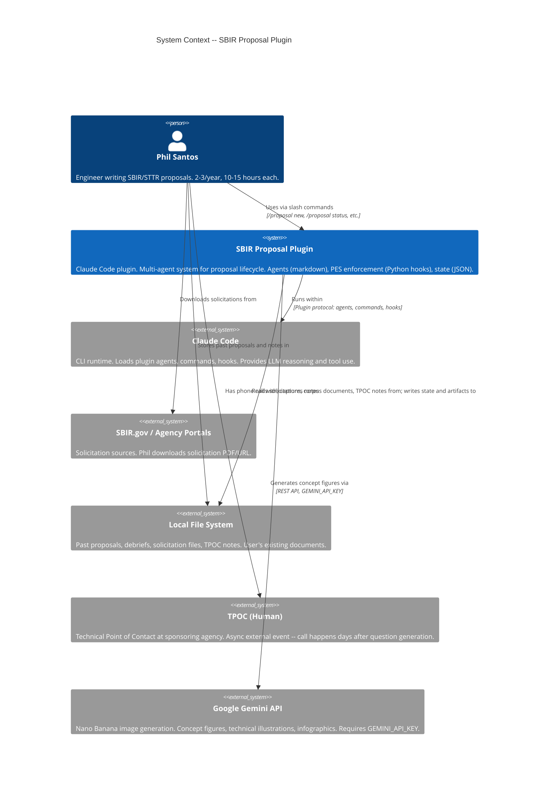
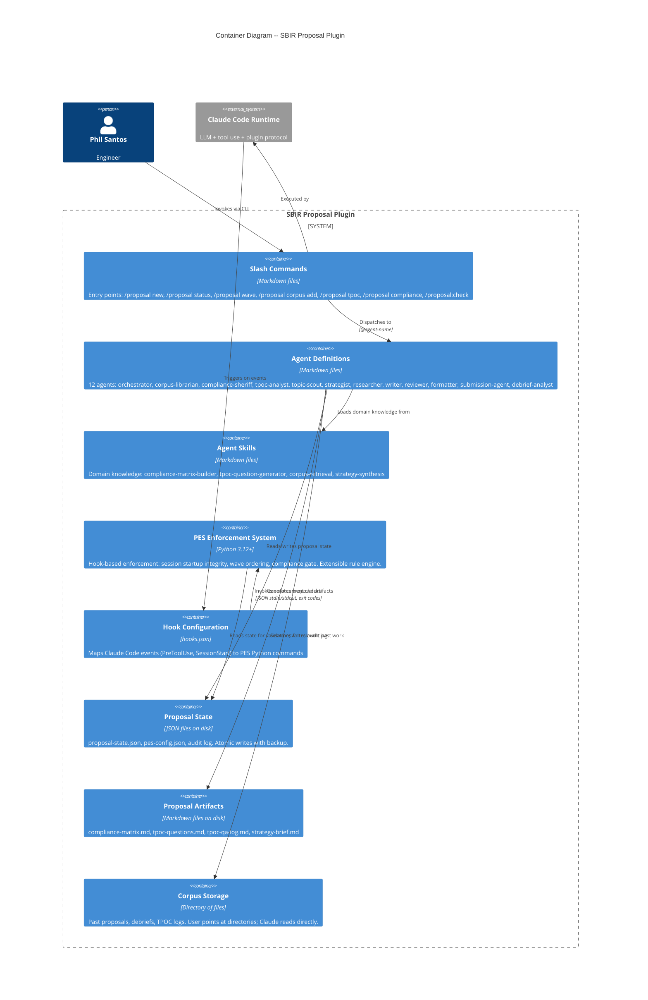
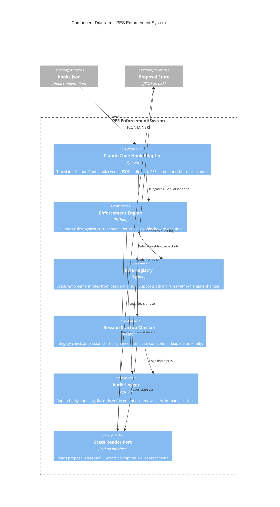

# SBIR Proposal Plugin -- Architecture Document

## System Context and Capabilities

The SBIR Proposal Plugin is a Claude Code plugin that guides engineers through the SBIR/STTR proposal lifecycle. It operates entirely within the Claude Code CLI -- no web UI, no server, no database. Agents are markdown files that Claude Code loads on demand. State persists as JSON files on disk. An enforcement layer (PES) runs as Python code invoked via Claude Code hooks.

**Phase C1 scope:** Walking skeleton covering Waves 0-1 plus PES foundation. Core capabilities: corpus ingestion and retrieval, compliance matrix extraction, TPOC question generation/ingestion, strategy brief, proposal state persistence, PES enforcement (3 invariant classes), status/reorientation.

**Primary user:** Phil Santos -- small business engineer, 2-3 proposals/year, 10-15 hours each, CLI-native.

---

## C4 System Context (Level 1)



---

## C4 Container (Level 2)



---

## C4 Component (Level 3) -- PES Enforcement System

PES is the only container with internal complexity warranting a component diagram. The agents, commands, and skills containers are flat collections of markdown files.



---

## Component Architecture

### Plugin Directory Structure (Phase C1)

```
sbir-plugin-cc/                          # Plugin root = git repository
├── .claude-plugin/
│   └── plugin.json                      # Plugin metadata (name, description, author)
├── agents/
│   ├── sbir-orchestrator.md             # Master PM -- state, handoffs, checkpoints
│   ├── sbir-corpus-librarian.md         # Corpus ingestion and retrieval
│   ├── sbir-compliance-sheriff.md       # Compliance matrix extraction and tracking
│   ├── sbir-tpoc-analyst.md             # TPOC question generation and answer ingestion
│   ├── sbir-topic-scout.md              # Solicitation parsing and metadata extraction
│   ├── sbir-fit-scorer.md               # Company fit scoring against solicitation
│   └── sbir-strategist.md               # Strategy brief synthesis
├── commands/
│   ├── proposal-new.md                  # /proposal new -- start new proposal
│   ├── proposal-status.md               # /proposal status -- show current state
│   ├── proposal-wave.md                 # /proposal wave <name> -- jump to wave
│   ├── proposal-corpus-add.md           # /proposal corpus add <dir> -- ingest docs
│   ├── proposal-tpoc-questions.md       # /proposal tpoc questions -- generate Qs
│   ├── proposal-tpoc-ingest.md          # /proposal tpoc ingest -- capture answers
│   ├── proposal-compliance-add.md       # /proposal compliance add -- manual item
│   ├── proposal-compliance-check.md     # /proposal compliance check -- matrix status
│   └── proposal-check.md               # /proposal:check -- simplified compliance
├── hooks/
│   └── hooks.json                       # Event-to-command mappings for PES
├── scripts/
│   ├── pes-hook                         # Executable entry point (shell wrapper)
│   ├── nano-banana-generate.sh          # Gemini Nano Banana image generation wrapper
│   └── pes/
│       ├── __init__.py
│       ├── adapters/
│       │   └── drivers/
│       │       └── hooks/
│       │           └── claude_code_hook_adapter.py
│       ├── application/
│       │   ├── enforcement_engine.py
│       │   ├── session_checker.py
│       │   └── rule_registry.py
│       ├── domain/
│       │   ├── rules.py               # Rule types and evaluation
│       │   └── audit.py               # Audit entry model
│       └── ports/
│           ├── state_reader.py        # Port: read proposal state
│           └── audit_writer.py        # Port: write audit entries
├── skills/
│   ├── compliance-sheriff/
│   │   └── compliance-matrix-builder.md
│   ├── tpoc-analyst/
│   │   └── tpoc-question-generator.md
│   ├── corpus-librarian/
│   │   └── corpus-retrieval.md
│   ├── strategist/
│   │   └── strategy-synthesis.md
│   └── common/
│       ├── sbir-domain-glossary.md
│       └── proposal-state-schema.md
├── templates/
│   ├── proposal-state-template.json    # Schema template for new proposals
│   ├── compliance-matrix-template.md
│   └── pes-config-template.json
└── rules/
    └── sbir-plugin-rules.md            # Rules auto-loaded by Claude Code
```

### Component Boundaries

| Component | Responsibility | Boundary Type |
|-----------|---------------|---------------|
| **Commands** | Entry points. Parse user intent, dispatch to agents. | Driving adapter (user -> system) |
| **Agents** | Domain reasoning. Each agent owns a slice of the proposal workflow. | Application core (markdown-defined behavior) |
| **Skills** | Domain knowledge. Reusable expertise loaded by agents on demand. | Knowledge layer (markdown) |
| **PES** | Enforcement. Validates invariants before agent actions proceed. | Cross-cutting enforcement (Python) |
| **State** | Persistence. Single source of truth for proposal metadata. | Driven adapter (system -> disk) |
| **Artifacts** | Output. Living documents produced by agents, reviewed by human. | Driven adapter (system -> disk) |
| **Corpus** | Input. User's existing documents read by Claude Code directly. | Driven adapter (disk -> system) |

### Component Interactions

```
User CLI Input
    |
    v
[Slash Command] ──dispatches──> [Agent]
    |                              |
    |                              |── loads ──> [Skills]
    |                              |── reads/writes ──> [State]
    |                              |── generates ──> [Artifacts]
    |                              |── searches ──> [Corpus]
    |
[Claude Code Hook Event]
    |
    v
[hooks.json] ──invokes──> [PES Python]
    |                          |
    |                          |── reads ──> [State]
    |                          |── evaluates ──> [Rules from pes-config.json]
    |                          |── writes ──> [Audit Log]
    |                          |── returns ──> exit code (0=allow, 1=block, 2=reject)
```

---

## Technology Stack

| Component | Technology | License | Rationale |
|-----------|-----------|---------|-----------|
| **Plugin runtime** | Claude Code | Proprietary (Anthropic) | Required -- this IS a Claude Code plugin |
| **Agent definitions** | Markdown with YAML frontmatter | N/A | Claude Code plugin convention |
| **Skill definitions** | Markdown | N/A | Claude Code plugin convention |
| **Command definitions** | Markdown with YAML frontmatter | N/A | Claude Code plugin convention |
| **PES enforcement** | Python 3.12+ | PSF License (OSS) | Same as nWave DES; Claude Code hook protocol requires executable |
| **State persistence** | JSON files on local disk | N/A | Simplest option; human-readable; no database dependency |
| **Artifact format** | Markdown files | N/A | Human-editable in any text editor; git-friendly |
| **Corpus storage** | Raw files on disk (PDF, .docx, .txt, .md) | N/A | Claude Code reads directly; no vector DB |
| **Corpus search** | Claude Code built-in file reading | Proprietary (Anthropic) | LLM reads files, reasons about relevance. No separate indexing. |
| **Image generation** | Google Gemini Nano Banana API | Google API ToS | Concept figures, technical illustrations, infographics. Optional -- degrades to external briefs if GEMINI_API_KEY not set. |
| **Schema validation** | Python `jsonschema` library | MIT | Validate proposal-state.json structure |
| **Hook protocol** | JSON on stdin/stdout + exit codes | N/A | Claude Code hook convention |

### Technology Decisions (see ADRs)

- **ADR-001:** Plugin architecture follows nWave conventions
- **ADR-002:** PES as Python hook-based enforcement (not agent instructions)
- **ADR-003:** Claude Code native file reading for corpus search (no vector DB)
- **ADR-004:** JSON files for state persistence (no database)
- **ADR-005:** One agent per domain role from day one (no agent collapsing)
- **ADR-006:** Per-project state with global plugin installation
- **ADR-007:** Google Gemini Nano Banana for proposal figure generation

---

## Integration Patterns

### Human Checkpoint Pattern

Agents present output at defined gates. The human approves, revises, or skips. State records the decision. PES enforces that downstream waves cannot start without upstream approval.

```
Agent produces artifact
    -> Renders to CLI or writes to ./artifacts/
    -> Presents checkpoint prompt: (a)pprove / (r)evise / (s)kip / (q)uit
    -> Records decision in proposal-state.json
    -> PES enforces gate (e.g., Wave 1 requires Go decision)
```

### Async External Event Pattern (TPOC Calls)

```
/proposal tpoc questions   -> generates questions, writes to artifact file
                            -> sets tpoc_status = "questions_generated"
    [days pass -- user has phone call with TPOC]
/proposal tpoc ingest      -> reads notes file, matches answers
                            -> sets tpoc_status = "answers_ingested"
                            -> updates compliance matrix

If call never happens:
    tpoc_status remains "questions_generated"
    No wave is blocked
    Strategy brief generated without TPOC data
```

### PES Hook Integration

```json
// hooks/hooks.json
{
    "hooks": [
        {
            "type": "SessionStart",
            "command": "PYTHONPATH=${CLAUDE_PLUGIN_ROOT}/scripts python3 -m pes.adapters.drivers.hooks.claude_code_hook_adapter session_start"
        },
        {
            "type": "PreToolUse",
            "command": "PYTHONPATH=${CLAUDE_PLUGIN_ROOT}/scripts python3 -m pes.adapters.drivers.hooks.claude_code_hook_adapter pre_tool_use"
        }
    ]
}
```

**Event flow:**
1. Claude Code triggers event (SessionStart, PreToolUse)
2. Hook adapter receives event as JSON on stdin
3. Adapter translates to PES domain command
4. Enforcement engine evaluates rules against current state
5. Engine returns allow/block/warn
6. Adapter writes JSON to stdout, returns exit code

**Exit codes:**
- `0` -- allow (proceed normally)
- `1` -- block (PES prevents the action; message explains why)
- `2` -- reject (invalid input to PES itself)

### State Write Pattern (Atomic Writes)

```
1. Write new state to proposal-state.json.tmp
2. Copy existing proposal-state.json to proposal-state.json.bak
3. Rename proposal-state.json.tmp to proposal-state.json (atomic on most filesystems)
```

This ensures no partial writes corrupt state on crash.

### Error Message Pattern

All error messages follow the what/why/what-to-do pattern (NFR-003):

```
WHAT:  "Could not parse solicitation at this URL"
WHY:   "The page may require authentication or returned unexpected content"
DO:    "Try downloading the PDF and providing a local file path: /proposal new --file ./solicitation.pdf"
```

Every error path in every command produces a message with these three elements. No bare exceptions, no stack traces, no cryptic codes.

---

## Quality Attribute Strategies

### Maintainability / Extensibility (Priority 1)

- **PES rule extensibility:** Rules defined in `pes-config.json`, not hardcoded. New invariants added by configuration, not engine changes.
- **Agent modularity:** Each agent is a separate markdown file. Adding Wave 2-4 agents in Phase C2 requires no changes to existing agents.
- **Skill extraction:** Domain knowledge in skills, not agent bodies. Skills can be updated independently.
- **Phased delivery:** C1/C2/C3 boundaries are clean. No C1 component blocks C2 additions.

### Usability (Priority 2)

- **Zero setup corpus:** Point at a directory, ingest. No schema, no tagging, no organizing.
- **Immediate value:** `/proposal status` works from first command. `/proposal new` delivers Go/No-Go value in one session.
- **Error guidance:** Every error message follows what/why/what-to-do pattern.
- **Progress indicators:** Commands that trigger LLM calls show progress within 100ms.

### Reliability (Priority 3)

- **Atomic state writes:** Write-to-temp, rename pattern prevents corruption.
- **State backup:** One prior version retained as `.bak`.
- **Session crash recovery:** PES session startup detects orphaned files, corrupted state, inconsistencies.
- **Graceful degradation:** Missing corpus does not block proposal. Pending TPOC does not block waves.

### Security (Addressed by Architecture)

- **Primarily local execution:** No network services, no listening ports. One optional outbound API call: Nano Banana image generation sends figure prompts (descriptive text only, not proposal content) to Google Gemini API. All proposal data stays on the user's machine.
- **No sensitive data in plugin code:** Plugin code (agents, commands, skills) contains no secrets. Proposal data is in the user's project directory.
- **Corpus data sovereignty:** Past proposals and debriefs never leave the local filesystem. No embeddings sent to external services.
- **PES audit trail:** All enforcement decisions and waivers are logged locally with timestamps. Provides accountability without external exposure.
- **No authentication required:** Single-user local tool. Multi-user access control is a Phase C2 concern (if needed).

### Observability (Addressed by Architecture)

- **PES audit log:** Every enforcement action, human decision, and waiver logged to `.sbir/audit/`.
- **Command response time:** NFR-001 mandates <1s for state reads, <100ms for progress indicators.
- **State inspection:** `proposal-state.json` is human-readable JSON. `/proposal status` provides a dashboard view.

---

## Proposal State Schema (Phase C1)

```json
{
    "schema_version": "1.0.0",
    "proposal_id": "string (UUID)",
    "topic": {
        "id": "AF243-001",
        "agency": "Air Force",
        "title": "Compact Directed Energy for Maritime UAS Defense",
        "solicitation_url": "https://www.sbir.gov/node/12345",
        "solicitation_file": "./solicitations/AF243-001.pdf",
        "deadline": "2026-04-15",
        "phase": "I"
    },
    "current_wave": 0,
    "go_no_go": "pending | go | no-go",
    "waves": {
        "0": { "status": "active | completed | not_started", "completed_at": null },
        "1": { "status": "not_started", "completed_at": null }
    },
    "corpus": {
        "directories_ingested": [],
        "document_count": 0,
        "file_hashes": {}
    },
    "compliance_matrix": {
        "path": "./artifacts/wave-1-strategy/compliance-matrix.md",
        "item_count": 0,
        "generated_at": null
    },
    "tpoc": {
        "status": "not_started | questions_generated | answers_ingested",
        "questions_path": null,
        "qa_log_path": null,
        "questions_generated_at": null,
        "answers_ingested_at": null
    },
    "strategy_brief": {
        "path": null,
        "status": "not_started | generated | approved",
        "approved_at": null
    },
    "fit_scoring": {
        "subject_matter": null,
        "past_performance": null,
        "certifications": null,
        "recommendation": null
    },
    "created_at": "ISO-8601",
    "updated_at": "ISO-8601"
}
```

### Company Profile Schema (Global)

Location: `~/.sbir/company-profile.json`. Shared across all proposals. Created on first `/proposal new` if missing (user prompted for basics).

Schema to be defined during step 02-02 (solicitation parsing / fit scoring). Expected fields: company name, capabilities, certifications (SAM.gov, socioeconomic), key personnel, past performance summaries, facility descriptions.

---

## PES Configuration Schema (Phase C1)

```json
{
    "enforcement": {
        "session_startup_check": true,
        "wave_ordering": "strict",
        "compliance_gate": true
    },
    "deadlines": {
        "warning_days": 7,
        "critical_days": 3
    },
    "audit_log": {
        "enabled": true,
        "path": "./.sbir/audit/",
        "retention_days": 365
    },
    "overrides": {
        "waiver_requires_reason": true,
        "waiver_marker": "<!-- PES-ENFORCEMENT: exempt -->"
    }
}
```

### Phase C1 Invariants

| # | Invariant | Type | Enforcement |
|---|-----------|------|-------------|
| 1 | Session startup integrity | Structural | On SessionStart: validate proposal-state.json, detect orphaned drafts, check deadline proximity |
| 2 | Wave ordering | Structural | On PreToolUse: Wave 1 commands blocked if `go_no_go != "go"` |
| 3 | Compliance matrix existence | Structural | On PreToolUse: drafting commands blocked if compliance matrix does not exist |

### Phase C2+ Extensibility

New rules added to `pes-config.json` without changing the enforcement engine:

```json
{
    "enforcement": {
        "pdc_gate": true,
        "deadline_blocking": true,
        "corpus_integrity": true
    }
}
```

The rule registry loads rules dynamically. Each rule implements a common interface: `evaluate(state, event) -> Decision(allow|block|warn, message)`.

---

## Deployment Architecture

This is a Claude Code plugin. There is no traditional deployment.

**Installation:**
```bash
claude plugin install github:pmvanev/sbir-plugin-cc
```

**Activation:** Plugin is enabled in `~/.claude/settings.json` after installation.

**Project initialization:** User runs `/proposal new` in any directory. Creates `.sbir/` subdirectory with `proposal-state.json` and `pes-config.json`.

**No infrastructure:** No servers, no containers, no cloud services. Everything runs locally on the user's machine within Claude Code.

---

## Phase C1 Roadmap

### Rejected Simple Alternatives

#### Alternative 1: Single agent with inline rules
- What: One `proposal-agent.md` file handling all commands, with PES rules as agent instructions.
- Expected Impact: Could handle 70% of scenarios.
- Why Insufficient: Agent instructions are not enforceable. PES must operate at the hook level to guarantee invariants. Single agent would exceed 400-line limit and violate the nWave convention.

#### Alternative 2: Commands only, no agents
- What: Slash commands directly contain all behavior. No agent dispatch.
- Expected Impact: Could handle 80% of Phase C1 scenarios.
- Why Insufficient: Loses agent specialization. Commands cannot load skills. Would require duplicating domain knowledge across command files. Does not scale to C2/C3.

### Build Phases

Phase C1 is organized into 4 implementation phases with 12 steps.

#### Phase 01: Foundation (US-007)

```yaml
step_01-01:
  title: "Plugin skeleton and proposal state schema"
  description: "Create plugin structure (.claude-plugin/, agents/, commands/, hooks/, scripts/, skills/) and proposal-state.json schema with atomic write/read operations."
  stories: [US-007]
  acceptance_criteria:
    - "Plugin installs via claude plugin install and appears in settings"
    - "proposal-state.json created with versioned schema on /proposal new"
    - "State write uses atomic temp-file-then-rename pattern"
    - "State read detects missing file and returns helpful message"
    - "Corrupted state file detected with recovery from .bak"
  architectural_constraints:
    - "State read/write logic in PES Python (scripts/pes/), not in agent markdown"
    - "Schema version field present for future migration"

step_01-02:
  title: "PES enforcement engine and hook integration"
  description: "PES Python package with hook adapter, enforcement engine, rule registry, and audit logger. Hooks.json maps SessionStart and PreToolUse events."
  stories: [US-006]
  acceptance_criteria:
    - "SessionStart hook runs silent integrity check"
    - "Clean state produces no PES output"
    - "Enforcement engine loads rules from pes-config.json"
    - "Audit log records enforcement actions"
    - "Exit code 0 allows, exit code 1 blocks with message"
  architectural_constraints:
    - "PES follows ports-and-adapters: hook adapter -> application service -> domain rules"
    - "Rule registry supports adding rules without engine changes"
```

#### Phase 02: Corpus and Solicitation (US-003, US-002)

```yaml
step_02-01:
  title: "Directory-based corpus ingestion"
  description: "Corpus add command accepts directory path, ingests supported documents, deduplicates by content hash, reports results."
  stories: [US-003]
  acceptance_criteria:
    - "Accepts directory path and ingests PDF, .docx, .doc, .txt, .md files"
    - "Reports count and type of ingested documents"
    - "Skips unsupported file types with count"
    - "Re-ingesting adds only new files (dedup by hash)"
    - "Empty directory produces helpful message"
  architectural_constraints:
    - "Corpus metadata stored in proposal-state.json"
    - "Files remain in original location; corpus tracks paths and hashes"

step_02-02:
  title: "Solicitation parsing and new proposal creation"
  description: "New proposal command parses solicitation from URL or local file, extracts metadata, searches corpus for related work, scores fit, presents Go/No-Go checkpoint."
  stories: [US-002]
  acceptance_criteria:
    - "Parses solicitation for topic ID, agency, phase, deadline, title"
    - "Searches corpus for related past work with relevance indication"
    - "Scores company fit and presents structured recommendation"
    - "Go/No-Go is a human checkpoint with go, no-go, defer options"
    - "Go decision records in state and unlocks Wave 1"
    - "No-Go archives the proposal"
    - "Empty corpus handled gracefully"
    - "Unparseable solicitation produces actionable error"
  architectural_constraints:
    - "Solicitation parsing is agent responsibility (LLM reads document)"
    - "Corpus search uses Claude Code file reading (no vector DB)"
```

#### Phase 03: Wave 1 Capabilities (US-001, US-004, US-005, US-009) -- 5 steps

```yaml
step_03-01:
  title: "Proposal status and reorientation"
  description: "Status command displays current wave, per-wave progress, pending actions, deadline countdown, and suggested next action."
  stories: [US-001]
  acceptance_criteria:
    - "Displays current wave, per-wave progress, deadline countdown"
    - "Shows pending async events (TPOC) with state"
    - "Suggests concrete next action based on current state"
    - "Shows PES deadline warning at critical threshold"
    - "Handles gracefully when no proposal exists"
  architectural_constraints:
    - "Read-only operation; does not modify state"
    - "Days-to-deadline computed at display time"

step_03-02:
  title: "Compliance matrix generation and manual editing"
  description: "Extract shall-statements, format requirements, and implicit requirements from solicitation. Map to sections. Flag ambiguities. Support manual addition of missed items."
  stories: [US-004]
  acceptance_criteria:
    - "Extracts explicit shall-statements, format requirements, and implicit requirements"
    - "Maps each item to a proposal section; flags ambiguities"
    - "Matrix is human-editable markdown; low extraction count warns"
    - "User can add missed items via /proposal compliance add"
    - "Manually added items marked as such and section-mapped"
  architectural_constraints:
    - "Matrix written to ./artifacts/wave-1-strategy/compliance-matrix.md"
    - "Matrix is a living document -- single file updated across waves"

step_03-03:
  title: "TPOC question generation"
  description: "Generate prioritized TPOC questions from solicitation gaps, compliance matrix ambiguities, and strategic probes. Write to editable file."
  stories: [US-005]
  acceptance_criteria:
    - "Questions generated from ambiguities, gaps, and strategic probes"
    - "Questions categorized by type and ordered by priority"
    - "Written to editable file user modifies before call"
    - "Call-never-happened is valid state that does not block progress"
  architectural_constraints:
    - "Questions written to ./artifacts/wave-1-strategy/tpoc-questions.md"
    - "State tracks tpoc_status for async event handling"

step_03-04:
  title: "TPOC answer ingestion and delta analysis"
  description: "Ingest TPOC call notes, match answers to questions, generate delta analysis, update compliance matrix."
  stories: [US-005]
  acceptance_criteria:
    - "Accepts file path for call notes (text, markdown, or Word)"
    - "Matches answers to original questions; marks unanswered"
    - "Generates delta analysis (TPOC vs. solicitation text)"
    - "Updates compliance matrix with TPOC clarifications"
  architectural_constraints:
    - "Q&A log is write-once after ingestion (immutable)"
    - "Delta analysis propagates to compliance matrix"

step_03-05:
  title: "Strategy brief generation and Wave 1 checkpoint"
  description: "Synthesize strategy brief from solicitation, compliance matrix, corpus, and TPOC data. Present at human checkpoint as Wave 1 exit gate."
  stories: [US-009]
  acceptance_criteria:
    - "Brief covers: technical approach, TRL, teaming, Phase III, budget, risks"
    - "Generated even without TPOC answers (notes their absence)"
    - "Strategy alignment is human checkpoint with approve/revise/skip"
    - "Approval unlocks Wave 2 (PES-enforced gate)"
    - "Revision cycles regenerate with user feedback"
  architectural_constraints:
    - "Written to ./artifacts/wave-1-strategy/strategy-brief.md"
    - "Write-once after approval; referenced but not mutated"
```

#### Phase 04: Enforcement and Check (US-006, US-008)

```yaml
step_04-01:
  title: "PES wave ordering enforcement"
  description: "Enforce that Wave 1 commands require Go decision. Block /proposal wave strategy when go_no_go is not 'go'."
  stories: [US-006]
  acceptance_criteria:
    - "Wave 1 commands blocked when go_no_go != 'go'"
    - "Wave 1 commands allowed when go_no_go == 'go'"
    - "Block message explains what is required"
    - "PES enforcement rules configurable in pes-config.json"
  architectural_constraints:
    - "Enforcement at hook layer (PreToolUse), not agent layer"
    - "Rule added to registry without engine changes"

step_04-02:
  title: "PES session startup integrity check"
  description: "On session start, validate state file integrity, detect orphaned drafts, check deadline proximity."
  stories: [US-006]
  acceptance_criteria:
    - "Orphaned files (draft without matrix entry) detected and warned"
    - "Clean state produces no output"
    - "Deadline proximity check surfaces warning at threshold"
    - "Corrupted state triggers recovery attempt"
  architectural_constraints:
    - "Runs on SessionStart hook event"
    - "Non-blocking: warns but never blocks session startup"

step_04-03:
  title: "Simplified compliance check command"
  description: "Read compliance matrix and report coverage: covered, partial, missing, waived counts."
  stories: [US-008]
  acceptance_criteria:
    - "Reports coverage by status category"
    - "Shows count of waived items distinct from missing"
    - "Handles missing matrix gracefully with guidance"
    - "Extensible: Phase C2 adds PDC evaluation"
  architectural_constraints:
    - "Reads compliance-matrix.md; parses status field per item"
```

### Roadmap Summary

| Phase | Steps | Stories | Est. Production Files |
|-------|-------|---------|----------------------|
| 01 Foundation | 2 | US-007, US-006 (partial) | 12 |
| 02 Corpus & Solicitation | 2 | US-003, US-002 | 6 |
| 03 Wave 1 Capabilities | 5 | US-001, US-004, US-005, US-009 | 10 |
| 04 Enforcement & Check | 3 | US-006 (complete), US-008 | 4 |
| **Total** | **12** | **9 stories, 39 scenarios** | **~32** |

Step ratio: 12 / 32 = 0.38 (well under 2.5 threshold).

### Step-to-Story Traceability

| Step | Story | Scenarios Covered |
|------|-------|-------------------|
| 01-01 | US-007 | 4 |
| 01-02 | US-006 (partial) | 2 (clean state, extensibility) |
| 02-01 | US-003 | 5 |
| 02-02 | US-002 | 6 (with deferred scenarios for empty corpus) |
| 03-01 | US-001 | 4 |
| 03-02 | US-004 | 4 (generate, low count, status, manual add) |
| 03-03 | US-005 | 2 (generate, pending) |
| 03-04 | US-005 | 2 (ingest, partial) |
| 03-05 | US-009 | 4 |
| 04-01 | US-006 | 2 (wave ordering) |
| 04-02 | US-006 | 1 (session startup orphan) |
| 04-03 | US-008 | 3 |

---

## ADR Index

| ADR | Title | Status |
|-----|-------|--------|
| ADR-001 | Plugin architecture follows nWave conventions | Accepted |
| ADR-002 | PES as Python hook-based enforcement | Accepted |
| ADR-003 | Claude Code native file reading for corpus search | Accepted |
| ADR-004 | JSON files for state persistence | Accepted |
| ADR-005 | One agent per domain role from day one | Accepted |
| ADR-006 | Per-project state with global plugin installation | Accepted |
| ADR-007 | Google Gemini Nano Banana for proposal figure generation | Accepted |

See `docs/adrs/` for full ADR documents.
