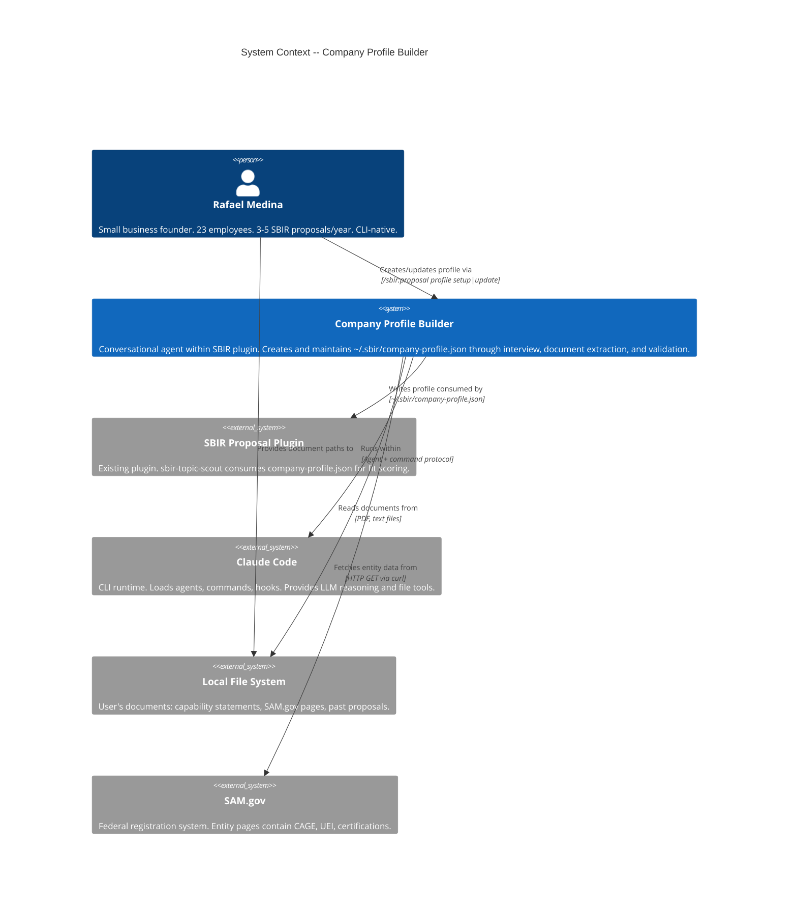
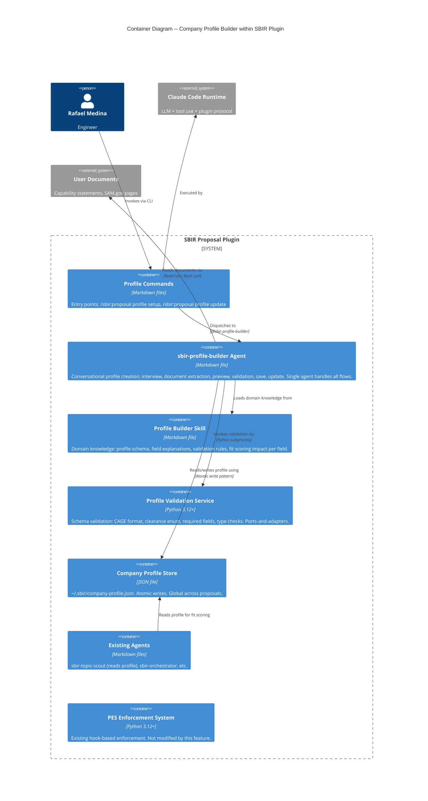

# Company Profile Builder -- Architecture Design

## Feature Context

The Company Profile Builder adds conversational creation and maintenance of `~/.sbir/company-profile.json`. This global file powers the fit scoring engine consumed by `sbir-topic-scout`. Currently users must hand-craft JSON. This feature adds an agent-driven interview, document extraction, schema validation, and selective update.

**Scope**: 5 user stories (US-CPB-001 through US-CPB-005), 22 scenarios, ~9 days effort.

---

## C4 System Context (Level 1)



---

## C4 Container (Level 2)



---

## Component Architecture

### New Components

| Component | Type | Location | Responsibility |
|-----------|------|----------|---------------|
| `sbir-profile-builder` agent | Markdown | `agents/sbir-profile-builder.md` | Conversational orchestration: mode selection, document extraction, interview, preview, save, update, overwrite protection |
| `profile-builder` skill | Markdown | `skills/profile-builder/profile-domain.md` | Domain knowledge: schema field definitions, fit scoring impact per field, validation rules, interview question templates |
| Profile setup command | Markdown | `commands/sbir-proposal-profile-setup.md` | Entry point for `/sbir:proposal profile setup`. Dispatches to agent. |
| Profile update command | Markdown | `commands/sbir-proposal-profile-update.md` | Entry point for `/sbir:proposal profile update`. Dispatches to agent with update context. |
| Profile validation service | Python | `scripts/pes/domain/profile_validation.py` | Schema validation: field presence, type checks, format validation (CAGE, clearance enum, UEI) |
| Profile port | Python | `scripts/pes/ports/profile_port.py` | Abstract interface for profile read/write operations |
| Profile adapter | Python | `scripts/pes/adapters/json_profile_adapter.py` | JSON file adapter implementing profile port with atomic writes |
| Profile schema template | JSON | `templates/company-profile-schema.json` | JSON Schema definition for validation; single source of truth for structure |

### Modified Components

| Component | Modification |
|-----------|-------------|
| `skills/topic-scout/fit-scoring-methodology.md` | Update "missing profile" message to reference `/sbir:proposal profile setup` (already suggested in handoff) |

### Unchanged Components

PES enforcement system, existing agents, existing commands, hooks.json -- no modifications required. Profile creation is not wave-gated.

---

## Component Boundaries

### Boundary 1: Agent (Markdown) -- Conversational Logic

The `sbir-profile-builder` agent owns:
- Mode selection (documents / interview / both)
- Document content extraction (LLM interprets document content)
- Conversational interview (asks targeted questions for missing fields)
- Preview rendering (human-readable format)
- User interaction (confirm / edit / cancel)
- Overwrite protection flow (detect existing, offer backup / update / cancel)

The agent does NOT own:
- Schema validation logic (delegated to Python service)
- File I/O mechanics (delegated to adapter via Python)
- Profile data structure definition (defined in schema template)

### Boundary 2: Python Validation Service -- Schema Enforcement

The profile validation service owns:
- Field presence checking (required vs optional fields)
- Format validation (CAGE = 5 alphanumeric, clearance enum, employee_count > 0)
- Type validation (strings, arrays, nested objects, booleans)
- Validation result reporting (field-level errors with expected formats)

### Boundary 3: Python Profile Adapter -- Persistence

The profile adapter owns:
- Atomic write pattern (write .tmp -> backup .bak -> rename .tmp)
- File existence detection
- File metadata reading (last modified date for overwrite warning)
- Directory creation (`~/.sbir/` if absent)
- File permission setting (restrictive permissions on sensitive data)

### Boundary 4: Skill (Markdown) -- Domain Knowledge

The profile builder skill owns:
- Field-by-field fit scoring impact explanations
- Interview question templates per schema section
- Valid values reference (socioeconomic categories, clearance levels)
- Schema field definitions with business context

---

## Data Flow

### Setup Flow (US-CPB-001 + US-CPB-002 + US-CPB-005)

```
User: /sbir:proposal profile setup
    |
    v
[Profile Setup Command] --> dispatches --> [sbir-profile-builder Agent]
    |
    v
1. Check existing profile (via profile adapter)
    |-- exists --> Overwrite Protection (US-CPB-005):
    |              show company_name + last_modified
    |              offer: start_fresh (backup + proceed) | update (redirect) | cancel
    |-- not exists --> proceed
    |
    v
2. Mode selection: documents | interview | both
    |
    v
3a. Document extraction (if selected):
    |-- Read files via Read tool / Bash curl
    |-- LLM extracts profile fields from content
    |-- Report extracted vs missing fields
    |
3b. Interview for gaps:
    |-- Load profile-domain skill for field explanations
    |-- Ask only about missing fields (targeted)
    |-- Record responses into draft
    |
    v
4. Preview + Validate (US-CPB-002):
    |-- Invoke profile validation service (Python)
    |-- Display human-readable preview with validation status
    |-- If failures: show field errors, allow correction, re-validate
    |-- If passed: offer confirm / edit / cancel
    |
    v
5. Save (on confirm):
    |-- Profile adapter writes atomically
    |-- Confirm save location
    |-- Suggest /sbir:proposal new as next step
```

### Update Flow (US-CPB-004)

```
User: /sbir:proposal profile update
    |
    v
[Profile Update Command] --> dispatches --> [sbir-profile-builder Agent]
    |
    v
1. Check existing profile (via profile adapter)
    |-- not exists --> error: suggest /sbir:proposal profile setup
    |-- exists --> load current profile
    |
    v
2. Show available sections, user selects one
    |
    v
3. Display current values for selected section
    |
    v
4. Accept modifications (add to arrays, replace scalars)
    |
    v
5. Validate complete updated profile (same validation service)
    |
    v
6. Preview changes, confirm, save atomically
```

---

## Technology Stack

| Component | Technology | License | Rationale |
|-----------|-----------|---------|-----------|
| Profile agent | Markdown (Claude Code agent) | N/A | Plugin convention per ADR-001 |
| Profile skill | Markdown | N/A | Plugin convention -- domain knowledge on demand |
| Profile commands | Markdown (Claude Code commands) | N/A | Plugin convention per ADR-001 |
| Validation service | Python 3.12+ | PSF (OSS) | Consistent with existing PES Python code |
| Schema definition | JSON Schema (Draft 2020-12) | N/A | Standard schema language; validated by `jsonschema` library (MIT) |
| JSON file I/O | Python `json` stdlib | PSF (OSS) | No additional dependency |
| Schema validation lib | `jsonschema` 4.x | MIT | Already in project (used by PES) |
| Document reading | Claude Code Read tool + Bash curl | N/A | Agent tools for local files and URLs |

No new technology introduced. No proprietary technology. All Python code follows existing ports-and-adapters pattern.

---

## Integration Patterns

### Agent-to-Python Validation

The agent invokes the validation service as a Python subprocess for schema checking. This follows the same pattern PES uses for hook invocation.

```
Agent constructs profile JSON draft
    -> Writes draft to temp location or passes via stdin
    -> Invokes: python -m pes.domain.profile_validation validate
    -> Receives: JSON result with pass/fail and field-level errors
    -> Displays result to user
```

### Cross-Agent: Profile Consumer

`sbir-topic-scout` reads `~/.sbir/company-profile.json` directly in Phase 3 SCORE. The profile builder writes this file. No API contract -- just a shared file with a shared schema (defined in `templates/company-profile-schema.json`).

Contract: the saved file MUST match the schema defined in `templates/company-profile-schema.json`. Both agents reference this single source of truth.

### Atomic Write Pattern (Reused)

Same pattern as `JsonStateAdapter`:
1. Write to `~/.sbir/company-profile.json.tmp`
2. Copy existing to `~/.sbir/company-profile.json.bak`
3. Rename `.tmp` to `company-profile.json`

### File Permission Pattern (New)

Profile contains sensitive data (CAGE code, UEI, security clearance, ITAR status). On Unix systems, set file permissions to 600 (owner read/write only) after write. On Windows, rely on user-level NTFS permissions (no programmatic change needed -- user's home directory is already protected).

---

## Quality Attribute Strategies

### Maintainability

- Single schema template (`templates/company-profile-schema.json`) is the source of truth for both writer (profile-builder) and reader (topic-scout)
- Validation service is a pure domain function with no infrastructure imports
- Adding new profile fields requires: update schema template + update skill + update validation -- no agent rewrite

### Usability

- Three input modes (documents / interview / both) accommodate different user contexts
- Field-by-field fit scoring explanations reduce cognitive load
- Targeted interview (skip already-extracted fields) respects user's time
- Edit-during-preview avoids re-running the entire flow

### Reliability

- Atomic write pattern prevents partial file corruption
- Backup (.bak) enables recovery from accidental overwrites
- Overwrite protection (US-CPB-005) prevents data loss
- Validation gate (US-CPB-002) prevents invalid data from reaching fit scoring

### Security

- File contains sensitive data: CAGE code, UEI, security clearance level, ITAR status
- Restrictive file permissions (600 on Unix)
- Data stays local -- no network transmission of profile data
- Backup file inherits same permissions
- `~/.sbir/` should be excluded from version control (.gitignore pattern)

---

## Rejected Simple Alternatives

### Alternative 1: Agent-only validation (no Python service)

- **What**: Let the LLM agent validate the profile JSON directly without a Python validation service
- **Expected Impact**: Covers ~70% of validation cases
- **Why Insufficient**: LLM validation is probabilistic -- it may miss format violations (CAGE code length, enum values). Schema validation must be deterministic. The existing `jsonschema` library provides exact contract enforcement. A wrong profile silently degrades fit scoring for every future proposal.

### Alternative 2: Inline profile creation in topic-scout

- **What**: When topic-scout detects missing profile, prompt inline for fields (no separate agent/command)
- **Expected Impact**: Covers the initial creation use case (~40% of the feature)
- **Why Insufficient**: Mixes concerns (scoring vs profile management). Does not address document extraction, selective update, overwrite protection, or validation gate. Topic-scout already has 175 lines of behavior -- adding profile creation would exceed the 400-line agent limit.

### Why the proposed solution is necessary

1. Deterministic validation requires Python -- LLM-only validation is unreliable for format constraints
2. Separate agent respects single-responsibility and the 400-line agent limit
3. Document extraction + targeted interview requires a multi-step flow that warrants its own command/agent boundary

---

## Roadmap

### Phase 01: Foundation (US-CPB-005 + US-CPB-001 core)

```yaml
step_01-01:
  title: "Profile schema template, port, and adapter"
  description: "JSON Schema template for company profile. Profile port (read/write/exists/metadata). JSON file adapter with atomic writes, directory creation, and file permissions."
  stories: [US-CPB-005, US-CPB-001]
  acceptance_criteria:
    - "Profile schema template validates known-good and known-bad profiles"
    - "Adapter writes atomically (tmp -> bak -> rename)"
    - "Adapter creates ~/.sbir/ if absent"
    - "Adapter detects existing profile and returns metadata (name, last modified)"
    - "File permissions are restrictive on Unix systems"
  architectural_constraints:
    - "Port in scripts/pes/ports/profile_port.py"
    - "Adapter in scripts/pes/adapters/json_profile_adapter.py"
    - "Schema in templates/company-profile-schema.json"

step_01-02:
  title: "Profile validation service"
  description: "Domain service validates profile dict against schema. Returns field-level errors with expected formats. Covers CAGE format, clearance enum, employee count, required fields."
  stories: [US-CPB-002]
  acceptance_criteria:
    - "Valid profile passes with no errors"
    - "Invalid CAGE code (wrong length) returns specific field error"
    - "Invalid clearance enum returns allowed values"
    - "Missing required fields listed individually"
    - "Employee count <= 0 rejected"
  architectural_constraints:
    - "Pure domain: no file I/O, no infrastructure imports"
    - "Uses jsonschema library for structural validation plus custom business rules"
```

### Phase 02: Agent and Commands (US-CPB-001 + US-CPB-005 + US-CPB-002)

```yaml
step_02-01:
  title: "Profile builder agent with interview flow and overwrite protection"
  description: "sbir-profile-builder agent. Mode selection (documents/interview/both). Guided interview asking section-by-section. Overwrite protection: detect existing profile, offer backup/update/cancel. Profile skill with field explanations."
  stories: [US-CPB-001, US-CPB-005]
  acceptance_criteria:
    - "Interview covers all schema sections with plain-English questions"
    - "Each field question explains fit scoring impact"
    - "Cancel at any point writes no file"
    - "Existing profile detected before setup begins"
    - "Start fresh creates backup before proceeding"
    - "Update redirect transitions to update flow"
  architectural_constraints:
    - "Agent at agents/sbir-profile-builder.md (200-400 lines)"
    - "Skill at skills/profile-builder/profile-domain.md"
    - "YAML frontmatter with tools: Read, Glob, Grep, Bash"

step_02-02:
  title: "Profile commands with preview and validation gate"
  description: "Setup and update commands dispatching to agent. Preview displays all fields human-readable with validation result. Save blocked until validation passes. Edit-during-preview supported."
  stories: [US-CPB-002, US-CPB-001, US-CPB-005]
  acceptance_criteria:
    - "/sbir:proposal profile setup dispatches to sbir-profile-builder"
    - "/sbir:proposal profile update dispatches with update context"
    - "Preview shows every field in readable format, not raw JSON"
    - "Validation failures show field name, value, and expected format"
    - "Save requires explicit confirmation after validation passes"
  architectural_constraints:
    - "Commands at commands/sbir-proposal-profile-setup.md and commands/sbir-proposal-profile-update.md"
    - "YAML frontmatter with description and argument-hint"
```

### Phase 03: Document Extraction and Update (US-CPB-003 + US-CPB-004)

```yaml
step_03-01:
  title: "Document extraction integration"
  description: "Agent reads PDFs, text files, and fetches URLs. Extracts profile fields via LLM interpretation. Reports extracted vs missing. Multiple documents additive. Unsupported formats produce clear error."
  stories: [US-CPB-003]
  acceptance_criteria:
    - "PDF and text files read and analyzed for profile fields"
    - "URL fetch via curl extracts SAM.gov entity data"
    - "Extracted fields displayed with values for user verification"
    - "Missing fields listed to drive targeted interview"
    - "Multiple documents merge without losing prior extractions"
    - "Unsupported format produces actionable error"
  architectural_constraints:
    - "Extraction is agent behavior (LLM reads content), not Python code"
    - "Extract-then-confirm pattern: user verifies before data enters draft"

step_03-02:
  title: "Selective profile section update"
  description: "Update flow: load existing profile, show sections, user selects one, display current values, accept modifications, validate complete profile, save atomically."
  stories: [US-CPB-004]
  acceptance_criteria:
    - "Shows available sections for modification"
    - "Displays current values for selected section"
    - "Array fields append without removing existing entries"
    - "Scalar fields replace value"
    - "Unselected sections unchanged in saved file"
    - "No-profile-exists produces error with setup guidance"
  architectural_constraints:
    - "Reuses same validation service and atomic write pattern"
    - "Same agent handles both setup and update via command context"
```

### Roadmap Summary

| Phase | Steps | Stories | Est. Production Files |
|-------|-------|---------|----------------------|
| 01 Foundation | 2 | US-CPB-005, US-CPB-001, US-CPB-002 (partial) | 4 |
| 02 Agent & Commands | 2 | US-CPB-001, US-CPB-002, US-CPB-005 | 5 |
| 03 Extraction & Update | 2 | US-CPB-003, US-CPB-004 | 1 (agent behavior, no new files) |
| **Total** | **6** | **5 stories, 22 scenarios** | **~10** |

Step ratio: 6 / 10 = 0.60 (well under 2.5 threshold).

### Step-to-Story Traceability

| Step | Stories | Scenarios Covered |
|------|---------|-------------------|
| 01-01 | US-CPB-005, US-CPB-001 | 3 (atomic write, directory create, existing detection) |
| 01-02 | US-CPB-002 | 3 (valid pass, invalid CAGE, missing fields) |
| 02-01 | US-CPB-001, US-CPB-005 | 8 (interview flow, field explanations, cancel, overwrite protection) |
| 02-02 | US-CPB-002, US-CPB-001, US-CPB-005 | 4 (preview, validation gate, commands) |
| 03-01 | US-CPB-003 | 6 (PDF, URL, multi-doc, unsupported, partial, no-data) |
| 03-02 | US-CPB-004 | 4 (add entry, preserve unmodified, no profile, update cert) |

---

## ADR Index (Feature-Specific)

| ADR | Title | Status |
|-----|-------|--------|
| ADR-013 | Profile validation as Python domain service | Accepted |
| ADR-014 | Single agent for setup and update flows | Accepted |
| ADR-015 | JSON Schema as single source of truth for profile structure | Accepted |

See `docs/adrs/` for full ADR documents.
