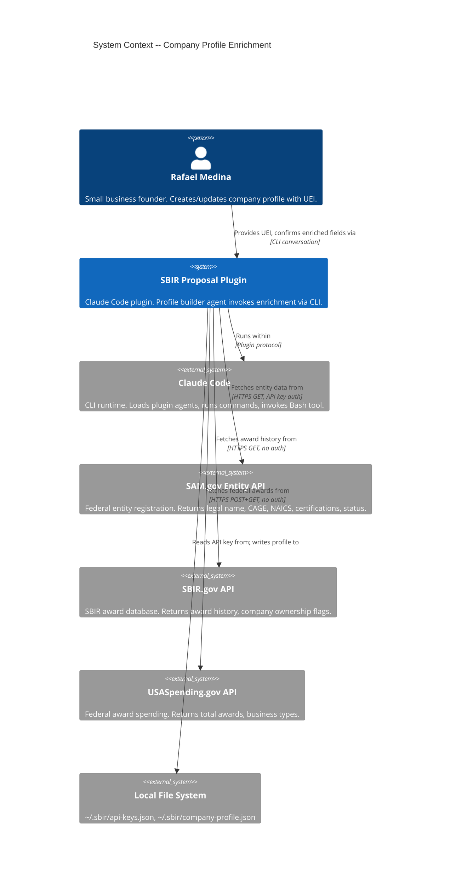
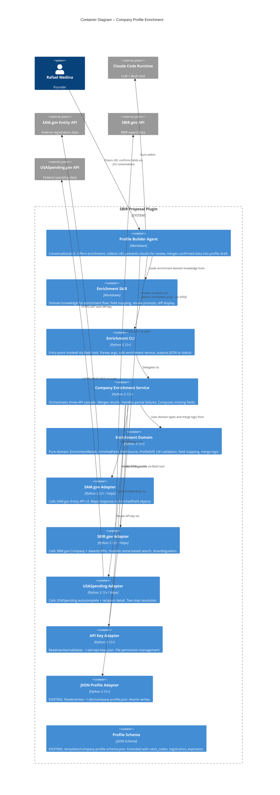

# Architecture Design: Company Profile Enrichment

## Feature Summary

Extend the existing company profile builder to automatically enrich profiles from three federal APIs (SAM.gov Entity API, SBIR.gov Company/Awards API, USASpending.gov) using the company's UEI as the single input. Enrichment proposes values; the user confirms before any data enters the profile.

## Quality Attribute Priorities

| Quality Attribute | Priority | Strategy |
|-------------------|----------|----------|
| **Testability** | P1 | Pure domain logic (field mapping, diff, merge) isolated from HTTP infrastructure via ports |
| **Fault tolerance** | P2 | Partial enrichment accepted; each API failure is independent; graceful degradation |
| **Auditability** | P3 | Source attribution on every enriched field; API URLs and timestamps in profile metadata |
| **Maintainability** | P4 | New API sources added by implementing EnrichmentSourcePort; no service/domain changes |

## Architecture Decision: Extend Existing Ports-and-Adapters

**Style**: Same hexagonal/ports-and-adapters as existing PES code (per ADR-002, CLAUDE.md).

**Justification**: Solo developer, brownfield extension. No new infrastructure patterns justified. Enrichment is a new domain capability added to the existing `scripts/pes/` tree with new port, adapters, domain, and service.

---

## C4 System Context (Level 1)



---

## C4 Container (Level 2)



---

## Component Architecture

### New Components

| Component | Location | Responsibility |
|-----------|----------|---------------|
| **EnrichmentSourcePort** | `scripts/pes/ports/enrichment_port.py` | Abstract interface: fetch company data from a single external source |
| **ApiKeyPort** | `scripts/pes/ports/api_key_port.py` | Abstract interface: read/write/validate API keys |
| **SamGovAdapter** | `scripts/pes/adapters/sam_gov_adapter.py` | Implements EnrichmentSourcePort for SAM.gov Entity API |
| **SbirGovAdapter** | `scripts/pes/adapters/sbir_gov_adapter.py` | Implements EnrichmentSourcePort for SBIR.gov Company/Awards API |
| **UsaSpendingAdapter** | `scripts/pes/adapters/usa_spending_adapter.py` | Implements EnrichmentSourcePort for USASpending.gov API |
| **JsonApiKeyAdapter** | `scripts/pes/adapters/json_api_key_adapter.py` | Implements ApiKeyPort for ~/.sbir/api-keys.json |
| **Enrichment Domain** | `scripts/pes/domain/enrichment.py` | Pure domain: value objects (EnrichedField, FieldSource, EnrichmentResult), UEI validation, field mapping |
| **ProfileDiff Domain** | `scripts/pes/domain/profile_diff.py` | Pure domain: diff logic comparing EnrichmentResult against existing profile |
| **CompanyEnrichmentService** | `scripts/pes/domain/enrichment_service.py` | Application service: orchestrates cascade, merges, computes missing fields |
| **Enrichment CLI** | `scripts/pes/enrichment_cli.py` | CLI entry point: parses args, wires adapters to service, outputs JSON |

### Modified Components

| Component | Location | Change |
|-----------|----------|--------|
| **Profile Schema** | `templates/company-profile-schema.json` | Add `naics_codes` array, `registration_expiration` field, `enrichment_metadata` in sources |
| **Profile Builder Agent** | `agents/sbir-profile-builder.md` | New ENRICHMENT phase between MODE SELECT and GATHER |
| **Enrichment Skill** | `skills/profile-builder/enrichment-domain.md` | New skill: enrichment flow prompts, field mapping reference, review templates |

### Reused Components (No Changes)

| Component | Rationale |
|-----------|-----------|
| **ProfilePort + JsonProfileAdapter** | Profile read/write already works. Enrichment merges into profile draft that agent writes via existing adapter. |
| **ProfileValidationService** | Schema validation runs before save. Extended schema fields validated automatically via jsonschema. |
| **Existing PES infrastructure** | Hook adapter, enforcement engine, audit logger -- no changes needed. Enrichment is agent-side, not hook-side. |

---

## Integration Pattern: Agent-to-Python Bridge

```
Agent (markdown)                       Python (scripts/pes/)
     |                                       |
     |-- Bash: python enrichment_cli.py      |
     |         --uei DKJF84NXLE73            |
     |         --mode enrich                  |
     |                                       |
     |                        enrichment_cli.py
     |                            |
     |                        CompanyEnrichmentService
     |                            |
     |                    +-------+-------+-------+
     |                    |       |       |       |
     |              SamGov   SbirGov  UsaSpending  ApiKey
     |              Adapter  Adapter  Adapter      Adapter
     |                    |       |       |       |
     |                    v       v       v       v
     |                  SAM.gov SBIR.gov USASpend ~/.sbir/
     |                                       |
     |<-- JSON stdout: EnrichmentResult      |
     |                                       |
     Agent displays results, user confirms
     |
     |-- Bash: python enrichment_cli.py
     |         --uei DKJF84NXLE73
     |         --mode diff
     |         --profile-path ~/.sbir/company-profile.json
     |                                       |
     |<-- JSON stdout: ProfileDiff           |
```

### CLI Modes

| Mode | Purpose | Input | Output |
|------|---------|-------|--------|
| `enrich` | Initial enrichment from UEI | `--uei` | JSON: EnrichmentResult with all fields and sources |
| `diff` | Compare enrichment against existing profile | `--uei`, `--profile-path` | JSON: ProfileDiff with additions, changes, matches |
| `validate-key` | Test SAM.gov API key validity | (reads from api-keys.json) | JSON: `{valid: bool, error: str}` |
| `save-key` | Store API key securely | `--key` (stdin, not CLI arg) | JSON: `{saved: bool, path: str}` |

**Security note**: API key passed via stdin for `save-key` mode, never as a CLI argument. For `enrich` and `diff` modes, the CLI reads the key from `~/.sbir/api-keys.json` directly.

---

## Data Flow: Enrichment Cascade

```
1. Agent prompts for UEI
2. Agent invokes: python enrichment_cli.py --uei DKJF84NXLE73 --mode enrich
3. CLI wires adapters -> service
4. Service calls SAM.gov (primary):
   - GET /entity-information/v3/entities?ueiSAM={UEI}&api_key={KEY}
   - Extracts: legal_name, cage_code, naics_codes, business_types, registration_status, expiration
   - If fails: mark SAM fields as unavailable, continue
5. Service calls SBIR.gov (augments with company name from SAM.gov):
   - GET /api/company?keyword={company_name}
   - If multiple matches: return candidates for agent to disambiguate
   - GET /public/api/awards?firm={selected_company_name}
   - Extracts: award_count, awards[], ownership_flags
   - If fails: mark SBIR fields as unavailable, continue
6. Service calls USASpending (augments with company name from SAM.gov):
   - POST /api/v2/autocomplete/recipient/ body: {"search_text": company_name}
   - GET /api/v2/recipient/{recipient_id}/?year=all
   - Extracts: total_award_amount, transaction_count, business_types
   - If fails: mark USASpending fields as unavailable, continue
7. Service merges all results into EnrichmentResult
8. CLI outputs JSON to stdout
9. Agent parses, displays with source attribution
10. User confirms/edits/skips each field
11. Agent merges confirmed fields into profile draft
12. Agent continues to INTERVIEW for remaining gaps
```

---

## Partial Failure Strategy

| API | Failure Mode | Impact | Recovery |
|-----|-------------|--------|----------|
| SAM.gov | 403 (invalid key) | No SAM fields; SBIR.gov and USASpending cannot resolve company name | Agent offers: re-enter key, skip enrichment |
| SAM.gov | Timeout/5xx | No SAM fields; downstream APIs cannot resolve | Agent offers: retry, skip enrichment |
| SAM.gov | Empty result (wrong UEI) | No entity found | Agent offers: re-enter UEI, skip enrichment |
| SBIR.gov | Timeout/5xx | No award history | Continue with SAM.gov + USASpending data; awards asked in interview |
| SBIR.gov | Multiple matches | Ambiguous company name | Return candidates to agent; user selects |
| USASpending | Timeout/5xx | No federal award totals | Continue with SAM.gov + SBIR.gov data |
| All three | All fail | No enrichment data | Agent falls back to manual interview (existing flow) |

**Key dependency**: SBIR.gov and USASpending require the company name resolved from SAM.gov. If SAM.gov fails, these two cannot proceed. The enrichment result marks all fields as unavailable and the agent falls back to manual interview.

---

## Schema Extension

### New Fields in company-profile-schema.json

```json
{
  "naics_codes": {
    "type": "array",
    "description": "NAICS codes from SAM.gov registration. Primary code listed first.",
    "items": {
      "type": "object",
      "required": ["code"],
      "properties": {
        "code": { "type": "string" },
        "primary": { "type": "boolean", "default": false }
      }
    }
  },
  "certifications.sam_gov.registration_expiration": {
    "type": "string",
    "format": "date",
    "description": "SAM.gov registration expiration date"
  },
  "certifications.sam_gov.entity_structure": {
    "type": "string",
    "description": "Legal entity structure (LLC, Corp, etc.) from SAM.gov"
  }
}
```

### Source Attribution Extension

The existing `sources.web_references` array is extended with enrichment API entries:

```json
{
  "sources": {
    "web_references": [
      {
        "url": "https://api.sam.gov/entity-information/v3/entities?ueiSAM=DKJF84NXLE73",
        "label": "SAM.gov Entity API",
        "accessed_at": "2026-03-26T14:00:00Z",
        "fields_populated": ["company_name", "certifications.sam_gov", "naics_codes"]
      }
    ],
    "enrichment_metadata": {
      "enriched_at": "2026-03-26T14:00:00Z",
      "uei_used": "DKJF84NXLE73",
      "sources_attempted": ["SAM.gov", "SBIR.gov", "USASpending.gov"],
      "sources_succeeded": ["SAM.gov", "SBIR.gov", "USASpending.gov"],
      "fields_enriched": 8,
      "fields_confirmed_by_user": 8
    }
  }
}
```

---

## Technology Stack

| Component | Technology | Version | License | Rationale |
|-----------|-----------|---------|---------|-----------|
| HTTP client | httpx | 0.27+ | BSD-3-Clause | Already adopted (ADR-018). Timeout control, connection pooling. |
| JSON schema validation | jsonschema | existing | MIT | Already in use for profile validation. |
| Python runtime | Python | 3.12+ | PSF | Project standard. |
| API key storage | JSON file | N/A | N/A | `~/.sbir/api-keys.json`. Simplest approach, consistent with existing JSON state pattern. |

No new dependencies beyond httpx (already in project).

---

## ADR Index (New)

| ADR | Title |
|-----|-------|
| ADR-041 | NAICS codes as top-level profile field |
| ADR-042 | API key storage in separate file |
| ADR-043 | Enrichment as optional profile builder phase |

See `docs/adrs/` for full documents.

---

## Roadmap (Implementation Steps)

### Rejected Simple Alternatives

#### Alternative 1: WebSearch/WebFetch in agent (no Python)
- **What**: Agent uses WebSearch and WebFetch to query APIs directly, no Python service.
- **Expected Impact**: Could populate ~60% of fields.
- **Why Insufficient**: WebFetch URL-in-context restriction complicates API calls. No testable domain logic. No retry/timeout control. No structured JSON parsing. Field mapping logic untestable.

#### Alternative 2: Single adapter for all three APIs
- **What**: One monolithic adapter handling all three API calls.
- **Expected Impact**: 100% functional coverage.
- **Why Insufficient**: Violates single-responsibility. Cannot test individual API adapters in isolation. Cannot add/remove API sources without modifying shared code. Partial failure handling becomes complex conditional logic.

### Steps

```yaml
roadmap:
  feature: "company-profile-enrichment"
  stories: [US-CPE-004, US-CPE-001, US-CPE-002, US-CPE-003]
  total_scenarios: 26
  estimated_production_files: 12
  delivery_surfaces:
    python_tdd: 10  # port, 3 adapters, domain, diff, service, cli, api_key port, api_key adapter
    markdown_forge: 2  # agent update, enrichment skill

phases:
  "01":
    title: "Enrichment Foundation"
    steps:
      "01-01":
        title: "Enrichment domain types and UEI validation"
        description: "Pure domain: EnrichedField, FieldSource, EnrichmentResult value objects. UEI format validation (12 alphanumeric). Field-to-schema mapping constants."
        acceptance_criteria:
          - "UEI validated as 12 alphanumeric characters; invalid format rejected with message"
          - "EnrichmentResult holds fields from multiple sources with per-field attribution"
          - "Missing fields computed from schema required fields minus populated fields"
        architectural_constraints:
          - "Pure domain -- no imports from adapters or infrastructure"
          - "Domain types used by all adapters and the service"
        stories: [US-CPE-001]

      "01-02":
        title: "API key port, adapter, and validation"
        description: "ApiKeyPort interface. JsonApiKeyAdapter reads/writes ~/.sbir/api-keys.json. Key validation via SAM.gov test call. File permission setting."
        acceptance_criteria:
          - "Key read from ~/.sbir/api-keys.json when file exists"
          - "Missing key file detected without error"
          - "Key validated with SAM.gov test call; invalid key produces clear error"
          - "Key saved with owner-only file permissions"
          - "Key never appears in CLI arguments"
        architectural_constraints:
          - "Port in ports/, adapter in adapters/"
          - "Adapter handles file I/O and permissions only"
        stories: [US-CPE-004]

  "02":
    title: "Three-API Adapters"
    steps:
      "02-01":
        title: "SAM.gov Entity API adapter"
        description: "Implements EnrichmentSourcePort. Calls SAM.gov v3 Entity API with UEI and API key. Maps response to EnrichedField objects for legal name, CAGE, NAICS, certifications, status."
        acceptance_criteria:
          - "Entity data retrieved for valid UEI with correct field mapping"
          - "Empty result for unknown UEI returns no-entity-found indicator"
          - "Timeout after configurable duration returns failure with source attribution"
          - "Business type codes mapped to human-readable certification names"
        architectural_constraints:
          - "Uses httpx (ADR-018) for HTTP calls"
          - "Maps SAM.gov JSON paths to enrichment domain types"
        stories: [US-CPE-001]

      "02-02":
        title: "SBIR.gov Company and Awards API adapter"
        description: "Implements EnrichmentSourcePort. Searches by company name. Handles multiple matches (returns candidates). Fetches awards for selected company."
        acceptance_criteria:
          - "Award history retrieved by company name search"
          - "Multiple company matches returned as disambiguation candidates"
          - "Each award has agency, topic area, and phase"
          - "Timeout returns failure without blocking other adapters"
        architectural_constraints:
          - "Company name from SAM.gov result required as input"
          - "Disambiguation candidates returned to caller, not resolved internally"
        stories: [US-CPE-001]

      "02-03":
        title: "USASpending.gov recipient API adapter"
        description: "Implements EnrichmentSourcePort. Two-step resolution: autocomplete by name, then fetch recipient detail by ID. Returns total awards and business types."
        acceptance_criteria:
          - "Recipient resolved from company name via autocomplete endpoint"
          - "Total federal award amount and transaction count returned"
          - "Business types returned for cross-check against SAM.gov"
          - "Timeout at either step returns failure gracefully"
        architectural_constraints:
          - "Two-step HTTP call: POST autocomplete, then GET recipient detail"
          - "Company name from SAM.gov result required as input"
        stories: [US-CPE-001]

  "03":
    title: "Service, CLI, and Diff"
    steps:
      "03-01":
        title: "Company enrichment service with partial failure handling"
        description: "Orchestrates three-API cascade. SAM.gov first (provides company name for others). Merges results. Handles partial failures. Computes missing fields list."
        acceptance_criteria:
          - "All three APIs called; results merged into single EnrichmentResult"
          - "Single API failure does not prevent other APIs from returning data"
          - "SAM.gov failure prevents SBIR.gov and USASpending (name dependency)"
          - "Missing fields list accurate relative to profile schema"
        architectural_constraints:
          - "Depends on EnrichmentSourcePort, not concrete adapters"
          - "Partial failure state tracked per-source in result"
        stories: [US-CPE-001]

      "03-02":
        title: "Profile diff logic for re-enrichment"
        description: "Compare EnrichmentResult against existing profile JSON. Detect additions, changes, and matches. Array comparison (NAICS, past performance) detects new items without treating reorder as change."
        acceptance_criteria:
          - "New NAICS code detected as addition"
          - "New SBIR award detected as addition"
          - "Reordered array elements not flagged as changes"
          - "User-entered fields not in API responses preserved as-is"
          - "No-change result clearly indicated"
        architectural_constraints:
          - "Pure domain logic -- no I/O, no adapters"
        stories: [US-CPE-003]

      "03-03":
        title: "Enrichment CLI entry point"
        description: "CLI with modes: enrich, diff, validate-key, save-key. Wires adapters to service. Outputs JSON to stdout. Reads API key from file, not CLI args."
        acceptance_criteria:
          - "enrich mode outputs EnrichmentResult JSON for valid UEI"
          - "diff mode outputs ProfileDiff JSON comparing enrichment to existing profile"
          - "validate-key mode tests API key and outputs validity"
          - "save-key mode reads key from stdin, saves to api-keys.json"
          - "All error conditions produce structured JSON, not stack traces"
        architectural_constraints:
          - "Entry point only -- no business logic in CLI module"
          - "API key never in CLI arguments"
        stories: [US-CPE-001, US-CPE-004]

  "04":
    title: "Agent Integration and Schema"
    steps:
      "04-01":
        title: "Schema extension and agent enrichment phase"
        description: "Add naics_codes and registration_expiration to profile schema. Update profile builder agent with ENRICHMENT phase between MODE SELECT and GATHER. Create enrichment skill. Agent invokes CLI, displays results, collects confirmations."
        acceptance_criteria:
          - "naics_codes field accepted by profile schema validation"
          - "Enrichment offered when API key is available"
          - "Enrichment skippable -- manual interview flow preserved"
          - "Each enriched field displays source attribution"
          - "Confirmed fields merge into profile draft; skipped fields go to interview"
          - "Re-enrichment during update shows diff with per-field accept/reject"
        architectural_constraints:
          - "Agent invokes Python CLI via Bash tool"
          - "No enriched data enters profile without user confirmation"
          - "Existing profile builder phases unchanged when enrichment is skipped"
        stories: [US-CPE-001, US-CPE-002, US-CPE-003, US-CPE-004]
```

### Roadmap Summary

| Phase | Steps | Est. Production Files |
|-------|-------|----------------------|
| 01 Foundation | 2 | 4 (domain types, port, adapter, key port) |
| 02 API Adapters | 3 | 3 (one per adapter) |
| 03 Service + CLI | 3 | 3 (service, diff, CLI) |
| 04 Agent Integration | 1 | 2 (schema, agent+skill) |
| **Total** | **9** | **~12** |

Step ratio: 9 / 12 = 0.75 (well under 2.5 threshold).

---

## Story-to-Step Traceability

| Story | Steps | Scenarios Covered |
|-------|-------|-------------------|
| US-CPE-004 | 01-02, 03-03, 04-01 | 4 (key found, key setup, invalid key, skip) |
| US-CPE-001 | 01-01, 02-01, 02-02, 02-03, 03-01, 03-03, 04-01 | 5 (full enrichment, forgotten award, multiple matches, entity not found, partial failure) |
| US-CPE-002 | 04-01 | 5 (confirm all, edit field, skip field, source attribution, no-confirm gate) |
| US-CPE-003 | 03-02, 04-01 | 5 (new NAICS, new award, no changes, preserve manual data, selective acceptance) |

---

## Quality Gates Checklist

- [x] Requirements traced to components (story-to-step table above)
- [x] Component boundaries with clear responsibilities (component table)
- [x] Technology choices in ADRs with alternatives (ADR-041, 042, 043)
- [x] Quality attributes addressed (testability, fault tolerance, auditability, maintainability)
- [x] Dependency-inversion compliance (EnrichmentSourcePort, ApiKeyPort; adapters depend inward)
- [x] C4 diagrams (L1 System Context + L2 Container, Mermaid)
- [x] Integration patterns specified (Agent-to-Python bridge via CLI + JSON stdout)
- [x] OSS preference validated (httpx BSD-3, jsonschema MIT, no new proprietary)
- [x] Roadmap step ratio efficient (9/12 = 0.75)
- [x] AC behavioral, not implementation-coupled
- [x] Schema extension backward-compatible (naics_codes optional, not required)
