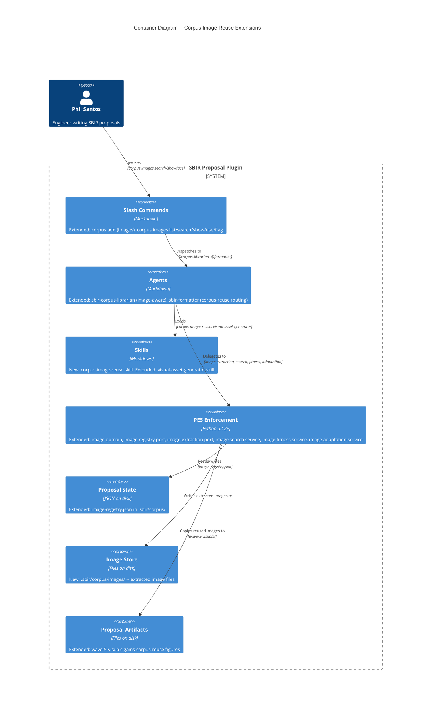
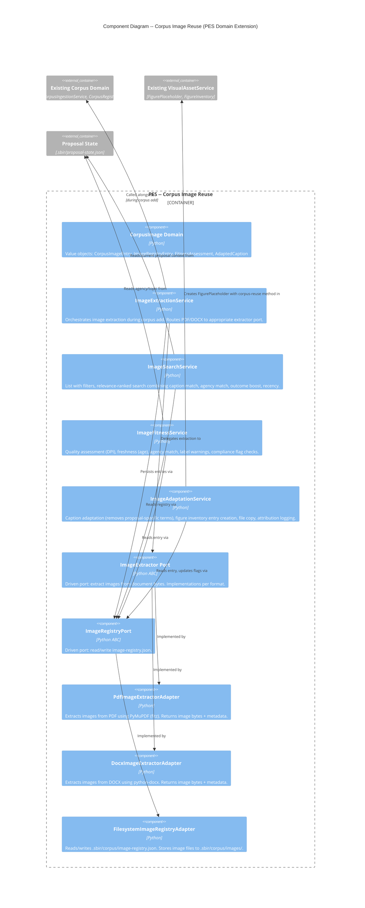

# Corpus Image Reuse -- Architecture Design

## System Context

Extends the SBIR Proposal Plugin's corpus subsystem with image extraction, indexing, search, fitness assessment, adaptation, and formatter integration. No new external systems. No new infrastructure. All state remains local JSON files + filesystem.

**Quality attributes (priority order):** Maintainability > Testability > Auditability > Time-to-market

**Constraints:** Solo developer, OOP ports-and-adapters, no server/database, Windows (Git Bash), Python 3.12+

---

## C4 System Context (Level 1)

No change to Level 1 diagram. Corpus Image Reuse operates entirely within the existing SBIR Proposal Plugin boundary. No new external systems are introduced.

---

## C4 Container (Level 2) -- Corpus Image Reuse Extensions



---

## C4 Component (Level 3) -- Corpus Image Reuse Domain



---

## Component Boundaries

| Component | Responsibility | Type | New/Extended |
|-----------|---------------|------|-------------|
| **CorpusImage domain** | Value objects for image entries, fitness assessments, adapted captions | Domain | New |
| **ImageExtractionService** | Orchestrate extraction during `corpus add`, route by format, handle failures, dedup by hash | Application service | New |
| **ImageSearchService** | Filter/list images, relevance-ranked search | Application service | New |
| **ImageFitnessService** | Quality/freshness/agency assessment, label warnings, compliance checks | Application service | New |
| **ImageAdaptationService** | Caption adaptation, file copy to artifacts, figure inventory entry, attribution | Application service | New |
| **ImageExtractor port** | Extract images from document bytes | Driven port | New |
| **ImageRegistryPort** | Read/write image-registry.json and image files | Driven port | New |
| **PdfImageExtractorAdapter** | PyMuPDF-based PDF image extraction | Adapter | New |
| **DocxImageExtractorAdapter** | python-docx-based DOCX image extraction | Adapter | New |
| **FilesystemImageRegistryAdapter** | JSON file read/write for image registry | Adapter | New |
| **CorpusIngestionService** | Extended: calls ImageExtractionService after text ingestion | Application service | Extended |
| **FigurePlaceholder** | Extended: accepts `generation_method: "corpus-reuse"` | Domain value object | Extended |
| **VisualAssetService** | Extended: routes "corpus-reuse" to review (skips generation) | Application service | Extended |
| **sbir-corpus-librarian agent** | Extended: image-aware commands (list, search, show, use, flag) | Agent (markdown) | Extended |
| **sbir-formatter agent** | Extended: recognizes corpus-reuse in figure inventory | Agent (markdown) | Extended |
| **corpus-image-reuse skill** | New skill: image search strategies, fitness criteria, adaptation heuristics | Skill (markdown) | New |
| **visual-asset-generator skill** | Extended: corpus-reuse method documentation | Skill (markdown) | Extended |

---

## Technology Stack

| Component | Technology | Version | License | Rationale |
|-----------|-----------|---------|---------|-----------|
| PDF image extraction | PyMuPDF (fitz) | >=1.24 | AGPL-3.0 (or commercial) | See ADR-020. Best extraction quality, handles most encodings, returns image bytes + metadata (DPI, format). pdfplumber and PyPDF2 lack reliable image extraction. |
| DOCX image extraction | python-docx | >=1.1 | MIT | Already referenced in codebase (`python_docx_adapter.py`). Provides `InlineShape` and embedded image access. |
| Image hashing | hashlib (stdlib) | N/A | PSF | SHA-256 consistent with existing corpus deduplication. |
| Image metadata | Pillow | >=10.0 | MIT-CMU (HPND) | Read DPI and resolution from extracted image bytes. Lightweight, widely maintained. |
| Image registry | JSON files | N/A | N/A | Consistent with existing state persistence (ADR-004). |

---

## Integration Patterns

### Extraction Integration (extends `corpus add`)

```
corpus add <directory>
    |
    v
CorpusIngestionService.ingest_directory()  -- existing text ingestion
    |
    +-- ImageExtractionService.extract_from_documents(new_entries)
            |
            +-- For each PDF: ImageExtractor.extract(path) -> list[RawImage]
            +-- For each DOCX: ImageExtractor.extract(path) -> list[RawImage]
            |
            +-- Classify each image (caption + context heuristics)
            +-- Assess quality (DPI from Pillow)
            +-- Deduplicate by SHA-256 content hash
            +-- Persist via ImageRegistryPort
            |
            v
        ImageExtractionResult (counts by type, quality, failures)
```

### Search and Assessment Integration

```
corpus images search "<query>" --agency USAF
    |
    v
ImageSearchService.search(query, filters, proposal_context)
    |
    +-- Read image-registry.json via ImageRegistryPort
    +-- Read proposal-state.json for current agency/topic
    +-- Score: caption_match * 0.4 + agency_match * 0.25 + outcome_boost * 0.2 + recency * 0.15
    +-- Return ranked results
```

### Adaptation and Formatter Integration

```
corpus images use <id> --section technical-approach --figure-number 3
    |
    v
ImageAdaptationService.adapt_for_reuse(image_id, section, figure_number)
    |
    +-- Read image entry from registry
    +-- Check compliance flags (block if flagged)
    +-- Copy image file to ./artifacts/wave-5-visuals/
    +-- Generate adapted caption (remove proposal-specific terms)
    +-- Create FigurePlaceholder(generation_method="corpus-reuse")
    +-- Record attribution in figure log
    +-- Return AdaptationResult

    ... later during Wave 5 ...

VisualAssetService.generate_figure(placeholder)
    |
    +-- if generation_method == "corpus-reuse":
    |       Skip generation
    |       Return FigureGenerationResult(review_status="pending-manual-review")
    +-- else: existing generation routing
```

### Image Registry Schema

Stored at `.sbir/corpus/image-registry.json`:

```json
{
  "schema_version": "1.0.0",
  "images": [
    {
      "id": "af243-001-p07-img01",
      "source_proposal": "AF243-001",
      "proposal_title": "...",
      "agency": "USAF",
      "outcome": "WIN",
      "page_number": 7,
      "section": "Technical Approach",
      "original_figure_number": 3,
      "caption": "Figure 3: CDES System Architecture...",
      "surrounding_text": "The proposed system architecture...",
      "figure_type": "system-diagram",
      "file_path": ".sbir/corpus/images/af243-001-p07-img01.png",
      "content_hash": "a3f2b7c...",
      "resolution_width": 2048,
      "resolution_height": 1536,
      "dpi": 300,
      "quality_level": "high",
      "size_bytes": 867328,
      "extraction_date": "2026-03-16",
      "origin_type": "company-created",
      "compliance_flag": null,
      "duplicate_sources": []
    }
  ]
}
```

### Figure Type Classification

Heuristic classification from caption text and surrounding context:

| Type | Caption indicators |
|------|-------------------|
| `system-diagram` | "system architecture", "block diagram", "system overview" |
| `trl-roadmap` | "TRL", "technology readiness", "maturation" |
| `org-chart` | "organization", "team structure", "management" |
| `schedule` | "schedule", "timeline", "Gantt", "milestone" |
| `concept-illustration` | "concept", "illustration", "deployment", "scenario" |
| `data-chart` | "chart", "graph", "performance data", "results" |
| `process-flow` | "process", "workflow", "flow", "sequence" |
| `unclassified` | No match -- valid default |

---

## Quality Attribute Strategies

### Maintainability

- **Ports-and-adapters throughout**: Every new infrastructure dependency (PDF extraction, DOCX extraction, image file storage) accessed through a driven port. Swapping PyMuPDF for another library requires only a new adapter.
- **Separate domain module**: `corpus_image.py` is a new file, not merged into `corpus.py`. Clean separation of text corpus and image corpus concerns.
- **Service composition**: `ImageExtractionService` is called by `CorpusIngestionService`, not embedded in it. Services compose; they do not inherit.

### Testability

- **ImageExtractor port**: Test extraction logic with in-memory stubs returning pre-built image bytes. No real PDFs in unit tests.
- **ImageRegistryPort**: Test search/fitness/adaptation with in-memory registry. No filesystem in unit tests.
- **Deterministic ID generation**: Image IDs derived from `{proposal_id}-p{page}-img{index}` -- predictable in tests.

### Auditability

- **Source attribution**: Every reused image records source proposal, original figure number, and method "corpus-reuse" in the figure log.
- **Compliance flags**: `corpus images flag <id>` marks images for compliance review. Flagged images blocked from reuse.
- **Immutable extraction metadata**: Once extracted, image registry entries are append-only. Compliance flags are additive, not destructive.

### Time-to-market

- **Extend, don't replace**: Reuse existing `CorpusIngestionService`, `FigurePlaceholder`, `VisualAssetService`, `FileVisualAssetAdapter`.
- **Heuristic classification**: Simple caption keyword matching. No ML, no external API. Good enough for SBIR figure types.
- **Existing agent extension**: Extend `sbir-corpus-librarian` and `sbir-formatter` agents rather than creating new agents (consistent with ADR-005 one-agent-per-role).

---

## Rejected Simple Alternatives

### Alternative 1: Manual image management (no extraction)

- **What**: Users manually export images from PDFs and place them in a known directory. Plugin indexes the directory.
- **Expected impact**: 60% -- search and reuse work, but extraction is manual (the largest pain point from JTBD scoring at 18.0).
- **Why insufficient**: The #1 opportunity is "minimize time to locate a relevant figure" (score 18.0). Manual extraction defeats the primary value proposition. Users already have this workflow and it takes 30-60 min per proposal.

### Alternative 2: Metadata-only registry (no image file storage)

- **What**: Store only metadata pointers back to original PDF page numbers. No extracted image files.
- **Expected impact**: 40% -- search works, but users must open the original PDF to view/copy the image.
- **Why insufficient**: Fitness assessment requires image resolution/DPI analysis (needs image bytes). Adaptation requires file copy to artifacts. Without extracted files, assessment and reuse are manual.

### Why the proposed solution is necessary

1. Simple alternatives fail because the core job is "extract + index + search + assess + adapt" as an integrated pipeline. Removing extraction removes the automation that justifies the feature.
2. Complexity is justified by the 5-service decomposition mapping cleanly to 5 user stories, each independently testable through ports.

---

## Roadmap

### Phase 01: Image Domain and Extraction (US-CIR-001)

```yaml
step_01-01:
  title: "Image domain model and registry port"
  description: "Domain value objects for image entries, extraction results, quality levels. Registry port for read/write. Filesystem registry adapter."
  stories: [US-CIR-001]
  acceptance_criteria:
    - "Image entry captures: source, page, caption, type, DPI, hash, compliance flag"
    - "Registry supports add, read-by-id, read-all, update-flag operations"
    - "Duplicate images (same hash) merge source proposals, not duplicate entries"
    - "Registry persists to .sbir/corpus/image-registry.json with atomic writes"
  architectural_constraints:
    - "Domain objects in scripts/pes/domain/corpus_image.py (separate from corpus.py)"
    - "Port in scripts/pes/ports/image_registry_port.py"
    - "Adapter in scripts/pes/adapters/filesystem_image_registry_adapter.py"

step_01-02:
  title: "PDF and DOCX image extraction"
  description: "ImageExtractor port with PDF adapter (PyMuPDF) and DOCX adapter (python-docx). Extract images with page/position metadata. Quality assessment via Pillow."
  stories: [US-CIR-001]
  acceptance_criteria:
    - "PDF extraction returns images with page number, position, surrounding text"
    - "DOCX extraction returns embedded images with relationship metadata"
    - "Quality assessment records DPI and resolution; levels: high/medium/low"
    - "Unsupported encodings logged per-image without blocking other extractions"
    - "Images stored as-extracted (PNG, JPEG) -- no format conversion"
  architectural_constraints:
    - "Port in scripts/pes/ports/image_extractor_port.py"
    - "PDF adapter in scripts/pes/adapters/pdf_image_extractor_adapter.py"
    - "DOCX adapter in scripts/pes/adapters/docx_image_extractor_adapter.py"

step_01-03:
  title: "Extraction service and corpus add integration"
  description: "ImageExtractionService orchestrates extraction, classification, dedup, and registry persistence. Integrated into corpus add flow alongside text ingestion."
  stories: [US-CIR-001]
  acceptance_criteria:
    - "corpus add extracts images alongside text ingestion"
    - "Images classified by figure type using caption/context heuristics"
    - "Extraction report includes image count by type and quality"
    - "Re-ingesting same directory does not duplicate existing images"
    - "Text-only documents report zero images without error"
  architectural_constraints:
    - "Service in scripts/pes/domain/image_extraction_service.py"
    - "CorpusIngestionService calls ImageExtractionService (composition, not inheritance)"
```

### Phase 02: Search, Browse, and Fitness (US-CIR-002, US-CIR-003)

```yaml
step_02-01:
  title: "Image search and browse"
  description: "ImageSearchService: list with filters (type, source, outcome, agency), relevance-ranked search combining caption match, agency match, outcome boost, recency."
  stories: [US-CIR-002]
  acceptance_criteria:
    - "corpus images list displays all images or filtered subset"
    - "Filters: --type, --source, --outcome, --agency"
    - "corpus images search returns relevance-ranked results"
    - "Empty results include actionable guidance"
    - "Empty catalog includes onboarding guidance"
  architectural_constraints:
    - "Service in scripts/pes/domain/image_search_service.py"
    - "Reads proposal-state.json for current agency/topic context"

step_02-02:
  title: "Image fitness assessment and compliance flagging"
  description: "ImageFitnessService: quality/freshness/agency assessment. Show command. Flag/unflag commands for compliance review."
  stories: [US-CIR-003]
  acceptance_criteria:
    - "corpus images show displays provenance, metadata, fitness, attribution"
    - "Quality: PASS (>=300 DPI), WARN (150-299), FAIL (<150)"
    - "Freshness: OK (<=12mo), WARNING (12-24mo), STALE (>24mo)"
    - "Caption analysis identifies proposal-specific terms as label warnings"
    - "corpus images flag records compliance concern in registry"
    - "Flagged images show compliance warning in all listings"
  architectural_constraints:
    - "Service in scripts/pes/domain/image_fitness_service.py"
```

### Phase 03: Adaptation and Formatter Integration (US-CIR-004, US-CIR-005)

```yaml
step_03-01:
  title: "Image adaptation and reuse selection"
  description: "ImageAdaptationService: caption adaptation, file copy, figure inventory entry, attribution. Block compliance-flagged images."
  stories: [US-CIR-004]
  acceptance_criteria:
    - "corpus images use copies image to ./artifacts/wave-5-visuals/"
    - "Caption adapted: proposal-specific terms removed/genericized"
    - "Original and adapted captions presented for human comparison"
    - "Manual review items listed for embedded image text"
    - "Figure inventory gains entry with generation_method: corpus-reuse"
    - "Compliance-flagged images blocked with clear error"
  architectural_constraints:
    - "Service in scripts/pes/domain/image_adaptation_service.py"
    - "Extends FigurePlaceholder to accept corpus-reuse method"

step_03-02:
  title: "Formatter corpus-reuse routing"
  description: "Extend VisualAssetService to recognize corpus-reuse method. Skip generation, present for review. Cross-reference validation includes corpus-reused figures."
  stories: [US-CIR-005]
  acceptance_criteria:
    - "Formatter recognizes generation_method: corpus-reuse, skips generation"
    - "Corpus-reuse figures presented with approve/revise/replace options"
    - "Approve changes status to approved for Wave 6 insertion"
    - "Replace converts to standard generation with method change logged"
    - "Cross-reference validation includes corpus-reused figures"
    - "Existing generation methods unaffected"
  architectural_constraints:
    - "Extended routing in VisualAssetService.generate_figure()"
    - "No change to FigureGenerator port -- corpus-reuse never invokes it"
```

### Phase 04: Agent and Skill Extensions

```yaml
step_04-01:
  title: "Agent and skill extensions for image-aware corpus and formatting"
  description: "Extend corpus-librarian agent with image commands. Add corpus-image-reuse skill. Extend formatter agent with corpus-reuse awareness. Extend visual-asset-generator skill."
  stories: [US-CIR-001, US-CIR-002, US-CIR-003, US-CIR-004, US-CIR-005]
  acceptance_criteria:
    - "corpus-librarian agent handles corpus images list/search/show/use/flag"
    - "corpus-image-reuse skill documents search strategies and fitness criteria"
    - "Formatter agent recognizes corpus-reuse in figure inventory"
    - "visual-asset-generator skill documents corpus-reuse method"
  architectural_constraints:
    - "Agent extensions stay within 400-line limit"
    - "New skill in skills/corpus-librarian/corpus-image-reuse.md"
    - "No new agents created (consistent with ADR-005)"
```

### Roadmap Summary

| Phase | Steps | Stories | Est. Production Files |
|-------|-------|---------|----------------------|
| 01 Domain + Extraction | 3 | US-CIR-001 | 7 (domain, port x2, adapter x3, service) |
| 02 Search + Fitness | 2 | US-CIR-002, US-CIR-003 | 2 (services) |
| 03 Adaptation + Formatter | 2 | US-CIR-004, US-CIR-005 | 2 (service, extended service) |
| 04 Agents + Skills | 1 | All 5 | 4 (2 agents, 2 skills -- markdown) |
| **Total** | **8** | **5 stories, 21 scenarios** | **~15** |

Step ratio: 8 / 15 = 0.53 (well under 2.5 threshold).

### Step-to-Story Traceability

| Step | Story | Scenarios |
|------|-------|-----------|
| 01-01 | US-CIR-001 | Registry CRUD, dedup, atomic writes |
| 01-02 | US-CIR-001 | PDF extraction, DOCX extraction, quality, failure handling |
| 01-03 | US-CIR-001 | Classification, ingestion integration, report |
| 02-01 | US-CIR-002 | List filtered, search ranked, empty results, empty catalog |
| 02-02 | US-CIR-003 | Full assessment, stale warning, compliance flag, low resolution |
| 03-01 | US-CIR-004 | Adapted caption, generic caption, flagged block, manual review |
| 03-02 | US-CIR-005 | Route to review, approve, replace, cross-reference |
| 04-01 | All | Agent commands, skill content |

---

## Dependency Graph (New Components)

```
image_extractor_port.py (driven port)
    |
    +-- pdf_image_extractor_adapter.py (PyMuPDF)
    +-- docx_image_extractor_adapter.py (python-docx)

image_registry_port.py (driven port)
    |
    +-- filesystem_image_registry_adapter.py

corpus_image.py (domain value objects)
    |
    +-- image_extraction_service.py (uses extractor port + registry port)
    +-- image_search_service.py (uses registry port + proposal state)
    +-- image_fitness_service.py (uses registry port + proposal state)
    +-- image_adaptation_service.py (uses registry port + visual_asset domain)
```

All dependencies point inward (adapters -> ports -> domain). No domain object imports infrastructure.

---

## ADR Index (New)

| ADR | Title | Status |
|-----|-------|--------|
| ADR-020 | PyMuPDF for PDF image extraction | Accepted |
| ADR-021 | Separate image registry from text corpus registry | Accepted |
| ADR-022 | Heuristic figure type classification | Accepted |
