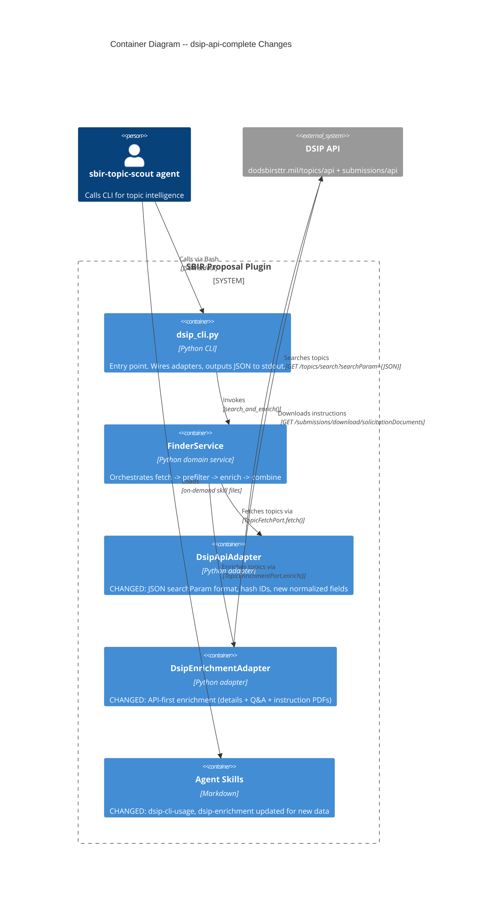
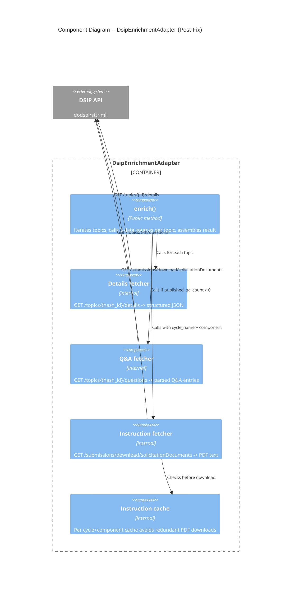

# Architecture Design: dsip-api-complete

## Summary

Fix DSIP API adapters to use correct query format and add 3 new API data sources (details, Q&A, instructions). No new architecture -- adapter-level changes behind existing ports.

## Quality Attributes (Ordered)

1. **Correctness** -- Search returns only matching topics; enrichment retrieves all 4 data types
2. **Testability** -- All adapter changes testable via mock HTTP transport; live fixtures recorded
3. **Maintainability** -- No new ports or domain objects; existing structure preserved

## Scope

- **Changed**: 2 adapters, 1 CLI, 2 skills, 1 agent (6 files)
- **Unchanged**: Ports, domain objects, finder service, scoring service
- **New files**: 0

## Existing System Analysis

### Current State

| Component | File | Issue |
|-----------|------|-------|
| DsipApiAdapter | `scripts/pes/adapters/dsip_api_adapter.py` | Uses flat `numPerPage`/`topicStatus` params. API silently returns all 32K topics. `_normalize_topic` missing hash ID, cycle_name, release_number, published_qa_count. |
| DsipEnrichmentAdapter | `scripts/pes/adapters/dsip_enrichment_adapter.py` | PDF-only enrichment. No `/details` API call, no `/questions` API call, no instruction PDF download. Q&A parsing from PDF text is lossy. |
| dsip_cli.py | `scripts/dsip_cli.py` | `_build_filters` passes flat `topicStatus` key. Output schema missing new fields. `detail` command assumes numeric ID. |
| dsip-cli-usage.md | `skills/topic-scout/dsip-cli-usage.md` | Documents numeric `topic_id: "68492"`. Describes PDF-only enrichment. |
| dsip-enrichment.md | `skills/topic-scout/dsip-enrichment.md` | Describes PDF-as-primary. No mention of `/details`, `/questions`, or instruction download endpoints. |
| sbir-topic-scout.md | `agents/sbir-topic-scout.md` | Minor -- no awareness of new data types for recommendation logic. |

### Port Interface Impact

| Port | Change Needed |
|------|--------------|
| `TopicFetchPort.fetch()` | **None** -- `filters: dict[str, str]` is generic enough. Adapter interprets filter values internally. |
| `TopicEnrichmentPort.enrich()` | **Signature change required** -- currently takes `topic_ids: list[str]`. Instruction downloads need `cycle_name`, `release_number`, `component` from search response. Must accept `topics: list[dict]` instead. |
| `EnrichmentResult` | **Fields expansion** -- completeness dict needs `solicitation_instructions` and `component_instructions` counts. Enriched dicts need new fields. |
| `FetchResult` | **None** -- topics list already `list[dict[str, Any]]`. |

### Integration Points

- `FinderService.search_and_enrich()` calls `enrichment_port.enrich(topic_ids=[...])` -- must change to pass full topic dicts
- `combine_topics_with_enrichment()` merges enrichment data -- must handle new fields
- `completeness_report()` must report 4 data types instead of 3

---

## C4 System Context (Level 1)

No change to system context. DSIP API is already an external system.

## C4 Container (Level 2) -- Affected Components

## C4 Component (Level 3) -- DsipEnrichmentAdapter Internal

---

## Technology Stack

No new dependencies. All already in use:

| Technology | Version | License | Usage |
|-----------|---------|---------|-------|
| httpx | >=0.24 | BSD-3-Clause | HTTP client for all API calls |
| pypdf | >=3.0 | BSD-3-Clause | PDF text extraction for instruction documents |
| pytest | >=7.0 | MIT | Unit and acceptance testing |

---

## Rejected Simpler Alternatives

### Alternative 1: Configuration-only fix (change URL params, no new endpoints)
- **What**: Fix only the search query format; keep PDF-only enrichment
- **Expected Impact**: 40% -- fixes search but Q&A and instructions remain unavailable
- **Why Insufficient**: Q&A and instruction data are the primary value-add for GO/NO-GO recommendations. PDF parsing cannot extract Q&A (it is not in the topic PDF).

### Alternative 2: Add details endpoint only, skip Q&A and instructions
- **What**: Fix search + add `/details` API call. Skip Q&A and instruction PDFs.
- **Expected Impact**: 60% -- structured descriptions replace lossy PDF parsing, but Q&A and instructions still missing
- **Why Insufficient**: Q&A reveals government intent (critical for scoring). Instructions define compliance requirements (critical for feasibility). Both are required for complete topic intelligence per outcome statements.

### Why Full Solution Necessary
1. All 4 data types are independent API calls -- no shared complexity
2. Each endpoint adds ~30 lines of adapter code -- marginal effort per endpoint
3. The user stories explicitly require all 4 data types based on JTBD analysis

---

## ADRs

### ADR-DSIP-01: Enrichment Port Signature Change

See `docs/adrs/ADR-DSIP-01-enrichment-port-signature.md`

### ADR-DSIP-02: API-First Enrichment Strategy

See `docs/adrs/ADR-DSIP-02-api-first-enrichment.md`
