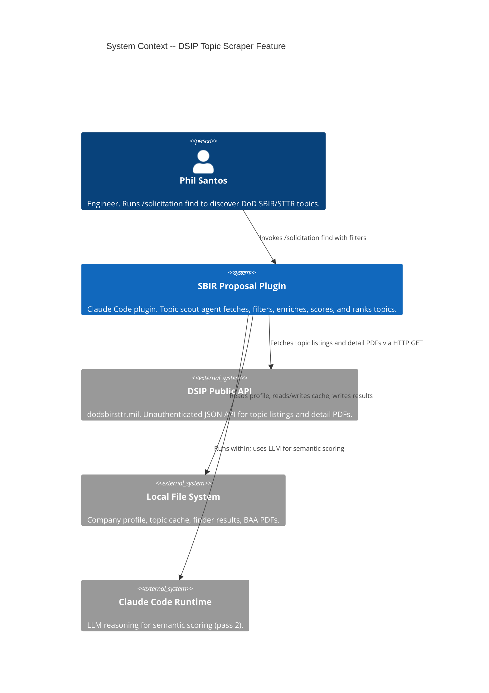

# DSIP Topic Scraper -- Feature Architecture

Feature: `dsip-topic-scraper`
Parent architecture: `docs/architecture/architecture.md`
ADRs: ADR-016 (DSIP API primary), ADR-017 (two-pass matching), ADR-018 (httpx), ADR-025 (enrichment), ADR-026 (topic cache)

---

## Existing System Analysis

### Already Implemented (Reuse)

| Component | File | Status |
|-----------|------|--------|
| `TopicFetchPort` | `scripts/pes/ports/topic_fetch_port.py` | Stable. Driven port with `fetch()` and `FetchResult`. |
| `DsipApiAdapter` | `scripts/pes/adapters/dsip_api_adapter.py` | Stable. Pagination, retry with exponential backoff, rate limiting, timeout. Uses httpx. |
| `BaaPdfAdapter` | `scripts/pes/adapters/baa_pdf_adapter.py` | Stable. Fallback `--file` source. |
| `FinderService` | `scripts/pes/domain/finder_service.py` | Stable. `search()` and `search_and_filter()` orchestrate fetch + pre-filter. |
| `KeywordPreFilter` | `scripts/pes/domain/keyword_prefilter.py` | Stable. Pure domain logic, capability keyword matching. |
| `TopicScoringService` | `scripts/pes/domain/topic_scoring.py` | Stable. Five-dimension scoring, `score_batch()`. |
| `TopicPursueService` | `scripts/pes/domain/topic_pursue_service.py` | Stable. Validates deadline, returns `PursueResult`. |
| `FinderResultsPort` | `scripts/pes/ports/finder_results_port.py` | Stable. `read()`, `write()`, `exists()`. |
| `JsonFinderResultsAdapter` | `scripts/pes/adapters/json_finder_results_adapter.py` | Stable. Atomic writes. |
| `TopicInfo` | `scripts/pes/domain/solicitation.py` | Stable. Frozen dataclass. |
| Topic Scout agent | `agents/sbir-topic-scout.md` | Stable. Phases: INGEST, PARSE, SCORE, RANK. |
| `/solicitation find` command | `commands/solicitation-find.md` | Stable. Dispatches to topic scout. |

### Existing Reference (Superseded by Existing Code)

| Component | File | Status |
|-----------|------|--------|
| Prototype scraper | `python_topic_scraper/scrape_dsip.py` | **Superseded.** DOM-based approach replaced by API-first in `DsipApiAdapter`. Enrichment logic (description extraction) is reference only. |

### New Components Needed

| Need | Justification |
|------|---------------|
| Topic enrichment port + adapter | No existing enrichment capability. `DsipApiAdapter.fetch()` returns metadata only; descriptions, instructions, and Q&A require per-topic detail fetching. |
| Topic cache port + adapter | No existing cache. `.sbir/dsip_topics.json` mentioned in user stories but not implemented. TTL-based freshness check needed. |
| Enrichment integration in FinderService | `search_and_filter()` currently returns metadata-only topics. Enrichment must occur between filter and score. |
| Progress reporting | `DsipApiAdapter` has `on_progress` callback but enrichment has no progress mechanism. |
| Structural change detection | `DsipApiAdapter._fetch_page()` raises on HTTP errors but does not detect API schema changes (missing `data` key). |

---

## C4 System Context (Level 1) -- DSIP Scraper Feature



---

## C4 Container (Level 2) -- Solicitation Discovery Pipeline

```mermaid
C4Container
    title Container Diagram -- Solicitation Discovery Pipeline

    Person(phil, "Phil Santos")

    System_Boundary(plugin, "SBIR Proposal Plugin") {
        Container(command, "/solicitation find", "Markdown command", "Entry point. Parses flags, dispatches to topic scout agent.")
        Container(agent, "Topic Scout Agent", "Markdown agent", "Orchestrates: fetch -> filter -> enrich -> score -> rank -> present.")
        Container(finder_svc, "FinderService", "Python", "Application service. Coordinates fetch, filter, cache check, enrichment, persist.")
        Container(prefilter, "KeywordPreFilter", "Python", "Pure domain. Keyword matching against profile capabilities.")
        Container(scoring_svc, "TopicScoringService", "Python", "Pure domain. Five-dimension fit scoring.")
        Container(pursue_svc, "TopicPursueService", "Python", "Application service. Topic selection and deadline validation.")
        Container(dsip_adapter, "DsipApiAdapter", "Python + httpx", "Driven adapter. DSIP API pagination, retry, rate limiting.")
        Container(enrich_adapter, "TopicEnrichmentAdapter", "Python + httpx", "Driven adapter. Per-topic PDF download and text extraction.")
        Container(cache_adapter, "TopicCacheAdapter", "Python", "Driven adapter. JSON file cache with TTL for topic data.")
        Container(baa_adapter, "BaaPdfAdapter", "Python", "Driven adapter. Fallback: extract topics from user-provided BAA PDF.")
        Container(results_adapter, "JsonFinderResultsAdapter", "Python", "Driven adapter. Atomic write of scored results.")
        Container(state, "Topic Cache + Results", "JSON files", ".sbir/dsip_topics.json (cache), .sbir/finder-results.json (results)")
    }

    System_Ext(dsip_api, "DSIP Public API", "dodsbirsttr.mil")
    System_Ext(claude_code, "Claude Code Runtime", "LLM")

    Rel(phil, command, "Invokes via CLI")
    Rel(command, agent, "Dispatches to @sbir-topic-scout")
    Rel(agent, finder_svc, "Calls search_and_filter_and_enrich()")
    Rel(finder_svc, dsip_adapter, "Fetches topic listings via TopicFetchPort")
    Rel(finder_svc, prefilter, "Pre-filters candidates")
    Rel(finder_svc, enrich_adapter, "Enriches candidates via TopicEnrichmentPort")
    Rel(finder_svc, cache_adapter, "Reads/writes cache via TopicCachePort")
    Rel(finder_svc, results_adapter, "Persists scored results via FinderResultsPort")
    Rel(agent, scoring_svc, "Scores enriched candidates")
    Rel(agent, pursue_svc, "Handles pursue flow")
    Rel(dsip_adapter, dsip_api, "HTTP GET /topics/api/public/topics/search")
    Rel(enrich_adapter, dsip_api, "HTTP GET /topics/api/public/topics/{id}/download/PDF")
    Rel(cache_adapter, state, "Reads/writes .sbir/dsip_topics.json")
    Rel(results_adapter, state, "Writes .sbir/finder-results.json")
    Rel(baa_adapter, state, "Reads user-provided BAA file")
```



---

## Component Architecture

### New Components

#### 1. TopicEnrichmentPort (Driven Port)

- **Responsibility**: Fetch detailed content (description, instructions, Q&A) for a list of topic IDs.
- **Boundary**: Port interface in `scripts/pes/ports/`. Returns enrichment data per topic. Reports completeness metrics.
- **Contract**: `enrich(topic_ids, on_progress) -> EnrichmentResult` where `EnrichmentResult` contains per-topic enrichment data, completeness counts, and any errors.

#### 2. DsipEnrichmentAdapter (Driven Adapter)

- **Responsibility**: Implements `TopicEnrichmentPort` using DSIP per-topic PDF download endpoint.
- **Boundary**: Adapter in `scripts/pes/adapters/`. Uses httpx (ADR-018).
- **Behavior**: Downloads topic PDF via `GET /topics/api/public/topics/{hash_id}/download/PDF`. Extracts description text, submission instructions, component instructions. Rate-limited (configurable delay between requests). Reports progress per topic. Logs failures per topic without stopping batch. Reports completeness metrics.
- **Note**: Q&A extraction may require DOM interaction via the Angular app; if the DSIP API exposes a Q&A endpoint, prefer that. Otherwise, Q&A is best-effort via PDF content parsing. The adapter should degrade gracefully when Q&A is not extractable from PDF.

#### 3. TopicCachePort (Driven Port)

- **Responsibility**: Read/write cached topic data with TTL-based freshness check.
- **Boundary**: Port interface in `scripts/pes/ports/`.
- **Contract**: `read() -> CacheResult | None`, `write(topics, metadata) -> None`, `is_fresh(ttl_hours) -> bool`

#### 4. JsonTopicCacheAdapter (Driven Adapter)

- **Responsibility**: Implements `TopicCachePort` using `.sbir/dsip_topics.json`.
- **Boundary**: Adapter in `scripts/pes/adapters/`. Atomic writes (temp + backup + rename).
- **Schema**: `{ scrape_date, source, ttl_hours, total_topics, enrichment_completeness, topics[] }`

#### 5. Enrichment domain logic (Domain)

- **Responsibility**: Combine fetch results with enrichment data. Validate enrichment completeness. Map enriched topic data to TopicInfo-compatible format for scoring.
- **Boundary**: Domain in `scripts/pes/domain/`. Pure logic, no I/O.

### Modified Components

#### FinderService (Extension)

- **Current**: `search()` and `search_and_filter()` -- fetch + pre-filter.
- **Extension**: Add orchestration method that includes cache check, enrichment, and completeness reporting. The new flow: check cache freshness -> if stale, fetch + pre-filter -> enrich candidates -> persist to cache -> return enriched candidates for scoring.
- **Note**: The scoring step remains in the agent layer (LLM semantic scoring) and `TopicScoringService` (quantitative scoring). FinderService orchestrates up to enrichment.

### Unchanged Components (No Modification)

- `TopicFetchPort` / `DsipApiAdapter` -- already handles listing fetch with pagination, retry, rate limiting
- `KeywordPreFilter` -- already handles keyword pre-filtering
- `TopicScoringService` -- already handles five-dimension scoring on enriched data
- `TopicPursueService` / `FinderResultsPort` / `JsonFinderResultsAdapter` -- already handle pursue flow and result persistence
- `BaaPdfAdapter` -- already handles `--file` fallback
- `TopicInfo` / `SolicitationParseResult` -- stable domain models
- `solicitation-find.md` command -- dispatches to topic scout agent (no change needed)

### Agent / Skill Updates

#### Topic Scout Agent (`agents/sbir-topic-scout.md`)

- **Update**: Phase 1 (INGEST) workflow updated to include cache check and enrichment steps. Agent should check cache freshness before fetching, offer to use cached data, and invoke enrichment for pre-filtered candidates.
- **Update**: Phase 3 (SCORE) workflow updated to use enriched descriptions for semantic scoring in addition to titles.

#### Topic Scout Skills (`skills/topic-scout/`)

- **New skill**: `dsip-enrichment.md` -- Domain knowledge for interpreting DSIP topic detail structure, Q&A format, and completeness assessment.

---

## Pipeline Flow

```
User: /solicitation find --agency "Air Force" --phase I
  |
  v
[1. Cache Check] -- TopicCachePort.is_fresh(ttl_hours=24)
  |                  If fresh: offer user choice (use cache / re-scrape)
  |                  If stale or absent: proceed to fetch
  v
[2. Fetch] -- TopicFetchPort.fetch(filters={agency, phase, status})
  |            DsipApiAdapter: paginated API calls, retry, rate limit
  |            Returns: FetchResult with metadata-only topics
  v
[3. Pre-Filter] -- KeywordPreFilter.filter(topics, capabilities)
  |                 Eliminates irrelevant topics by keyword match
  |                 Returns: FilterResult with candidates
  v
[4. Enrich] -- TopicEnrichmentPort.enrich(candidate_ids, on_progress)
  |             DsipEnrichmentAdapter: per-topic PDF download + extraction
  |             Returns: EnrichmentResult with descriptions, instructions, Q&A
  |             Reports progress: [N/total] TOPIC-ID [ok/warn]
  v
[5. Cache Write] -- TopicCachePort.write(enriched_topics, metadata)
  |                  Persists to .sbir/dsip_topics.json with scrape_date
  v
[6. Score] -- TopicScoringService.score_batch(enriched_topics, profile)
  |            Five-dimension fit scoring with enriched descriptions
  |            Returns: list[ScoredTopic] sorted by composite descending
  v
[7. Rank & Display] -- Agent presents ranked table
  |                     GO / EVALUATE / NO-GO recommendations
  |                     Completeness metrics: Descriptions N/M | Instructions N/M | Q&A N/M
  v
[8. Persist] -- FinderResultsPort.write(scored_results)
  |              .sbir/finder-results.json with atomic write
  v
[9. Pursue (optional)] -- TopicPursueService.pursue(topic_id)
                           Validates deadline, returns PursueResult for /proposal new
```

---

## Technology Stack (New Dependencies)

| Component | Technology | License | Rationale |
|-----------|-----------|---------|-----------|
| HTTP client (enrichment) | httpx 0.27+ | BSD-3-Clause | Already in use by `DsipApiAdapter` (ADR-018). Reuse for enrichment HTTP calls. |
| PDF text extraction | PyPDF2 / pypdf 4.x | BSD-3-Clause | Extract description text from per-topic PDF downloads. Lightweight, pure Python, well-maintained (pypdf: 8K+ stars). No heavyweight dependencies. |

No new proprietary dependencies. No Playwright dependency -- the API-first approach (ADR-016) eliminates the need for headless browser. The prototype's DOM scraping approach is fully superseded by `DsipApiAdapter` + per-topic PDF download.

---

## Quality Attribute Strategies

### Reliability (US-DSIP-004)

- **Retry with exponential backoff**: Already in `DsipApiAdapter._fetch_page()`. Enrichment adapter reuses same pattern.
- **Per-topic failure isolation**: Enrichment failures logged and skipped. Remaining topics continue. Completeness metrics reported.
- **Structural change detection**: API response validated for expected keys (`total`, `data`). Missing keys trigger what/why/do error with diagnostic data saved to `.sbir/dsip_debug_response.json`.
- **Graceful degradation**: Partial enrichment results are usable. Missing descriptions reduce scoring confidence but don't block pipeline.

### Performance

- **Cache with TTL**: Avoids redundant API calls within configurable window (default 24 hours).
- **Pre-filter before enrich**: Only enriches candidate topics (20-50), not all fetched topics (300-500). Enrichment is the expensive operation (1 HTTP request per topic).
- **Rate limiting**: Configurable delay between enrichment requests to respect DSIP rate limits.

### Observability (US-DSIP-004)

- **Progress reporting**: Each pipeline phase reports progress via callback. No user-facing silence > 10 seconds.
- **Completeness metrics**: Descriptions N/M, Instructions N/M, Q&A N/M reported after enrichment.
- **Diagnostic data**: On structural change, raw API response saved to `.sbir/dsip_debug_response.json`.
- **Error messages**: All errors follow what/why/do pattern (existing convention).

### Maintainability

- **Ports-and-adapters**: New enrichment and cache functionality behind port interfaces. Adapter implementation swappable without domain changes.
- **Domain purity**: Enrichment data combination and validation in domain layer, no I/O.
- **Existing pattern reuse**: Same atomic write pattern, same progress callback pattern, same retry pattern as existing code.

### Testability

- **Port isolation**: `TopicEnrichmentPort` and `TopicCachePort` are abstract interfaces. Tests mock ports, not HTTP calls.
- **Pure domain logic**: Enrichment combination, completeness calculation, field mapping -- all testable without I/O.
- **Existing test patterns**: Follow same structure as existing PES tests in `tests/`.

---

## File Layout (New/Modified)

```
scripts/pes/
  ports/
    topic_enrichment_port.py     # NEW: TopicEnrichmentPort interface
    topic_cache_port.py          # NEW: TopicCachePort interface
  adapters/
    dsip_enrichment_adapter.py   # NEW: DSIP per-topic PDF enrichment
    json_topic_cache_adapter.py  # NEW: .sbir/dsip_topics.json cache
  domain/
    topic_enrichment.py          # NEW: enrichment combination + validation
    finder_service.py            # MODIFIED: add cache/enrich orchestration

skills/
  topic-scout/
    dsip-enrichment.md           # NEW: DSIP topic detail structure knowledge

agents/
  sbir-topic-scout.md            # MODIFIED: Phase 1 cache check, Phase 2 enrichment
```

Estimated production files: 5 new + 2 modified = 7 files

---

## Rejected Simple Alternatives

### Alternative 1: Enrich all topics (no pre-filter before enrichment)

- **What**: Skip pre-filter, enrich all 300-500 topics from API.
- **Expected Impact**: 100% enrichment completeness.
- **Why Insufficient**: 300-500 HTTP requests x 1-2 second delay = 5-17 minutes for enrichment alone. Exceeds 10-minute target. Wastes effort on irrelevant topics. Pre-filter reduces to 20-50 candidates.

### Alternative 2: Cache only (no enrichment, use titles only)

- **What**: Cache API metadata, score on titles only, no per-topic detail fetch.
- **Expected Impact**: Eliminates enrichment latency entirely.
- **Why Insufficient**: Titles alone are insufficient for meaningful scoring (US-DSIP-002 core requirement). "Compact Directed Energy for C-UAS" title doesn't reveal TRL expectations, teaming requirements, or phase expectations. The functional job is providing full detail for go/no-go decisions.

### Why Complex Solution Necessary

1. Simple alternatives fail: title-only scoring misses the core user need (detailed topic evaluation).
2. Complexity justified: enrichment is the primary value-add over manual portal browsing. Cache + TTL amortizes the enrichment cost across sessions.

---

## Roadmap

### Phase 01: Enrichment Infrastructure (US-DSIP-002, US-DSIP-004)

```yaml
step_01-01:
  title: "Topic enrichment port and adapter"
  description: "Driven port for per-topic detail fetching. Adapter downloads topic PDFs from DSIP API and extracts description, instructions, Q&A text."
  stories: [US-DSIP-002, US-DSIP-004]
  acceptance_criteria:
    - "Enrichment port accepts topic IDs and returns per-topic detail data"
    - "Each enriched topic includes description, instructions, and Q&A when available"
    - "Individual topic enrichment failures logged without stopping batch"
    - "Completeness metrics reported: description/instruction/Q&A counts"
    - "Progress reported per topic during enrichment"
  architectural_constraints:
    - "Port interface in scripts/pes/ports/"
    - "Adapter uses httpx (ADR-018) with retry and rate limiting"
    - "Rate-limited: configurable delay between per-topic requests"

step_01-02:
  title: "Topic cache port and adapter with TTL"
  description: "Driven port for topic data caching. Adapter persists enriched topics to .sbir/dsip_topics.json with TTL-based freshness check."
  stories: [US-DSIP-003]
  acceptance_criteria:
    - "Cache persists enriched topic data with scrape_date and source metadata"
    - "Freshness check returns stale when cache exceeds configurable TTL"
    - "Cache write uses atomic temp-backup-rename pattern"
    - "Missing or corrupt cache handled gracefully"
  architectural_constraints:
    - "Port interface in scripts/pes/ports/"
    - "Adapter writes to .sbir/dsip_topics.json"
    - "Follows existing atomic write pattern from JsonFinderResultsAdapter"
```

### Phase 02: Pipeline Integration (US-DSIP-001, US-DSIP-003)

```yaml
step_02-01:
  title: "FinderService enrichment orchestration"
  description: "Extend FinderService to orchestrate cache check, enrichment of pre-filtered candidates, and cache persistence in the search pipeline."
  stories: [US-DSIP-001, US-DSIP-003]
  acceptance_criteria:
    - "Fresh cache offered to user; stale cache triggers re-fetch"
    - "Pre-filtered candidates enriched before scoring"
    - "Enriched results persisted to cache after enrichment"
    - "Partial enrichment failures produce usable results with completeness report"
  architectural_constraints:
    - "FinderService gains TopicEnrichmentPort and TopicCachePort dependencies"
    - "Existing search() and search_and_filter() remain backward-compatible"

step_02-02:
  title: "Structural change detection and diagnostics"
  description: "Detect DSIP API response schema changes. Save diagnostic data. Produce what/why/do error messages."
  stories: [US-DSIP-004]
  acceptance_criteria:
    - "Missing expected API keys detected and reported"
    - "Raw response saved to .sbir/dsip_debug_response.json on structural change"
    - "Error messages follow what/why/do pattern with --file fallback suggestion"
    - "No user-facing silence longer than 10 seconds during any pipeline phase"
  architectural_constraints:
    - "Detection in DsipApiAdapter (existing) and DsipEnrichmentAdapter (new)"
    - "Diagnostic file written via adapter, not domain"
```

### Phase 03: Agent and Skill Integration (US-DSIP-001, US-DSIP-002, US-DSIP-003)

```yaml
step_03-01:
  title: "Topic scout agent and skill updates"
  description: "Update topic scout agent workflow for cache check and enrichment. New DSIP enrichment skill with topic detail structure knowledge."
  stories: [US-DSIP-001, US-DSIP-002, US-DSIP-003]
  acceptance_criteria:
    - "Agent checks cache freshness before fetching"
    - "Agent reports enrichment completeness after enrichment phase"
    - "Enriched descriptions used in LLM semantic scoring"
    - "DSIP enrichment skill loadable by topic scout agent"
  architectural_constraints:
    - "Agent markdown only; no Python changes"
    - "Skill in skills/topic-scout/dsip-enrichment.md"
```

### Roadmap Summary

| Phase | Steps | Stories | Est. Production Files |
|-------|-------|---------|----------------------|
| 01 Enrichment Infrastructure | 2 | US-DSIP-002, US-DSIP-003, US-DSIP-004 | 4 |
| 02 Pipeline Integration | 2 | US-DSIP-001, US-DSIP-003, US-DSIP-004 | 2 |
| 03 Agent & Skill | 1 | US-DSIP-001, US-DSIP-002, US-DSIP-003 | 2 |
| **Total** | **5** | **4 stories, 17 scenarios** | **~7** (5 new + 2 modified) |

Step ratio: 5 / 7 = 0.71 (well under 2.5 threshold).

### Step-to-Story Traceability

| Step | Stories | Scenarios Covered |
|------|---------|-------------------|
| 01-01 | US-DSIP-002, US-DSIP-004 | Enrich full detail, no Q&A, failure recovery, completeness, progress |
| 01-02 | US-DSIP-003 | Cache reuse, freshness check |
| 02-01 | US-DSIP-001, US-DSIP-003 | End-to-end fetch, pagination, integration, cache reuse, missing fields |
| 02-02 | US-DSIP-004 | Structural change, diagnostic save, timeout, retry |
| 03-01 | US-DSIP-001, US-DSIP-002, US-DSIP-003 | Agent workflow, skill loading, enriched scoring |

---

## ADR Index (Feature-Scoped)

| ADR | Title | Status |
|-----|-------|--------|
| ADR-016 | DSIP Public API as Primary Data Source | Accepted (existing) |
| ADR-017 | Two-Pass Matching (Keyword Pre-Filter + LLM Scoring) | Accepted (existing) |
| ADR-018 | httpx as HTTP Client | Accepted (existing) |
| ADR-025 | Per-Topic PDF Download for Enrichment | Proposed |
| ADR-026 | File-Based Topic Cache with TTL | Proposed |

See `docs/adrs/` for full ADR documents.
