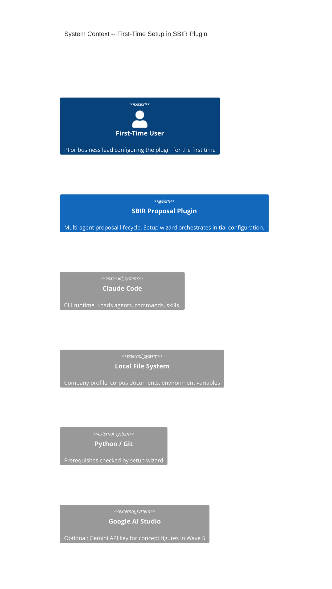
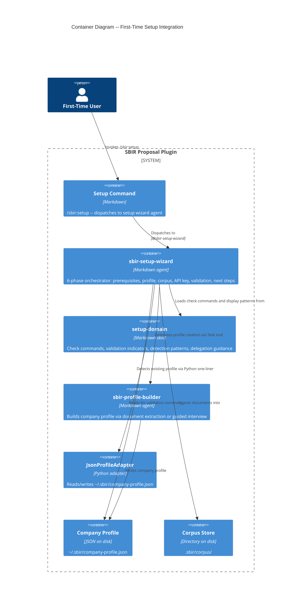

# Architecture Document: First-Time Setup

## System Context

The first-time setup wizard guides new users through complete SBIR plugin configuration in one interactive session. It orchestrates prerequisite checks, company profile creation (via delegation to sbir-profile-builder), corpus document ingestion, API key detection, and a unified validation summary. The emotional arc moves from anxious to confident through progressive visible checkmarks.

**Implementation type**: Markdown artifacts only (1 agent, 1 command, 1 skill). No new Python services. Delegates to existing agents and adapters.

---

## C4 System Context (Level 1)



---

## C4 Container (Level 2)



---

## Component Architecture

### Component Boundaries

| Component | File | Responsibility | Type |
|-----------|------|---------------|------|
| **Command** | `commands/sbir-setup.md` | Entry point. Dispatches to setup wizard agent. No arguments. | New |
| **Agent** | `agents/sbir-setup-wizard.md` | Orchestrates 6-phase setup flow. Enforces sequential gates. Delegates profile creation. | New |
| **Skill** | `skills/setup-wizard/setup-domain.md` | Domain knowledge: prerequisite check commands, validation indicators, profile/corpus detection patterns, Gemini config instructions. | New |
| **Profile agent** | `agents/sbir-profile-builder.md` | Existing agent invoked via Task tool for profile creation/update. | Existing (reused) |
| **Profile adapter** | `scripts/pes/adapters/json_profile_adapter.py` | Existing adapter used for profile existence detection. | Existing (reused) |

### Why Single Agent (Not Split)

The setup flow is a linear 6-phase sequence where each phase gates the next. Splitting into multiple agents would require orchestration overhead and break the single-session UX goal. The wizard delegates to sbir-profile-builder for the one complex sub-task (profile creation) while handling the simpler steps directly.

### Data Flow

```
Python / Git environment ─────────┐
                                    │
~/.sbir/company-profile.json ─────┤
                                    │
.sbir/corpus/ ────────────────────┤
                                    │
$GEMINI_API_KEY ──────────────────┤
                                    ▼
                    ┌─────────────────────────────────┐
                    │   sbir-setup-wizard               │
                    │                                    │
                    │  Phase 1: PREREQUISITES             │
                    │    → check Python 3.12+, Git, CC    │
                    │    → gate: all pass or halt          │
                    │                                    │
                    │  Phase 2: COMPANY PROFILE            │
                    │    → detect existing profile          │
                    │    → delegate to sbir-profile-builder │
                    │    → gate: profile exists             │
                    │                                    │
                    │  Phase 3: CORPUS SETUP               │
                    │    → accept directory paths or skip   │
                    │    → incremental ingestion            │
                    │                                    │
                    │  Phase 4: API KEY                    │
                    │    → detect GEMINI_API_KEY or skip    │
                    │                                    │
                    │  Phase 5: VALIDATION SUMMARY         │
                    │    → re-verify all items              │
                    │    → compute READY / READY (warnings) │
                    │                                    │
                    │  Phase 6: NEXT STEPS                 │
                    │    → display concrete commands        │
                    └─────────────────────────────────────┘
                               │
              ┌────────────────┼────────────────┐
              ▼                ▼                ▼
  ~/.sbir/company-     .sbir/corpus/     User proceeds to
  profile.json         (populated)       /sbir:solicitation find
```

---

## Integration Points

### Upstream: Existing Components Reused

| Component | Integration | Required |
|-----------|------------|----------|
| sbir-profile-builder agent | Invoked via Task tool for profile creation/update | Yes (for new profile) |
| JsonProfileAdapter | Python one-liner for profile existence detection | Yes |
| Corpus ingestion logic | Reused for document ingestion | Yes (if user has docs) |

### Downstream: What Setup Enables

| Consumer | Dependency | Mechanism |
|----------|-----------|-----------|
| sbir-topic-scout | Company profile for fit scoring | Reads `~/.sbir/company-profile.json` |
| sbir-solicitation-finder | Company profile for keyword matching | Reads `~/.sbir/company-profile.json` |
| All Wave 0+ agents | Corpus documents for context | Reads `.sbir/corpus/` |
| sbir-visual-asset-generator | Gemini API key for concept figures | Reads `$GEMINI_API_KEY` env var |

### PES Integration

No new PES rules needed. Setup wizard operates before any proposal is created. Existing PES enforcement activates when the user creates their first proposal via `/sbir:proposal new`.

---

## Agent Workflow Design

### Phase 1: PREREQUISITES

- Display welcome banner with estimated time (10-15 minutes)
- Check Python version via Bash (`python --version`, fall back to `python3 --version`)
- Check Git version via Bash (`git --version`)
- Claude Code auth: always passes (user is interacting)
- Display results using `[ok]` / `[!!]` indicators
- **Gate**: All prerequisites pass. Any failure halts with fix instructions.

### Phase 2: COMPANY PROFILE

- Detect existing profile via JsonProfileAdapter Python one-liner
- Existing profile: offer keep / update / fresh / quit
- No profile: explain fit scoring context, offer mode selection (documents / interview / both)
- Invoke sbir-profile-builder via Task tool
- After return: re-read profile, display summary
- **Gate**: Profile exists and is valid. Cancel exits setup.

### Phase 3: CORPUS SETUP

- Ask if user has past proposals/debriefs
- Accept comma-separated directory paths
- Validate each path, ingest supported documents
- Report: ingested count, skipped count, already-indexed count
- Skip option available with add-later guidance
- **Gate**: Corpus ingested or explicitly skipped.

### Phase 4: API KEY

- Check `$GEMINI_API_KEY` environment variable
- Present: confirm and continue automatically
- Absent: explain optional nature (Wave 5 only), offer skip or configure instructions
- **Gate**: Status recorded. Not a blocker.

### Phase 5: VALIDATION SUMMARY

- Re-verify all items (do not trust cached results)
- Display unified checklist with `[ok]` / `[!!]` / `[--]` indicators
- Compute overall status: READY or READY (with warnings)
- **Gate**: Validation complete.

### Phase 6: NEXT STEPS

- Display concrete commands: `/sbir:solicitation find`, `/sbir:proposal new`, `/sbir:proposal status`
- Note re-run capability: `/sbir:setup` to update configuration

---

## Error Handling

| Condition | Behavior |
|-----------|----------|
| Python < 3.12 or not found | Display version and fix link. Halt setup. |
| Git not found | Display fix link with PATH note. Halt setup. |
| Profile builder cancellation | Display "Run /sbir:setup later to resume." Exit cleanly. |
| Invalid corpus directory path | Display error, offer retry or skip. |
| Empty corpus directory | Display "No supported documents found." Offer retry or skip. |
| SAM.gov inactive in profile | Warning in validation: `[!!]` with NO-GO consequence note. |
| GEMINI_API_KEY absent | Informational in validation: `[--]` with Wave 5 note. |

---

## Quality Attribute Strategies

### Idempotency
- Every phase detects existing configuration before acting
- Re-running `/sbir:setup` never overwrites without consent
- Corpus ingestion is incremental (content-hash deduplication)
- Profile offers keep/update/fresh options

### Cancel Safety
- User can quit at any phase
- No partial state written on quit
- Completed steps (saved profile, ingested corpus) persist because they were atomically written by their respective agents

### Usability
- Target: under 15 minutes for first-time, under 30 seconds for returning user
- Progressive confidence via visible checkmarks after each step
- Same indicator pattern (`[ok]`/`[!!]`/`[--]`) throughout
- Error messages follow what/why/what-to-do pattern
- NO_COLOR environment variable respected

### Reliability
- Profile writes delegated to profile builder (uses atomic write pattern)
- Corpus writes use existing ingestion pipeline
- Validation re-checks rather than trusting cached state

### Testability
- 28 BDD scenarios defined in journey feature file
- 22 UAT scenarios across 5 user stories
- Agent behavior validated via manual walkthrough (markdown agent, no unit tests)

---

## ADR Index

No new ADRs required. First-time setup reuses existing architectural patterns:
- Delegation to specialist agents (established in C2)
- JsonProfileAdapter for profile detection (established in company-profile-builder)
- Atomic write pattern for state persistence (established in C1)
