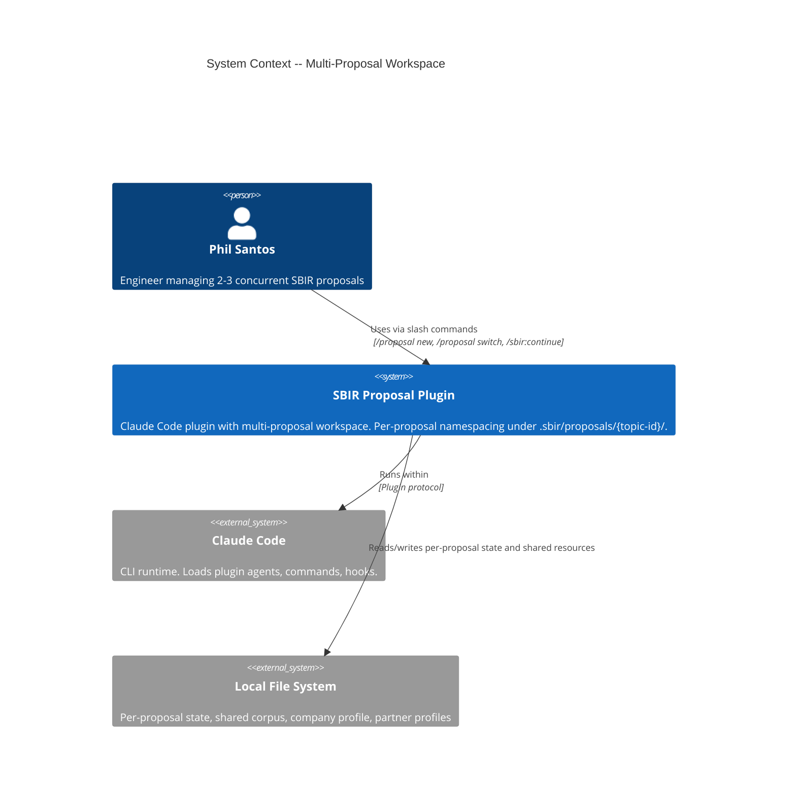
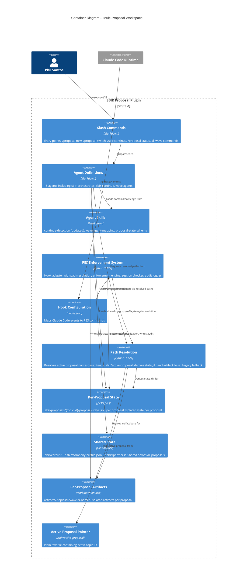
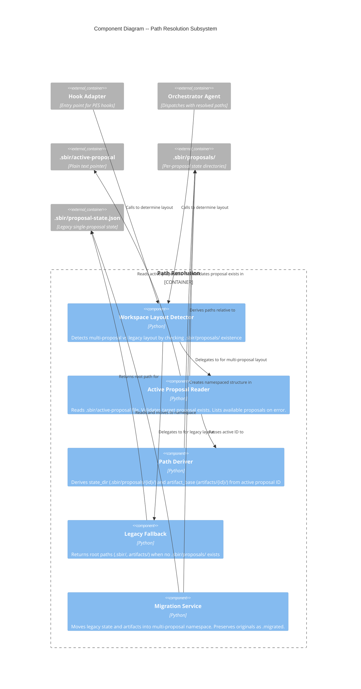

# Architecture Design: Multi-Proposal Workspace

## Overview

Brownfield extension to add per-proposal namespacing. Core change: a path resolution layer between the hook adapter entry point and existing parameterized adapters. The domain layer and ports are unchanged. This is an adapter-layer concern.

---

## C4 System Context (Level 1)



---

## C4 Container (Level 2)



---

## C4 Component (Level 3) -- Path Resolution Subsystem



---

## Component Architecture

### Two Delivery Surfaces

This plugin has two distinct delivery surfaces with different implementation patterns:

1. **Python code** (`scripts/pes/`): Hook enforcement logic invoked by Claude Code hooks via `hooks.json`. Delivered via TDD with pytest. Only PES hooks execute Python — agents never call Python directly.

2. **Markdown artifacts** (`agents/`, `commands/`, `skills/`): Agent behavioral specifications, slash command definitions, and domain knowledge files. Agents are Claude Code subagents that use Claude's tools (Read, Glob, Bash) to interact with the filesystem. New agents/commands are created via `/nw:forge`; existing ones are edited directly.

**Key boundary**: Agents enumerate proposals by globbing `.sbir/proposals/*/proposal-state.json` and reading each file. There is no Python "enumeration service" — that logic lives in the agent's behavioral specification and supporting skill. Python path resolution exists only for PES hook enforcement scoping.

### Change Classification

| Component | Surface | Change Type | Delivery Method | Rationale |
|-----------|---------|-------------|-----------------|-----------|
| Path Resolution (NEW) | Python | New adapter module | `code/tdd` | Central path derivation for PES hook enforcement |
| `hook_adapter.main()` | Python | Modify | `code/tdd` | Replace hardcoded `.sbir` with path resolver call |
| Migration logic (NEW) | Python | New adapter module | `code/tdd` | File copy/rename operations for legacy-to-multi migration |
| `proposal-switch` command (NEW) | Markdown | New command | `forge/command` | Dispatch switch to orchestrator agent |
| `sbir-continue` agent | Markdown | Modify | `agent/edit` | Add multi-proposal dashboard behavior |
| `sbir-orchestrator` agent | Markdown | Modify | `agent/edit` | Add switch routing, resolved path conventions |
| `proposal-new` command | Markdown | Modify | `command/edit` | Add `--name` flag docs, multi-proposal context |
| `continue-detection` skill | Markdown | Modify | `skill/edit` | Multi-proposal detection priority, dashboard patterns |
| `wave-agent-mapping` skill | Markdown | Modify | `skill/edit` | Add `proposal switch` to command routing table |
| `proposal-state-patterns` skill | Markdown | Modify | `skill/edit` | Document multi-proposal path conventions |
| Multi-proposal dashboard skill (NEW) | Markdown | New skill | `forge/skill` | Dashboard enumeration patterns, display templates, corruption handling |
| All wave agents (12) | Markdown | Modify (pattern) | `agent/edit` (batch) | Path references updated to use orchestrator-provided context |
| `JsonStateAdapter` | Python | None | — | Already parameterized with `state_dir` |
| `FileAuditAdapter` | Python | None | — | Already parameterized with `audit_dir` |
| Domain layer (rules, services) | Python | None | — | Operates on state dict, path-agnostic |
| Enforcement engine | Python | None | — | Receives state dict, no path awareness |

### Key Architectural Advantage

The existing ports-and-adapters architecture already parameterizes `JsonStateAdapter(state_dir)` and `FileAuditAdapter(audit_dir)`. The path resolution layer produces these parameters. No domain or port changes needed. The Python change is strictly in how the adapter composition root (`hook_adapter.main()`) determines paths for PES enforcement.

Agent-side path resolution is a behavioral convention, not Python code: the orchestrator reads `.sbir/active-proposal`, derives paths, and passes them to specialist agents in the dispatch context.

### Integration Pattern: Path Resolution Flow

```
Command invoked / Hook fires
    |
    v
Path Resolver
    |-- Check: .sbir/proposals/ exists?
    |       YES -> Read .sbir/active-proposal
    |              |-- File exists? Validate proposal dir exists
    |              |-- Return: state_dir=.sbir/proposals/{id}/, artifact_base=artifacts/{id}/
    |       NO  -> Check: .sbir/proposal-state.json exists?
    |              |-- YES -> Legacy mode: state_dir=.sbir/, artifact_base=artifacts/
    |              |-- NO  -> Fresh workspace: create multi-proposal layout
    |
    v
Consumer (hook_adapter / orchestrator / agent)
    |-- Passes state_dir to JsonStateAdapter
    |-- Passes audit_dir to FileAuditAdapter
    |-- Passes artifact_base to agent dispatch context
```

### Multi-Proposal Dashboard Flow

The dashboard is agent behavior, not Python code. The `sbir-continue` agent uses Claude's tools (Glob, Read) to enumerate and display proposals.

```
/sbir:continue
    |
    v
sbir-continue agent (Markdown behavioral spec)
    |-- Check: .sbir/proposals/ exists? (Glob tool)
    |       MULTI -> Glob .sbir/proposals/*/proposal-state.json
    |                |-- Read each state file (Read tool, catch corruption per-proposal)
    |                |-- Read .sbir/active-proposal for active indicator
    |                |-- Sort by deadline proximity
    |                |-- Separate active vs completed
    |                |-- Display table + deadline-driven suggestion
    |       LEGACY -> Current single-proposal display (unchanged)
    |       FRESH  -> Welcome message (unchanged)
```

### Proposal Creation Flow (Multi-Proposal)

```
/proposal new <solicitation>
    |
    v
Path Resolver detects layout
    |-- MULTI or FRESH -> Create .sbir/proposals/{topic-id}/
    |                      |-- Check collision: dir already exists? Error with --name hint
    |                      |-- Create proposal-state.json in namespace
    |                      |-- Write .sbir/active-proposal = {topic-id}
    |                      |-- Create artifacts/{topic-id}/
    |-- LEGACY -> Prompt: migrate or separate workspace
    |              |-- MIGRATE -> Migration service moves existing proposal
    |                             Then create new proposal in namespace
```

---

## Quality Attribute Strategies

### Backward Compatibility (Priority 1 -- CRITICAL)

- Layout detection is the first operation in path resolution
- Legacy path (no `.sbir/proposals/`) returns root paths identically to current behavior
- No `.sbir/proposals/` directory created in legacy workspaces during normal operations
- Migration is opt-in, triggered only by explicit `/proposal new` in legacy workspace

### Maintainability (Priority 2)

- Single path resolution entry point consumed by all components
- Path resolver is a pure function: inputs (CWD, filesystem state) -> outputs (state_dir, artifact_base)
- No scattered path-construction logic; DRY centralization

### Reliability (Priority 3)

- Per-proposal state isolation: corrupted state in one proposal cannot affect others
- Dashboard catches corruption per-proposal and displays error row, not crash
- Migration preserves originals as `.migrated` safety net
- Active-proposal pointer is plain text (resilient, human-editable)

### Testability

- Path resolver is infrastructure-independent (reads directory structure, returns strings)
- All existing adapter tests remain valid (JsonStateAdapter still receives state_dir)
- New tests focus on path resolution logic and layout detection

---

## Deployment Impact

No deployment changes. Same `claude plugin install` mechanism. Plugin detects workspace layout at runtime. No database, no server, no infrastructure changes.

---

## ADR Index (New)

| ADR | Title | Status |
|-----|-------|--------|
| ADR-030 | Active proposal pointer mechanism | Proposed |
| ADR-031 | Path resolution strategy | Proposed |
| ADR-032 | Legacy migration approach | Proposed |

See `docs/adrs/` for full ADR documents.
