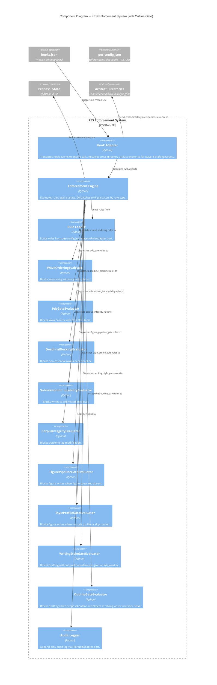

# Outline Gate Enforcement -- Architecture Design

## Overview

One new PES evaluator enforces the outline prerequisite for Wave 4 drafting. Blocks Write/Edit to wave-4-drafting/ when proposal-outline.md does not exist in the sibling wave-3-outline/ directory.

**Incident**: SF25D-T1201 session -- writer agent fabricated section structure in wave-4-drafting/ ignoring the approved outline in wave-3-outline/. Markdown instructions were present but the agent bypassed them.

**Approach**: Brownfield extension of existing PES enforcement system. Follows existing evaluator pattern exactly. One new adapter pattern: cross-directory artifact resolution (deriving wave-3-outline/ from wave-4-drafting/ target path). See ADR-046.

---

## C4 System Context (Level 1)

No change to system context. PES enforcement system already exists and intercepts all Claude Code tool invocations. The new evaluator adds one rule within the existing system boundary.

---

## C4 Container (Level 2)

No change to container diagram. The PES Enforcement System container gains one new internal component (evaluator) but its external interfaces remain identical:
- Input: PreToolUse hook events (JSON stdin)
- Output: ALLOW/BLOCK decisions (exit code + JSON stdout)

---

## C4 Component (Level 3) -- PES Enforcement System (Updated)

---

## Key Design Decision: Cross-Directory Artifact Resolution

See **ADR-046** for full rationale.

**Summary**: The adapter extends `resolve_tool_context()` to derive the sibling wave-3-outline/ path from a wave-4-drafting/ target:

1. Detect `wave-4-drafting/` in the normalized file_path (existing detection)
2. Replace the `wave-4-drafting` segment with `wave-3-outline` to get the sibling directory
3. Check for `proposal-outline.md` at the derived path
4. Pass result as `outline_artifacts_present: ["proposal-outline.md"]` (or empty list) in `tool_context`

Works for both multi-proposal (`artifacts/{topic-id}/wave-4-drafting/` -> `artifacts/{topic-id}/wave-3-outline/`) and legacy (`artifacts/wave-4-drafting/` -> `artifacts/wave-3-outline/`) layouts.

---

## Evaluator Behavior Summary

### OutlineGateEvaluator

- **Triggers when**: file_path targets `wave-4-drafting/`, and `proposal-outline.md` is NOT in `outline_artifacts_present`
- **Does not trigger when**: file_path is outside `wave-4-drafting/`, OR `proposal-outline.md` exists in `outline_artifacts_present`
- **No prerequisite creation exception**: Unlike FigurePipelineGateEvaluator which allows writing figure-specs.md itself, the writer agent never writes to wave-3-outline/ -- only the outliner does
- **No skip marker**: Unlike WritingStyleGateEvaluator and StyleProfileGateEvaluator, there is no skip path
- **Block message**: Includes guidance to complete the outline in Wave 3 and the path to wave-3-outline/

---

## Integration Points

| Integration Point | Direction | Description |
|---|---|---|
| Hook Adapter -> Engine | Extended | `tool_context` gains `outline_artifacts_present` field |
| Engine._evaluators | Extended | 9th evaluator: `"outline_gate"` -> `OutlineGateEvaluator()` |
| pes-config.json | Extended | 12th rule: `"drafting-requires-outline"` with type `"outline_gate"` |
| Hook Adapter -> Filesystem | New pattern | Cross-directory resolution: wave-4 path -> wave-3 sibling check |

---

## Quality Attribute Strategies

| Attribute | Strategy |
|---|---|
| **Testability** | Pure domain evaluator with no I/O. Cross-directory existence passed as data. TDD with pytest. |
| **Maintainability** | Follows existing evaluator pattern exactly. One ADR documents the new cross-directory resolution. |
| **Auditability** | All decisions (block and allow) recorded in audit log via existing engine audit path. |
| **Reliability** | Unknown rule_types silently return False (existing safety). Missing tool_context defaults to empty dict. |

---

## Deployment Architecture

No deployment changes. One new Python file loaded by existing import machinery. pes-config.json gains one rule. No new dependencies, no new infrastructure.
