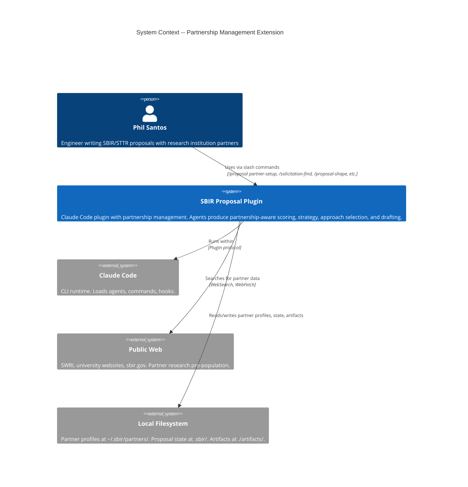
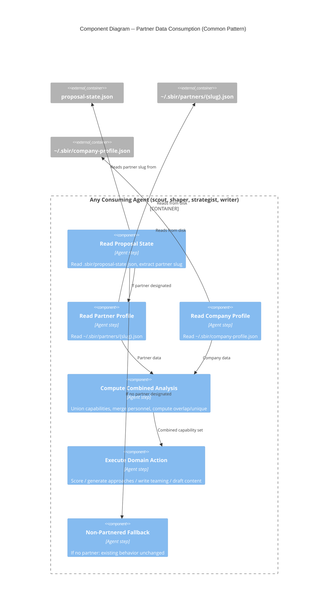

# Architecture Document: Partnership Management

## Feature ID

partnership-management

## System Context

The SBIR Proposal Plugin is a Claude Code plugin -- agents (markdown), skills (markdown), commands (markdown), and PES enforcement (Python). Partnership management extends this plugin with partner profile data, a new agent, new skills, new commands, and modifications to 4 existing agents so that partner capabilities become visible across the entire proposal lifecycle.

**Key constraint**: This is NOT a software application. There are no APIs, no containers, no microservices. The "components" are markdown agent files, skill files, command files, and JSON data schemas. The "integration" is agents reading JSON files from disk.

---

## C4 System Context (Level 1)



---

## C4 Container (Level 2) -- Partnership Data Flow

```mermaid
C4Container
    title Container Diagram -- Partnership Management Data Flow

    Person(phil, "Phil Santos", "Engineer")

    System_Boundary(plugin, "SBIR Proposal Plugin") {
        Container(cmd_partner_setup, "/proposal partner-setup", "Command (md)", "Dispatches to partner-builder for profile creation/update")
        Container(cmd_partner_screen, "/proposal partner-screen", "Command (md)", "Dispatches to partner-builder in screening mode")
        Container(cmd_partner_set, "/proposal partner-set", "Command (md)", "Changes designated partner in proposal state")
        Container(cmd_proposal_new, "/proposal new", "Command (md)", "Extended: STTR partner prompt")
        Container(cmd_solicit_find, "/solicitation-find", "Command (md)", "Existing: triggers partnership-aware scoring")
        Container(cmd_shape, "/proposal-shape", "Command (md)", "Existing: triggers partnership-aware approaches")
        Container(cmd_strategy, "/proposal-wave-strategy", "Command (md)", "Existing: triggers partnership-aware teaming")
        Container(cmd_draft, "/proposal-draft", "Command (md)", "Existing: triggers partnership-aware drafting")

        Container(agent_partner, "sbir-partner-builder", "Agent (md)", "NEW: Partner profile interview, web research, validation, combined capability preview")
        Container(agent_scout, "sbir-topic-scout", "Agent (md)", "MODIFIED: Dual-column scoring (solo vs. partnership)")
        Container(agent_shaper, "sbir-solution-shaper", "Agent (md)", "MODIFIED: Combined capabilities in approach generation, work split")
        Container(agent_strategist, "sbir-strategist", "Agent (md)", "MODIFIED: Auto-generated teaming section from partner profile")
        Container(agent_writer, "sbir-writer", "Agent (md)", "MODIFIED: Partnership content in draft sections")

        Container(skill_partner, "partner-builder/partner-domain", "Skill (md)", "NEW: Partner profile schema, interview guidance, validation rules")
        Container(skill_scoring, "topic-scout/fit-scoring-methodology", "Skill (md)", "MODIFIED: Partnership scoring methodology")
        Container(skill_approach, "solution-shaper/approach-evaluation", "Skill (md)", "MODIFIED: Partnership approach scoring, work split")
        Container(skill_strategy, "strategist/sbir-strategy-knowledge", "Skill (md)", "MODIFIED: Teaming section from partner data")
        Container(skill_state, "common/proposal-state-schema", "Skill (md)", "MODIFIED: Partner designation field")

        Container(partner_profiles, "Partner Profiles", "JSON on disk", "~/.sbir/partners/{slug}.json -- one per partner")
        Container(partner_schema, "Partner Profile Schema", "JSON Schema", "templates/partner-profile-schema.json")
        Container(proposal_state, "Proposal State", "JSON on disk", ".sbir/proposal-state.json -- extended with partner field")
        Container(screening_results, "Screening Results", "JSON on disk", ".sbir/partner-screenings/{slug}.json")
    }

    Rel(phil, cmd_partner_setup, "Creates/updates partner profiles")
    Rel(phil, cmd_partner_screen, "Screens new partner readiness")
    Rel(phil, cmd_proposal_new, "Starts proposal, selects partner for STTR")

    Rel(cmd_partner_setup, agent_partner, "Dispatches to")
    Rel(cmd_partner_screen, agent_partner, "Dispatches to (screening mode)")
    Rel(cmd_partner_set, proposal_state, "Updates partner designation")
    Rel(cmd_proposal_new, proposal_state, "Writes partner designation for STTR")

    Rel(agent_partner, partner_profiles, "Writes validated profiles to")
    Rel(agent_partner, partner_schema, "Validates against")
    Rel(agent_partner, screening_results, "Writes screening results to")

    Rel(agent_scout, partner_profiles, "Reads for combined scoring")
    Rel(agent_scout, proposal_state, "Reads designated partner")
    Rel(agent_shaper, partner_profiles, "Reads for approach generation")
    Rel(agent_shaper, proposal_state, "Reads designated partner")
    Rel(agent_strategist, partner_profiles, "Reads for teaming section")
    Rel(agent_strategist, proposal_state, "Reads designated partner")
    Rel(agent_writer, partner_profiles, "Reads for draft content")
    Rel(agent_writer, proposal_state, "Reads designated partner")

    Rel(cmd_solicit_find, agent_scout, "Dispatches to")
    Rel(cmd_shape, agent_shaper, "Dispatches to")
    Rel(cmd_strategy, agent_strategist, "Dispatches to")
    Rel(cmd_draft, agent_writer, "Dispatches to")
```



---

## C4 Component (Level 3) -- Partner Data Consumption Pattern

All 4 consuming agents follow the same pattern for reading partner data. This warrants a component-level view to ensure consistency.



---

## Component Architecture

### New Components

| Component | Type | File Path | Responsibility |
|-----------|------|-----------|---------------|
| **sbir-partner-builder** | Agent | `agents/sbir-partner-builder.md` | Partner profile interview, web research, validation, combined preview, screening mode |
| **partner-domain** | Skill | `skills/partner-builder/partner-domain.md` | Partner profile schema, field-by-field interview guidance, validation rules, STTR eligibility |
| **partner-profile-schema** | Schema | `templates/partner-profile-schema.json` | JSON Schema for partner profile validation |
| **proposal-partner-setup** | Command | `commands/proposal-partner-setup.md` | Entry point for `/proposal partner-setup` |
| **proposal-partner-screen** | Command | `commands/proposal-partner-screen.md` | Entry point for `/proposal partner-screen` |
| **proposal-partner-set** | Command | `commands/proposal-partner-set.md` | Entry point for `/proposal partner-set {slug}` |

### Modified Components

| Component | Type | File Path | Modification |
|-----------|------|-----------|-------------|
| **sbir-topic-scout** | Agent | `agents/sbir-topic-scout.md` | Add partnership scoring: dual-column display, combined SME, partnership STTR validation |
| **sbir-solution-shaper** | Agent | `agents/sbir-solution-shaper.md` | Add partner capabilities to approach generation, work split percentages, STTR 30% enforcement |
| **sbir-strategist** | Agent | `agents/sbir-strategist.md` | Add teaming section auto-generation from partner profile data |
| **sbir-writer** | Agent | `agents/sbir-writer.md` | Add partner references in draft sections (names, facilities, capabilities from profile) |
| **fit-scoring-methodology** | Skill | `skills/topic-scout/fit-scoring-methodology.md` | Add partnership scoring methodology, dual-column computation |
| **approach-evaluation** | Skill | `skills/solution-shaper/approach-evaluation.md` | Add combined capability scoring, work split schema |
| **sbir-strategy-knowledge** | Skill | `skills/strategist/sbir-strategy-knowledge.md` | Add partner-profile-driven teaming section template |
| **proposal-state-schema** | Skill | `skills/common/proposal-state-schema.md` | Add `partner` field documentation |
| **proposal-new** | Command | `commands/proposal-new.md` | Add STTR partner selection prompt |

### Data Models

#### Partner Profile Schema (`~/.sbir/partners/{slug}.json`)

Extends the company profile pattern with partner-specific fields:

```json
{
  "partner_name": "string",
  "partner_slug": "string (derived: lowercase, hyphens)",
  "partner_type": "university | federally_funded_rdc | nonprofit_research",
  "capabilities": ["keyword1", "keyword2"],
  "key_personnel": [
    {
      "name": "string",
      "role": "Co-PI | Researcher | Lab Director | etc.",
      "expertise": ["keyword1", "keyword2"]
    }
  ],
  "facilities": [
    {
      "name": "string",
      "description": "string (optional)"
    }
  ],
  "past_collaborations": [
    {
      "agency": "string",
      "topic_area": "string",
      "outcome": "WIN | LOSS | ONGOING",
      "year": "integer (optional)"
    }
  ],
  "sttr_eligibility": {
    "qualifies": true,
    "minimum_effort_capable": true,
    "notes": "string (optional)"
  },
  "created_at": "ISO-8601",
  "updated_at": "ISO-8601"
}
```

**Design rationale**: Mirrors company profile structure for familiarity. `partner_type` enables STTR eligibility validation. `facilities` is partner-specific (company profile lacks this). `past_collaborations` captures joint history (not the partner's independent past performance, which is not our data to store).

#### Proposal State Extension

Add to `.sbir/proposal-state.json`:

```json
{
  "partner": {
    "slug": "cu-boulder | null",
    "designated_at": "ISO-8601 | null"
  }
}
```

`null` for non-partnered proposals. All consuming agents check this field. Missing field treated as `null` for backward compatibility with existing proposals.

#### Screening Results Schema (`.sbir/partner-screenings/{slug}.json`)

```json
{
  "partner_name": "string",
  "screened_at": "ISO-8601",
  "topic_id": "string | null",
  "signals": {
    "timeline_commitment": "ok | caution | unknown",
    "bandwidth": "ok | caution | unknown",
    "sbir_experience": "ok | caution | unknown",
    "poc_assignment": "ok | caution | unknown",
    "scope_agreement": "ok | caution | unknown"
  },
  "capability_fit": "high | medium | low | not_assessed",
  "recommendation": "proceed | proceed_with_caution | do_not_proceed",
  "next_steps": ["string"],
  "risks": ["string"]
}
```

---

## Integration Patterns

### Partner Profile Discovery Pattern

All consuming agents discover partner profiles the same way:

1. Read `proposal-state.json` for `partner.slug`
2. If `slug` is null or missing: use current non-partnered behavior (unchanged)
3. If `slug` is present: read `~/.sbir/partners/{slug}.json`
4. If partner file missing: warn and fall back to non-partnered behavior
5. If partner file present: read company profile, compute combined analysis, proceed with partnership-aware behavior

This pattern ensures graceful degradation. No agent breaks when partner data is absent.

### Combined Capability Analysis (Computed at Runtime)

Each consuming agent computes the combined capability set independently:

- **Union of capabilities**: `company.capabilities + partner.capabilities` (deduplicated)
- **Union of personnel expertise**: `company.key_personnel[].expertise + partner.key_personnel[].expertise`
- **Overlap detection**: keywords appearing in both profiles
- **Unique-to-company**: keywords only in company profile
- **Unique-to-partner**: keywords only in partner profile

This is stateless computation from two JSON files. No caching required given the small data size.

### STTR Compliance Enforcement

STTR compliance is enforced at multiple points:

| Point | Enforcement | Agent |
|-------|------------|-------|
| Topic scoring | STTR dimension validates partner type | sbir-topic-scout |
| Approach generation | Work split >= 30% for partner | sbir-solution-shaper |
| Strategy brief | Teaming section states explicit STTR percentage | sbir-strategist |
| Proposal new | STTR topic prompts partner selection | orchestrator via proposal-new |

### Content Traceability Pattern

All generated partnership content follows the traceability rule from the shared artifacts registry:

- Personnel names match partner profile exactly (no paraphrasing)
- Facility names match partner profile exactly
- Capability keywords from partner profile (not synonyms)
- Source attribution cites partner profile file (e.g., `[Source: cu-boulder.json]`)

---

## Technology Stack

No new technology. All new components use existing plugin conventions:

| Component | Technology | Rationale |
|-----------|-----------|-----------|
| Partner builder agent | Markdown with YAML frontmatter | Existing agent convention |
| Partner domain skill | Markdown | Existing skill convention |
| Partner profile schema | JSON Schema | Mirrors company-profile-schema.json |
| Partner profiles | JSON files on disk | Mirrors company-profile.json pattern |
| Screening results | JSON files on disk | Same persistence pattern |
| Commands | Markdown with YAML frontmatter | Existing command convention |

No new Python PES code is required. Partner profile validation could use the existing `JsonProfileAdapter` pattern with a partner-specific schema, but this is a crafter decision (implementation HOW).

---

## Quality Attribute Strategies

### Maintainability (Priority 1)

- **Mirror pattern**: Partner builder mirrors company profile builder. Developers familiar with one understand the other.
- **Shared skill pattern**: `proposal-state-schema` is the single source of truth for the partner field. All agents reference it.
- **Graceful degradation**: Every modified agent has a non-partnered fallback path, preserving backward compatibility.

### Usability (Priority 2)

- **Familiar UX**: Partner setup mirrors `/proposal-profile-setup` flow. Same phases (mode select, research, gather, preview, validate and save).
- **Pre-population**: Web research reduces manual data entry for known institutions.
- **Combined preview**: Partner setup shows the combined capability analysis immediately, demonstrating value before save.
- **Automatic propagation**: Once a partner is designated in proposal state, all agents use it automatically. No per-command configuration.

### Reliability (Priority 3)

- **Atomic writes**: Partner profiles use the same write-to-tmp, backup-to-bak, rename pattern as company profiles.
- **Schema validation**: Every partner profile validated before write. Invalid profiles never persisted.
- **Cancel safety**: Cancel at any point writes no files (hard invariant, same as company profile builder).
- **Backward compatibility**: Existing proposals without `partner` field continue to work (null default).

### Data Integrity

- **Single source of truth**: Partner profile at `~/.sbir/partners/{slug}.json` is the only source. All agents read from there.
- **Name consistency**: Personnel and facility names in generated content must exactly match the partner profile. Agents do not paraphrase.
- **Work split consistency**: Percentages in approach brief propagate to strategy brief and draft. Inconsistencies flagged.

---

## Rejected Simple Alternatives

### Alternative 1: Extend company profile with partner data

- **What**: Add a `partners[]` array to `~/.sbir/company-profile.json` instead of creating separate partner files.
- **Expected impact**: 60% of the problem (profile storage works, but combined analysis and per-partner management become awkward).
- **Why insufficient**: Company profile is a single-entity document shared across all proposals. Partners are per-relationship entities that may be used with different proposals. Separate files enable listing, updating, and deleting partners independently. The company profile schema is already established and validated -- adding a nested partner array would require migrating all existing profiles.

### Alternative 2: No new agent -- extend profile-builder to handle partners

- **What**: Add partner interview capability to the existing `sbir-profile-builder` agent.
- **Expected impact**: 80% of the problem (same interview UX, same validation pattern).
- **Why insufficient**: The profile-builder agent is already at ~300 lines. Adding partner-specific sections (facilities, past collaborations, STTR eligibility, combined preview), screening mode, and partner management (list/update/delete) would exceed the 400-line nWave agent limit. The two agents share a pattern but have distinct domain knowledge (company fit scoring vs. partnership complementarity). Separate agents with separate skills is the established plugin convention (ADR-005: one agent per domain role).

### Why the proposed solution is necessary

1. Simple alternatives fail because partner profiles have different lifecycles and different consumers than company profiles. Partners are per-relationship, not per-company.
2. Complexity is justified by the cross-cutting integration: 4 existing agents need partnership awareness, and a single well-defined partner profile schema serves all of them consistently.

---

## Roadmap

### Implementation Phases

#### Phase 01: Foundation -- Partner Profile Builder (US-PM-001)

```yaml
step_01-01:
  title: "Partner profile schema and builder agent"
  description: "New agent and skill for partner profile creation. Conversational interview with web research, schema validation, atomic write to ~/.sbir/partners/{slug}.json."
  stories: [US-PM-001]
  acceptance_criteria:
    - "Partner interview covers 6 sections: basics, capabilities, personnel, facilities, past collaborations, STTR eligibility"
    - "Web research pre-populates draft data for known institutions"
    - "Preview shows combined capability analysis (company + partner)"
    - "Schema validation runs before every save; invalid profiles never written"
    - "Cancel at any point writes no files"
  architectural_constraints:
    - "Partner profiles stored at ~/.sbir/partners/{slug}.json"
    - "Schema defined in templates/partner-profile-schema.json"
    - "Agent mirrors sbir-profile-builder pattern"
```

#### Phase 02: State Wiring -- Partner Designation (US-PM-006)

```yaml
step_02-01:
  title: "Partner designation in proposal state"
  description: "Extend proposal state with partner field. STTR topics prompt partner selection during /proposal new. New /proposal partner-set command for mid-proposal changes."
  stories: [US-PM-006]
  acceptance_criteria:
    - "Proposal state includes partner slug (or null for non-partnered)"
    - "STTR topics prompt partner selection during /proposal new"
    - "All consuming agents read partner from proposal state"
    - "No partner profiles triggers helpful prompt, not error"
    - "Partner change warns about stale artifacts"
  architectural_constraints:
    - "Proposal state schema extended in skills/common/proposal-state-schema.md"
    - "Missing partner field treated as null (backward compatible)"
    - "New command: commands/proposal-partner-set.md"
```

#### Phase 03: First Integration -- Partnership-Aware Scoring and Strategy (US-PM-002, US-PM-003)

```yaml
step_03-01:
  title: "Partnership-aware topic scoring"
  description: "Topic scout displays dual-column scoring (solo vs. partnership). Combined SME from union of company + partner capabilities. STTR dimension validates partner type."
  stories: [US-PM-002]
  acceptance_criteria:
    - "Scoring shows solo and partnership columns when partner profiles exist"
    - "Delta column highlights score differences per dimension"
    - "Partnership SME uses union of company + partner capability keywords"
    - "Recommendation elevation (EVALUATE to GO) explicitly noted"
    - "No partner profiles = current behavior"
  architectural_constraints:
    - "Partner profiles read from ~/.sbir/partners/*.json"
    - "Modifications to sbir-topic-scout agent and fit-scoring-methodology skill"

step_03-02:
  title: "Partnership-aware strategy brief"
  description: "Strategist auto-generates teaming section from partner profile. Names personnel, lists facilities, shows capability complementarity and work split."
  stories: [US-PM-003]
  acceptance_criteria:
    - "Teaming section auto-generated from partner profile when partner designated"
    - "Personnel names match partner profile exactly"
    - "Capability complementarity matrix shows both entities"
    - "Missing partner fields flagged, not blocking"
    - "Non-partnered proposals retain current behavior"
  architectural_constraints:
    - "Strategist reads designated partner from proposal state"
    - "Modifications to sbir-strategist agent and sbir-strategy-knowledge skill"
```

#### Phase 04: Deep Integration -- Approaches and Drafting (US-PM-004, US-PM-007)

```yaml
step_04-01:
  title: "Partnership-aware approach generation"
  description: "Solution shaper uses combined capabilities for approach generation. Each approach includes work split. STTR 30% minimum enforced."
  stories: [US-PM-004]
  acceptance_criteria:
    - "Approach generation uses combined capability set"
    - "Each approach shows work split percentages"
    - "Approaches reference specific partner capabilities and personnel"
    - "STTR 30% minimum enforced on work splits"
    - "Non-partnered proposals retain current behavior"
  architectural_constraints:
    - "Modifications to sbir-solution-shaper agent and approach-evaluation skill"
    - "Work split percentages stored in approach-brief.md"

step_04-02:
  title: "Partnership content in proposal drafting"
  description: "Writer agent references partner name, personnel, facilities, and capabilities in draft sections. All references trace to partner profile."
  stories: [US-PM-007]
  acceptance_criteria:
    - "Draft sections reference partner name, personnel, facilities from profile"
    - "Personnel names in draft match partner profile exactly"
    - "Work split in draft matches strategy brief"
    - "Non-partnered proposals retain current behavior"
    - "Sparse partner data used as-is without fabrication"
  architectural_constraints:
    - "Writer reads designated partner profile from proposal state"
    - "Writer reads strategy brief teaming section as input"
```

#### Phase 05: Screening (US-PM-005)

```yaml
step_05-01:
  title: "New partner readiness screening"
  description: "Lightweight screening command assesses 5 readiness signals. Produces risk-assessed recommendation. Results saveable for later reference."
  stories: [US-PM-005]
  acceptance_criteria:
    - "Screening covers 5 signals: timeline, bandwidth, SBIR experience, POC, scope"
    - "Recommendation is PROCEED, PROCEED WITH CAUTION, or DO NOT PROCEED"
    - "Concrete next steps provided for CAUTION recommendations"
    - "Results saveable to .sbir/partner-screenings/{slug}.json"
    - "Screening transitions to /proposal partner-setup on proceed"
  architectural_constraints:
    - "New command: commands/proposal-partner-screen.md"
    - "Dispatches to sbir-partner-builder agent in screening mode"
    - "Screening results stored project-level, not global"
```

### Roadmap Summary

| Phase | Steps | Stories | Est. Production Files |
|-------|-------|---------|----------------------|
| 01 Foundation | 1 | US-PM-001 | 4 (agent, skill, schema, command) |
| 02 State Wiring | 1 | US-PM-006 | 3 (state schema skill, proposal-new cmd, partner-set cmd) |
| 03 First Integration | 2 | US-PM-002, US-PM-003 | 4 (2 agents, 2 skills modified) |
| 04 Deep Integration | 2 | US-PM-004, US-PM-007 | 4 (2 agents, 2 skills modified) |
| 05 Screening | 1 | US-PM-005 | 1 (command, reuses agent from Phase 01) |
| **Total** | **7** | **7 stories** | **~16** |

Step ratio: 7 / 16 = 0.44 (well under 2.5 threshold).

### Step-to-Story Traceability

| Step | Story | Priority |
|------|-------|----------|
| 01-01 | US-PM-001 (Partner Profile Builder) | Must Have |
| 02-01 | US-PM-006 (Partner Designation) | Must Have |
| 03-01 | US-PM-002 (Partnership Scoring) | Should Have |
| 03-02 | US-PM-003 (Partnership Strategy) | Must Have |
| 04-01 | US-PM-004 (Partnership Approaches) | Should Have |
| 04-02 | US-PM-007 (Partnership Drafting) | Should Have |
| 05-01 | US-PM-005 (Partner Screening) | Could Have |

---

## ADR Index

| ADR | Title | Status |
|-----|-------|--------|
| ADR-027 | Separate partner-builder agent (not extension of profile-builder) | Accepted |
| ADR-028 | Partner profiles as separate files per partner | Accepted |
| ADR-029 | Partner designation in proposal state (not per-command) | Accepted |

See `docs/adrs/` for full ADR documents.
