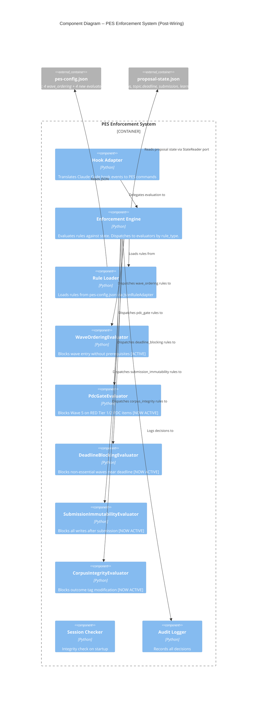

# Architecture: PES Enforcement Wiring

## Summary

Wire 4 dormant PES evaluators (PDC gate, deadline blocking, submission immutability, corpus integrity) by adding rule entries to `templates/pes-config.json`. All evaluators exist, are registered in `engine.py`, and have unit tests. The primary change is JSON configuration.

---

## C4 System Context (Level 1)

No change from existing architecture. The system boundary, actors, and external systems remain identical. PES enforcement wiring is entirely internal to the plugin.

---

## C4 Container (Level 2)

No new containers. The change affects the **PES Enforcement System** container and **Proposal State** container (config file).

---

## C4 Component (Level 3) -- PES Enforcement System (Updated)

The component diagram remains structurally identical. What changes is the **data flow** -- 4 new rules flow from `pes-config.json` through `Rule Registry` into `Enforcement Engine`, activating 4 evaluators that were previously dormant.



---

## What Changes Where

### Primary Change: `templates/pes-config.json`

Add 4 rule entries to the existing `rules` array. Each rule activates a dormant evaluator by matching its `rule_type` to the engine dispatch in `engine.py._rule_triggers()`.

**New rules to add:**

| rule_id | rule_type | Key Condition Fields | Activates |
|---------|-----------|---------------------|-----------|
| `wave-5-requires-pdc-green` | `pdc_gate` | `target_wave: 5`, `requires_pdc_green: true` | `PdcGateEvaluator` |
| `deadline-critical-blocking` | `deadline_blocking` | `critical_days: 3`, `non_essential_waves: [2, 3]` | `DeadlineBlockingEvaluator` |
| `submission-immutability` | `submission_immutability` | `requires_immutable: true` | `SubmissionImmutabilityEvaluator` |
| `corpus-outcome-integrity` | `corpus_integrity` | `append_only_tags: true` | `CorpusIntegrityEvaluator` |

### No Python Changes Expected

All 4 evaluators are already:
- Implemented in `scripts/pes/domain/`
- Imported and instantiated in `engine.py.__init__()`
- Dispatched in `engine.py._rule_triggers()` and `engine.py._build_message()`
- Unit tested in `tests/unit/test_c3_evaluators.py`

The engine's `evaluate()` method already iterates all loaded rules and dispatches by `rule_type`. Adding rules to config is sufficient to activate evaluators.

### Integration Test Gap

Existing tests validate evaluators through `EnforcementEngine.evaluate()` with fake rule loaders. There is **no integration test** proving the full pipeline:

```
pes-config.json (real) -> JsonRuleAdapter.load_rules() -> engine.evaluate() -> evaluator.triggers() -> result
```

This gap must be closed to confirm wiring works end-to-end.

---

## Existing Code Analysis

### Engine Dispatch Coverage (Verified)

| rule_type | `_rule_triggers()` | `_build_message()` | Notes |
|-----------|-------------------|-------------------|-------|
| `wave_ordering` | Line 84-85 | Falls to `rule.message` (line 106) | Active today |
| `pdc_gate` | Line 86-87 | Line 100-101 | Custom message with RED sections |
| `deadline_blocking` | Line 88-89 | Line 102-103 | Custom message with days remaining |
| `submission_immutability` | Line 90-91 | Line 104-105 | Custom message with topic ID |
| `corpus_integrity` | Line 92-93 | Falls to `rule.message` (line 106) | No custom `build_block_message` -- by design |

All dispatch paths exist. No engine changes needed.

### Rule Loading (Verified)

`JsonRuleAdapter.load_rules()` (line 21-42) reads `rules` array from config, constructs `EnforcementRule` dataclasses. Fields: `rule_id`, `description`, `rule_type`, `condition`, `message`. All new rules use this exact schema.

### Hook Pipeline (Verified)

`hooks.json` -> `hook_adapter.py` -> `process_hook_event()` -> `_handle_pre_tool_use()` -> `engine.evaluate()`. The `PreToolUse` event is already wired. No hook changes needed.

---

## Technology Stack

No new technologies. No new dependencies. This feature is pure configuration + integration tests.

| Component | Technology | License | Change |
|-----------|-----------|---------|--------|
| Rule config | JSON | N/A | Modified (4 rules added) |
| Integration tests | pytest | MIT | New test file |
| All evaluators | Python 3.12+ | PSF | No change |

---

## Quality Attribute Impact

| Attribute | Impact | Notes |
|-----------|--------|-------|
| **Reliability** | Positive | 4 enforcement invariants go from dormant to active |
| **Maintainability** | Neutral | Config-only change; no structural changes |
| **Testability** | Positive | Integration test gap closed |
| **Performance** | Negligible | 4 additional rules evaluated per `PreToolUse` event; microsecond-scale dict lookups |

---

## Rejected Simple Alternatives

### Alternative 1: Config-only (no integration tests)
- **What**: Add 4 rules to pes-config.json. Ship.
- **Expected Impact**: 95% -- evaluators activate correctly.
- **Why Insufficient**: No proof the full pipeline works. A typo in `rule_type` or `condition` field would silently fail (evaluator never fires). The shared artifacts registry flags this as HIGH integration risk.

### Alternative 2: Acceptance tests only (skip integration layer)
- **What**: Add rules + BDD acceptance tests from user stories.
- **Expected Impact**: 100% functional coverage but heavyweight.
- **Why Insufficient**: The 19 BDD scenarios in user stories are acceptance-designer's responsibility. Integration tests at the `process_hook_event()` boundary are lighter and prove wiring without full BDD infrastructure.

### Why Proposed Solution
Config + integration tests is the minimum that proves wiring works end-to-end. Acceptance tests are downstream (DISTILL wave).

---

## Roadmap

### Phase 01: Configuration and Integration Verification

```yaml
step_01-01:
  title: "Add 4 evaluator rules to pes-config.json"
  description: "Add pdc_gate, deadline_blocking, submission_immutability, and corpus_integrity rules to the rules array in templates/pes-config.json."
  stories: [US-PEW-001, US-PEW-002, US-PEW-003, US-PEW-004]
  acceptance_criteria:
    - "pes-config.json contains 8 rules total (4 existing wave_ordering + 4 new)"
    - "Each new rule has rule_type matching engine dispatch string exactly"
    - "PDC gate rule targets wave 5 with requires_pdc_green true"
    - "Deadline blocking rule has critical_days 3 and non_essential_waves [2, 3]"
    - "Submission immutability rule has requires_immutable true"
  architectural_constraints:
    - "Rules append to existing array; do not modify existing wave_ordering rules"
    - "Condition field names must match evaluator code exactly"

step_01-02:
  title: "Add corpus_integrity rule to pes-config.json"
  description: "Covered in step 01-01 (batched -- all 4 rules are identical-pattern config additions)."
  status: "BATCHED into 01-01"

step_01-03:
  title: "Integration tests: full hook pipeline per evaluator"
  description: "Test each evaluator fires through real JsonRuleAdapter loading real pes-config.json, through engine.evaluate(), producing correct decisions."
  stories: [US-PEW-001, US-PEW-002, US-PEW-003, US-PEW-004]
  acceptance_criteria:
    - "PDC gate blocks wave_5 tool with RED pdc_status via real config"
    - "Deadline blocking blocks non-essential wave within critical threshold via real config"
    - "Submission immutability blocks any tool when submitted+immutable via real config"
    - "Corpus integrity blocks outcome change via real config"
    - "Each evaluator allows when conditions are not met via real config"
  architectural_constraints:
    - "Tests use real JsonRuleAdapter + real pes-config.json (not fakes)"
    - "Tests enter through process_hook_event() or engine.evaluate()"
```

### Roadmap Summary

| Phase | Steps | Stories | Est. Production Files |
|-------|-------|---------|----------------------|
| 01 Config + Integration | 2 (01-01 batched, 01-03) | US-PEW-001 through 004 | 2 (pes-config.json + 1 test file) |

Step ratio: 2 / 2 = 1.0 (well under 2.5 threshold).

Note: Step 01-02 batched into 01-01 per identical-pattern rule (4 rules differ only by substitution variables).

---

## ADR

See `docs/adrs/adr-024-pes-config-only-wiring.md`.
