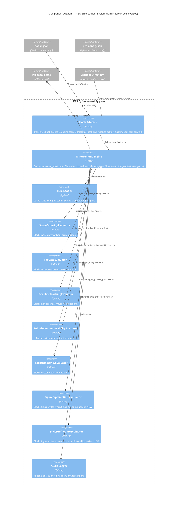

# PES Figure Pipeline Enforcement -- Architecture Design

## Overview

Two new PES evaluators enforce the figure generation pipeline in Wave 5 visual asset work. Prevents formatter agent from bypassing figure planning (Phase 1) and style analysis before generating figures.

**Incident**: SF25D-T1201 session -- formatter hand-coded inline SVGs directly into wave-5-visuals/, ignoring pipeline instructions.

**Approach**: Brownfield extension of existing PES enforcement system. No new architectural patterns -- follows existing evaluator pattern exactly. One interface change: `triggers()` gains a `tool_context` parameter (ADR-044).

---

## C4 System Context (Level 1)

No change to system context. PES enforcement system already exists and intercepts all Claude Code tool invocations. The new evaluators add two rules within the existing system boundary.

---

## C4 Container (Level 2)

No change to container diagram. The PES Enforcement System container gains two new internal components (evaluators) but its external interfaces remain identical:
- Input: PreToolUse hook events (JSON stdin)
- Output: ALLOW/BLOCK decisions (exit code + JSON stdout)

---

## C4 Component (Level 3) -- PES Enforcement System (Updated)

---

## Key Design Decision: file_path and Artifact Existence

See **ADR-044** for full rationale.

**Summary**: The `triggers()` method gains a `tool_context: dict` parameter (default `{}`). The hook adapter:
1. Extracts `file_path` from `hook_input["tool"]["file_path"]`
2. Resolves the artifact directory from the file_path
3. Checks prerequisite file existence (figure-specs.md, style-profile.yaml)
4. Passes `tool_context={"file_path": ..., "artifacts_present": [...]}` to the engine

Evaluators inspect `tool_context` for path matching and prerequisite checks. Existing evaluators ignore the new parameter.

---

## Evaluator Behavior Summary

### FigurePipelineGateEvaluator

- **Triggers when**: file_path targets `wave-5-visuals/`, file is NOT `figure-specs.md`, and `figure-specs.md` is NOT in `artifacts_present`
- **Does not trigger when**: file_path is outside `wave-5-visuals/`, OR file IS `figure-specs.md`, OR `figure-specs.md` exists
- **Block message**: Guidance to create figure-specs.md first, includes expected path

### StyleProfileGateEvaluator

- **Triggers when**: file_path targets `wave-5-visuals/`, file is NOT `figure-specs.md` or `style-profile.yaml`, AND `style-profile.yaml` is NOT in `artifacts_present`, AND `style_analysis_skipped` is not true in state
- **Does not trigger when**: file IS prerequisite artifact, OR style-profile.yaml exists, OR state has `style_analysis_skipped: true`
- **Block message**: Guidance to complete style analysis or explicitly skip, includes both resolution paths

---

## Integration Points

| Integration Point | Direction | Description |
|---|---|---|
| Hook Adapter -> Engine | Modified | `evaluate()` gains `tool_context` parameter |
| Engine -> Evaluators | Modified | `_rule_triggers()` passes `tool_context` to `triggers()` |
| Hook Adapter -> Filesystem | New | Checks artifact directory for prerequisite files |
| pes-config.json | Modified | Two new rules added |
| Engine._evaluators | Modified | Two new evaluator registrations |

---

## Quality Attribute Strategies

| Attribute | Strategy |
|---|---|
| **Testability** | Pure domain evaluators with no I/O. Artifact existence passed as data. TDD with pytest. |
| **Maintainability** | Follows existing evaluator pattern exactly. One ADR documents the interface change. |
| **Auditability** | All decisions (block and allow) recorded in audit log via existing engine audit path. |
| **Reliability** | Unknown rule_types silently return False (existing safety). Missing tool_context defaults to empty dict. |

---

## Deployment Architecture

No deployment changes. New Python files are loaded by existing import machinery. pes-config.json gains two rules. No new dependencies, no new infrastructure.
