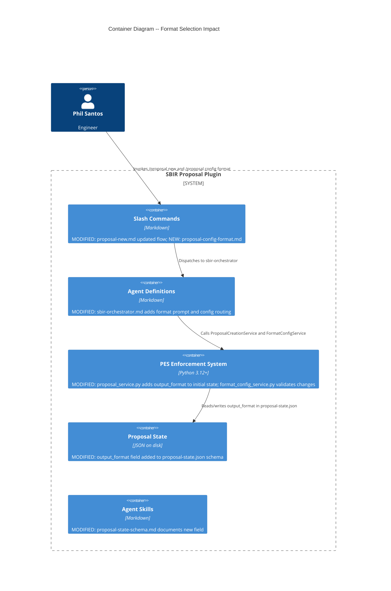

# Architecture: Proposal Format Selection

## Feature Context

Add an explicit format selection step (LaTeX or DOCX) to the `/proposal new` guided setup flow. The choice persists in `proposal-state.json` as `output_format` and drives all downstream formatting agents. A separate command allows mid-proposal format changes with rework warnings.

**User stories**: US-PFS-001 (setup selection), US-PFS-002 (mid-proposal change)

**Quality attribute drivers**: Maintainability (single source of truth for format), Usability (minimal added friction), Reliability (state consistency across waves)

---

## C4 System Context (Level 1)

No change to system context. The format selection feature operates entirely within the existing SBIR Proposal Plugin boundary. No new external systems are introduced.

*(Refer to main architecture document `docs/architecture/architecture.md` for system context diagram.)*

---

## C4 Container (Level 2)

Format selection touches 5 existing containers. No new containers are introduced.



---

## Component Boundaries -- What Changes Where

### Tier 1: State Schema (Foundation)

| File | Change | Responsibility |
|------|--------|----------------|
| `templates/proposal-state-schema.json` | Add `output_format` property (enum: `"latex"`, `"docx"`, default: `"docx"`) | Schema validation |
| `scripts/pes/domain/proposal_service.py` | `_build_initial_state()` includes `output_format` field | Initial state creation |

### Tier 2: Format Selection During Setup (US-PFS-001)

| File | Change | Responsibility |
|------|--------|----------------|
| `commands/proposal-new.md` | Document format selection step in flow | Command documentation |
| `agents/sbir-orchestrator.md` | Add format prompt after fit scoring, before Go/No-Go | Interactive prompt |
| `skills/common/proposal-state-schema.md` | Document `output_format` field | Agent knowledge |

### Tier 3: Mid-Proposal Format Change (US-PFS-002)

| File | Change | Responsibility |
|------|--------|----------------|
| `commands/proposal-config-format.md` | NEW command definition for `/proposal config format` | Command entry point |
| `agents/sbir-orchestrator.md` | Route `/proposal config format` to format change logic | Command routing |
| `scripts/pes/domain/format_config_service.py` | NEW service: validate format value, determine rework risk, update state | Domain logic |
| `scripts/pes/ports/state_port.py` | No change needed -- existing `StateReader.load()` and `StateWriter.save()` suffice | State persistence |
| `skills/orchestrator/wave-agent-mapping.md` | Add `proposal config format` to routing table | Agent routing |

### Tier 4: Downstream Consumer Awareness (Future)

These files will eventually read `output_format` from state but are NOT part of this feature's scope. Documented for traceability:

| File | Future Change | Wave |
|------|--------------|------|
| `agents/sbir-writer.md` | Read `output_format` for content structure hints | 3-4 |
| `agents/sbir-formatter.md` | Read `output_format` instead of prompting at Wave 6 | 5-6 |
| `scripts/pes/domain/formatting_service.py` | Select adapter based on `output_format` | 6 |
| `agents/sbir-submission-agent.md` | Package in correct format | 8 |

---

## Data Model Change

### proposal-state.json -- New Field

```json
{
  "output_format": "docx"
}
```

**Field specification:**

| Property | Value |
|----------|-------|
| Name | `output_format` |
| Type | string |
| Enum | `"latex"`, `"docx"` |
| Default | `"docx"` |
| Required | No (additive, existing proposals default to `"docx"` on missing) |
| Set by | sbir-orchestrator during `/proposal new` |
| Changed by | `/proposal config format <latex\|docx>` |
| Read by | status dashboard, sbir-writer, sbir-formatter, sbir-submission-agent |

**Schema evolution**: Follows ADR-012 pattern. Field is additive with a default value. No migration needed. Domain services handle missing field by defaulting to `"docx"`.

---

## FormatConfigService -- Domain Logic

New domain service in `scripts/pes/domain/format_config_service.py`. Responsibilities:

- Validate format value is in allowed enum (`"latex"`, `"docx"`)
- Determine rework risk based on `current_wave` (Wave 3+ = rework warning)
- Update `output_format` in state via existing `StateWriter` port
- Return result indicating success, rework warning, or validation error

**Ports used**: `StateReader` (existing), `StateWriter` (existing). No new ports required.

---

## Integration Patterns

### Format Selection Flow (within `/proposal new`)

```
Solicitation parsed -> Corpus searched -> Fit scored
    -> FORMAT PROMPT: "Choose output format: (1) LaTeX (2) DOCX. Default: docx"
    -> If solicitation contains PDF-submission hint: add "(recommended)" to LaTeX
    -> User selects -> output_format written to state
    -> Go/No-Go checkpoint
```

The format prompt is an orchestrator responsibility (interactive prompt), not PES Python. PES only handles state persistence and validation.

### Solicitation Format Hints

The orchestrator checks solicitation text for PDF-submission indicators during the `/proposal new` flow. If found, the format prompt includes a recommendation. This is LLM reasoning (agent behavior), not PES domain logic.

### Mid-Proposal Change Flow

```
/proposal config format latex
    -> Orchestrator dispatches to FormatConfigService
    -> Service reads current state (current_wave, output_format)
    -> If current_wave < 3: update state, return success
    -> If current_wave >= 3: return rework_warning, wait for confirmation
    -> On confirmation: update state, return success
    -> On decline: return unchanged
```

---

## Quality Attribute Strategies

### Maintainability

- Single source of truth: `output_format` in `.sbir/proposal-state.json`
- No downstream agent duplication of format logic
- FormatConfigService is a pure domain service with no infrastructure imports

### Usability

- One additional prompt in `/proposal new` (minimal friction)
- Sensible default (DOCX) -- press Enter to skip
- Clear rework warning when changing after Wave 3

### Reliability

- Schema additive -- existing proposals unaffected (ADR-012 pattern)
- Invalid values rejected before state write
- Atomic state writes (existing pattern) protect against corruption

### Testability

- FormatConfigService is a domain object testable through ports
- Orchestrator prompt behavior validated via acceptance tests
- Schema validation tested via existing jsonschema infrastructure

---

## Rejected Simple Alternatives

### Alternative 1: Default to DOCX, never ask

- **What**: Always use DOCX. Users who want LaTeX edit state manually.
- **Expected impact**: Covers 70% of use cases (DOCX is most common)
- **Why insufficient**: Phil alternates between LaTeX and DOCX. Manual state editing is error-prone and undiscoverable. Violates usability priority.

### Alternative 2: Defer to formatter at Wave 6 (current behavior)

- **What**: Formatter asks format question when it runs at Wave 6
- **Expected impact**: 100% of format decisions eventually made
- **Why insufficient**: Writer has already produced content without format awareness (Waves 3-4). LaTeX and DOCX have different figure handling and cross-reference patterns. Late selection causes rework. This is the problem the feature solves.

---

## Roadmap

### Phase 01: State Schema and Domain Logic

```yaml
step_01-01:
  title: "Add output_format to state schema and initial state builder"
  description: "Extend proposal-state-schema.json with output_format enum. Update ProposalCreationService._build_initial_state() to include output_format with default 'docx'."
  stories: [US-PFS-001]
  acceptance_criteria:
    - "Schema accepts output_format as 'latex' or 'docx'"
    - "New proposals include output_format defaulting to 'docx'"
    - "Existing proposals without output_format remain valid"
  architectural_constraints:
    - "Additive schema change per ADR-012 pattern"
    - "Domain service has no infrastructure imports"

step_01-02:
  title: "FormatConfigService for mid-proposal format changes"
  description: "Domain service validates format value, determines rework risk by wave number, updates state via StateWriter port."
  stories: [US-PFS-002]
  acceptance_criteria:
    - "Valid format values accepted and persisted"
    - "Invalid format values rejected with error"
    - "Changes at Wave 3+ return rework warning"
    - "Changes before Wave 3 proceed without warning"
    - "Declining confirmation leaves state unchanged"
  architectural_constraints:
    - "Uses existing StateReader/StateWriter ports"
    - "Pure domain service -- no infrastructure imports"
```

### Phase 02: Agent and Command Integration

```yaml
step_02-01:
  title: "Orchestrator format prompt and status display"
  description: "Add format selection prompt to /proposal new flow after fit scoring. Display output_format in /proposal status dashboard. Solicitation PDF hints surface LaTeX recommendation."
  stories: [US-PFS-001]
  acceptance_criteria:
    - "Format prompt appears after fit scoring, before Go/No-Go"
    - "Default selection (Enter) sets output_format to 'docx'"
    - "Explicit selection sets chosen format"
    - "PDF-submission hint triggers LaTeX recommendation"
    - "Status dashboard shows 'Format: LaTeX' or 'Format: DOCX'"
  architectural_constraints:
    - "Orchestrator owns interactive prompt (not PES Python)"
    - "Solicitation hint is LLM reasoning, not PES domain logic"

step_02-02:
  title: "Config format command and routing"
  description: "New /proposal config format command. Orchestrator routes to FormatConfigService. Rework warning at Wave 3+ requires confirmation."
  stories: [US-PFS-002]
  acceptance_criteria:
    - "/proposal config format latex updates state"
    - "/proposal config format docx updates state"
    - "Rework warning displayed at Wave 3+"
    - "Invalid format value rejected with helpful error"
  architectural_constraints:
    - "New command file: commands/proposal-config-format.md"
    - "Routing added to wave-agent-mapping skill"
```

### Roadmap Summary

| Phase | Steps | Stories | Est. Production Files |
|-------|-------|---------|----------------------|
| 01 State & Domain | 2 | US-PFS-001, US-PFS-002 | 3 |
| 02 Agent & Command | 2 | US-PFS-001, US-PFS-002 | 4 |
| **Total** | **4** | **2 stories, 9 scenarios** | **~7** |

Step ratio: 4 / 7 = 0.57 (well under 2.5 threshold).

---

## ADR Index

| ADR | Title | Status |
|-----|-------|--------|
| ADR-023 | Format selection as state-driven orchestrator prompt | Accepted |

See `docs/adrs/adr-023-format-selection-state-driven.md`.

---

## Quality Gates Checklist

- [x] Requirements traced to components (US-PFS-001 -> Tier 1+2, US-PFS-002 -> Tier 1+3)
- [x] Component boundaries with clear responsibilities (4 tiers documented)
- [x] Technology choices in ADRs with alternatives (ADR-023)
- [x] Quality attributes addressed (maintainability, usability, reliability, testability)
- [x] Dependency-inversion compliance (FormatConfigService uses ports, no infra imports)
- [x] C4 diagrams (L2 container showing impact; L1 unchanged)
- [x] Integration patterns specified (setup flow, mid-proposal change flow)
- [x] OSS preference validated (no new dependencies)
- [x] Roadmap step count efficient (4 steps / 7 files = 0.57)
- [x] AC behavioral, not implementation-coupled
- [x] 2+ rejected alternatives documented
