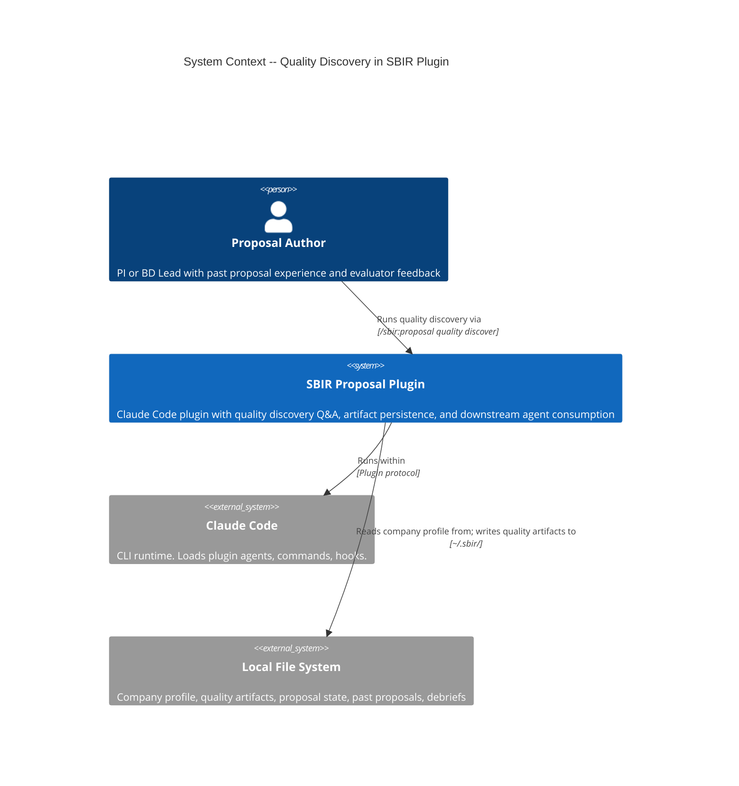
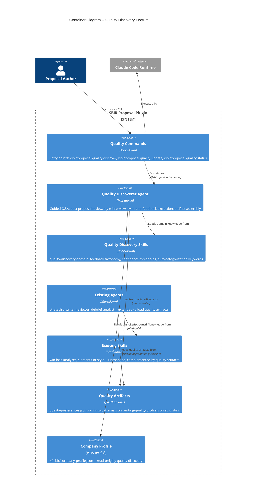

# Architecture: Proposal Quality Discovery

## System Context

Proposal quality discovery is a cross-cutting feature that adds a guided Q&A flow to capture institutional knowledge about what makes proposals win or lose from a writing quality perspective. It produces three company-level JSON artifacts at `~/.sbir/` consumed by downstream agents (strategist, writer, reviewer) across all future proposal cycles.

This feature is primarily a markdown agent + skills feature with no new Python code required. The existing atomic write pattern (PES) and the existing agent-skill-command architecture handle all needs.

---

## C4 System Context (Level 1)



---

## C4 Container (Level 2)



---

## Component Architecture

### New Components

| Component | Type | Location | Responsibility |
|-----------|------|----------|----------------|
| `sbir-quality-discoverer.md` | Agent | `agents/` | Guided Q&A flow: past proposal review, style interview, evaluator feedback extraction, artifact assembly |
| `quality-discovery-domain.md` | Skill | `skills/quality-discoverer/` | Feedback taxonomy, auto-categorization keywords, confidence thresholds, artifact schemas |
| `sbir-proposal-quality-discover.md` | Command | `commands/` | Entry point for `/sbir:proposal quality discover` |
| `sbir-proposal-quality-update.md` | Command | `commands/` | Entry point for `/sbir:proposal quality update` |
| `sbir-proposal-quality-status.md` | Command | `commands/` | Entry point for `/sbir:proposal quality status` |

### Modified Components (Additive Only)

| Component | Change | Nature |
|-----------|--------|--------|
| `sbir-strategist.md` | Add quality artifact loading in Phase 1 GATHER | +10 lines: read winning-patterns.json, filter by agency, cite patterns |
| `sbir-writer.md` | Add quality artifact loading in Phase 3 DRAFT | +15 lines: read all three artifacts, apply preferences, surface alerts |
| `sbir-reviewer.md` | Add quality artifact loading in Phase 1 ORIENT and Phase 2 SECTION REVIEW | +15 lines: read quality profile, check practices-to-avoid, produce tagged findings |
| `sbir-debrief-analyst.md` | Add quality update suggestion in Phase 4 SYNTHESIZE | +5 lines: after lessons-learned, suggest quality update command |
| `sbir-setup-wizard.md` | Add optional quality discovery step after corpus setup | +10 lines: offer quality discovery after Phase 3 |

### Unchanged Components

All existing Python code (PES), existing skills, existing state schemas, existing templates remain unchanged. Quality discovery reuses the atomic write pattern documented in the architecture but does not require new Python adapters -- the agent writes JSON files directly via the Write tool (same pattern as profile-builder writing company-profile.json).

---

## Technology Stack

| Component | Technology | License | Rationale |
|-----------|-----------|---------|-----------|
| Quality discoverer agent | Markdown (nWave convention) | N/A | Consistent with all other agents |
| Quality discovery skill | Markdown (nWave convention) | N/A | Consistent with all other skills |
| Quality commands | Markdown (nWave convention) | N/A | Consistent with all other commands |
| Quality artifacts | JSON files at ~/.sbir/ | N/A | Consistent with company-profile.json, human-readable |
| Atomic writes | Agent-driven (write .tmp, rename) | N/A | Existing pattern; no new Python needed |
| Auto-categorization | Keyword matching in agent skill | N/A | No NLP library needed; evaluator comments are short and keyword-rich |

No new technology introduced. No new Python code. No new dependencies.

---

## Artifact Schemas

### quality-preferences.json

```json
{
  "schema_version": "1.0.0",
  "updated_at": "ISO-8601",
  "tone": "formal_authoritative | direct_data_driven | conversational_accessible | custom",
  "tone_custom_description": "string (only when tone=custom)",
  "detail_level": "high_level | moderate | deep_technical",
  "evidence_style": "inline_quantitative | narrative_supporting | table_heavy",
  "organization": "short_paragraphs | medium_paragraphs | long_flowing",
  "practices_to_replicate": ["string"],
  "practices_to_avoid": ["string"]
}
```

### winning-patterns.json

```json
{
  "schema_version": "1.0.0",
  "updated_at": "ISO-8601",
  "confidence_level": "low | medium | high",
  "win_count": 0,
  "proposal_ratings": [
    {
      "topic_id": "AF243-001",
      "agency": "Air Force",
      "topic_area": "Directed Energy",
      "outcome": "WIN",
      "quality_rating": "weak | adequate | strong",
      "winning_practices": ["string"],
      "evaluator_praise": ["string"],
      "rated_at": "ISO-8601"
    }
  ],
  "patterns": [
    {
      "pattern": "Lead with quantitative results in every section",
      "frequency": 3,
      "agencies": ["Air Force", "Navy"],
      "source_proposals": ["AF243-001", "N244-008"],
      "universal": false,
      "first_seen": "ISO-8601",
      "last_seen": "ISO-8601"
    }
  ]
}
```

### writing-quality-profile.json

```json
{
  "schema_version": "1.0.0",
  "updated_at": "ISO-8601",
  "entries": [
    {
      "comment": "Technical approach was difficult to follow",
      "topic_id": "AF243-002",
      "agency": "Air Force",
      "outcome": "LOSS",
      "category": "organization_clarity | persuasiveness | tone | specificity",
      "sentiment": "positive | negative",
      "section": "technical_approach | sow | commercialization | general",
      "auto_categorized": true,
      "user_confirmed": true,
      "added_at": "ISO-8601"
    }
  ],
  "agency_patterns": [
    {
      "agency": "Air Force",
      "discriminators": ["organization_clarity"],
      "positive_count": 1,
      "negative_count": 2
    }
  ]
}
```

---

## Integration Patterns

### Quality Discovery Flow

```
User invokes /sbir:proposal quality discover
    |
    v
[sbir-quality-discoverer agent]
    |
    |-- Phase 1: Read ~/.sbir/company-profile.json#past_performance
    |             Walk through each entry, collect quality ratings
    |             (skip if zero entries)
    |
    |-- Phase 2: Guided interview for tone, detail, evidence, organization
    |             Collect practices to replicate/avoid
    |
    |-- Phase 3: Accept evaluator comments, auto-categorize
    |             Meta-writing -> writing-quality-profile.json
    |             Content -> route to existing weakness profile
    |             (skip if user has no feedback)
    |
    |-- Phase 4: Assemble artifacts, atomic write to ~/.sbir/
    |             Display summary with confidence and consumer agents
    |
    v
[Artifacts persist at ~/.sbir/]
```

### Downstream Consumption Pattern

```
Strategist (Wave 1):
    Read ~/.sbir/winning-patterns.json
    -> Filter patterns by current proposal's agency
    -> Cite in competitive positioning section
    -> Missing file = proceed without quality intelligence

Writer (Waves 3-4):
    Read ~/.sbir/quality-preferences.json
    -> Apply tone, organization, evidence style to drafts
    Read ~/.sbir/winning-patterns.json
    -> Apply winning practices as drafting guidance
    Read ~/.sbir/writing-quality-profile.json
    -> Surface quality alerts for matching agency + section
    -> Missing files = use defaults (elements-of-style or standard)

Reviewer (Waves 4, 7):
    Read ~/.sbir/writing-quality-profile.json
    -> Check for agency/section matches, produce [QUALITY PROFILE MATCH] findings
    Read ~/.sbir/quality-preferences.json
    -> Check practices_to_avoid against draft text
    -> Missing files = use standard criteria only
```

### Incremental Update Pattern

```
User invokes /sbir:proposal quality update (after Wave 9)
    |
    v
[sbir-quality-discoverer agent -- update mode]
    |
    |-- Read ./artifacts/wave-9-debrief/ for latest debrief
    |-- Extract writing quality feedback (auto-categorize)
    |-- Read existing ~/.sbir/ quality artifacts
    |-- Merge new data (additive, no data loss)
    |-- Flag stale patterns (>2 years old)
    |-- Recalculate confidence levels
    |-- Atomic write updated artifacts
    v
[Updated artifacts at ~/.sbir/]
```

---

## Quality Attribute Strategies

### Maintainability
- Single new agent with one skill -- minimal surface area
- Additive-only changes to 5 existing agents (no behavior modification)
- Artifact schemas versioned (schema_version field) for future evolution
- Agent follows same conventions as all other agents (200-400 lines)

### Usability
- Guided Q&A completable in under 10 minutes
- Predefined options with custom/freeform fallback for every dimension
- Skip any step; finish early; review and edit before saving
- Clear summary showing what was captured and which agents consume it

### Reliability
- Atomic writes (write .tmp, backup .bak, rename) for all artifact persistence
- Graceful degradation: every downstream agent checks for artifact existence; missing = proceed with defaults
- Partial discovery (only some steps completed) creates only the artifacts that have data
- Incremental updates merge with existing data (no data loss)

### Security
- All data stays on local filesystem (no network calls)
- Quality artifacts contain user-entered text, not sensitive proposal content
- Read-only access to company profile (quality discovery never modifies it)

---

## Rejected Simple Alternatives

### Alternative 1: Extend setup wizard only (no new agent)

- **What**: Add quality discovery as additional phases in sbir-setup-wizard.md
- **Expected Impact**: Could handle 60% of scenarios (initial discovery only)
- **Why Insufficient**: Setup wizard already at ~180 lines. Adding 4 discovery steps would exceed 400-line limit. Update mode (US-QD-008) does not belong in setup. Quality discovery can be invoked independently mid-lifecycle, not just at setup time.

### Alternative 2: Extend corpus librarian with quality tagging

- **What**: Add quality rating fields to corpus librarian's outcome tracking
- **Expected Impact**: Could handle 30% (past proposal quality ratings only)
- **Why Insufficient**: Style preferences and evaluator feedback extraction are entirely different domains from corpus management. Would violate single-responsibility. Corpus librarian is already at ~200 lines with image reuse. The Q&A interview flow is a distinct concern from corpus indexing.

### Why a New Agent is Necessary

1. Quality discovery has its own distinct workflow (guided interview, not indexing/search)
2. It operates independently of any specific proposal (company-level, not project-level)
3. It has its own trigger points (setup, post-cycle update, manual invocation)
4. Neither setup wizard nor corpus librarian can absorb 4 discovery steps without exceeding line limits or violating single-responsibility

---

## Roadmap

### Phase 01: Quality Discovery Agent and Core Flow (US-QD-001, US-QD-002, US-QD-003, US-QD-004)

```yaml
step_01-01:
  title: "Quality discoverer agent with past proposal review"
  description: "New agent reads past_performance from company profile, walks through each entry collecting quality ratings, winning practices, and evaluator praise. Handles skip, finish-early, and zero-proposals gracefully."
  stories: [US-QD-001]
  acceptance_criteria:
    - "Agent reads past_performance entries from company-profile.json"
    - "User rates each proposal as weak, adequate, or strong"
    - "User can skip proposals or finish early"
    - "Zero past proposals skips to next step"
    - "Quality ratings are additive -- company profile not modified"
  architectural_constraints:
    - "New agent at agents/sbir-quality-discoverer.md"
    - "New skill at skills/quality-discoverer/quality-discovery-domain.md"
    - "New command at commands/sbir-proposal-quality-discover.md"

step_01-02:
  title: "Writing style preferences interview"
  description: "Guided interview captures tone, detail level, evidence style, organization, and practices to replicate/avoid. Predefined options with custom fallback. Review and edit before saving."
  stories: [US-QD-002]
  acceptance_criteria:
    - "Interview captures all four dimensions plus practices arrays"
    - "Predefined options available with custom/freeform fallback"
    - "User can review and edit answers before saving"
    - "Completable in under 15 prompts"
  architectural_constraints:
    - "All logic within sbir-quality-discoverer agent Phase 2"

step_01-03:
  title: "Evaluator feedback extraction with auto-categorization"
  description: "Accept evaluator comments, auto-categorize as meta-writing or content, present for confirmation with override. Route content feedback to weakness profile reference. Detect cross-proposal patterns."
  stories: [US-QD-003]
  acceptance_criteria:
    - "Auto-categorizes comments as meta-writing or content"
    - "User confirms or overrides each categorization"
    - "Meta-writing stored in writing-quality-profile.json"
    - "Content feedback noted for weakness profile (not duplicated)"
    - "Cross-proposal patterns detected for same agency"
  architectural_constraints:
    - "Auto-categorization uses keyword matching from skill"
    - "All logic within sbir-quality-discoverer agent Phase 3"

step_01-04:
  title: "Artifact assembly with atomic persistence"
  description: "Assemble up to three artifacts from completed steps. Atomic write to ~/.sbir/. Display summary with confidence, consumer agents. Support incremental merge with existing artifacts."
  stories: [US-QD-004]
  acceptance_criteria:
    - "Creates only artifacts for completed steps"
    - "Each artifact has schema_version and updated_at"
    - "Incremental updates merge without data loss"
    - "Atomic write prevents partial corruption"
    - "Summary shows confidence levels and consumer agents"
  architectural_constraints:
    - "Atomic write: .tmp, .bak, rename"
    - "Confidence: low (<10 wins), medium (10-19), high (>=20)"
```

### Phase 02: Downstream Consumption (US-QD-005, US-QD-006, US-QD-007)

```yaml
step_02-01:
  title: "Strategist loads winning patterns"
  description: "Extend strategist to read winning-patterns.json during Phase 1 GATHER. Filter by agency. Cite patterns in competitive positioning. Graceful degradation when missing."
  stories: [US-QD-005]
  acceptance_criteria:
    - "Strategist reads winning-patterns.json if it exists"
    - "Patterns filtered by current proposal agency"
    - "Patterns cited with source and confidence in strategy brief"
    - "Missing file produces informational note, not error"
  architectural_constraints:
    - "Additive change to sbir-strategist.md Phase 1 GATHER"
    - "No existing behavior removed or modified"

step_02-02:
  title: "Writer applies quality intelligence"
  description: "Extend writer to load all three quality artifacts during Phase 3 DRAFT. Apply style preferences. Surface quality alerts for matching agency/section."
  stories: [US-QD-006]
  acceptance_criteria:
    - "Writer loads all three artifacts if they exist"
    - "Style preferences influence tone and organization"
    - "Quality alerts surface for matching agency/section"
    - "Missing artifacts degrade gracefully to defaults"
    - "Quality intelligence supplements elements-of-style"
  architectural_constraints:
    - "Additive change to sbir-writer.md Phase 3 DRAFT skill table"
    - "Quality preferences loaded alongside writing_style skill"

step_02-03:
  title: "Reviewer checks quality profile"
  description: "Extend reviewer to load writing-quality-profile.json and quality-preferences.json. Produce [QUALITY PROFILE MATCH] tagged findings. Check practices-to-avoid compliance."
  stories: [US-QD-007]
  acceptance_criteria:
    - "Reviewer loads both artifacts during Waves 4 and 7"
    - "Quality profile matches produce tagged findings with elevated severity"
    - "Practices-to-avoid violations produce style findings"
    - "Missing artifacts are non-fatal"
    - "Quality findings are additional, not replacing existing findings"
  architectural_constraints:
    - "Additive change to sbir-reviewer.md Phases 1 and 2"
    - "Existing weakness profile check remains unchanged"
```

### Phase 03: Incremental Learning and Integration (US-QD-008)

```yaml
step_03-01:
  title: "Quality update command and incremental learning"
  description: "New command triggers quality update mode. Reads Wave 9 debrief artifacts, extracts writing quality feedback, updates existing artifacts, flags stale patterns, recalculates confidence."
  stories: [US-QD-008]
  acceptance_criteria:
    - "Reads debrief artifacts from ./artifacts/wave-9-debrief/"
    - "New feedback extracted and categorized"
    - "Existing artifacts updated additively"
    - "Patterns over 2 years old flagged as stale"
    - "Confidence recalculated from updated corpus size"
    - "Missing prior artifacts directs to full discovery"
  architectural_constraints:
    - "New command at commands/sbir-proposal-quality-update.md"
    - "Reuses sbir-quality-discoverer agent in update mode"
    - "Additive note in sbir-debrief-analyst.md Phase 4"

step_03-02:
  title: "Setup wizard integration and quality status command"
  description: "Add optional quality discovery offer in setup wizard after corpus step. Create quality status command showing current artifact state."
  stories: [US-QD-002, US-QD-004]
  acceptance_criteria:
    - "Setup wizard offers quality discovery after corpus setup"
    - "Quality status command displays artifact summary"
    - "Status shows which artifacts exist and their freshness"
    - "Skip option available at every point"
  architectural_constraints:
    - "Additive change to sbir-setup-wizard.md after Phase 3"
    - "New command at commands/sbir-proposal-quality-status.md"
```

### Roadmap Summary

| Phase | Steps | Stories | Est. Production Files |
|-------|-------|---------|----------------------|
| 01 Core Discovery | 4 | US-QD-001, US-QD-002, US-QD-003, US-QD-004 | 3 (agent + skill + command) |
| 02 Downstream Consumption | 3 | US-QD-005, US-QD-006, US-QD-007 | 3 (modified agents) |
| 03 Integration | 2 | US-QD-008 + integration | 4 (2 commands + 2 modified agents) |
| **Total** | **9** | **8 stories, 28 scenarios** | **~10** |

Step ratio: 9 / 10 = 0.90 (well under 2.5 threshold).

---

## ADR Index

| ADR | Title | Status |
|-----|-------|--------|
| ADR-025 | Dedicated quality discoverer agent | Accepted |
| ADR-026 | Company-level quality artifacts at ~/.sbir/ | Accepted |
| ADR-027 | Keyword-based auto-categorization for evaluator feedback | Accepted |
