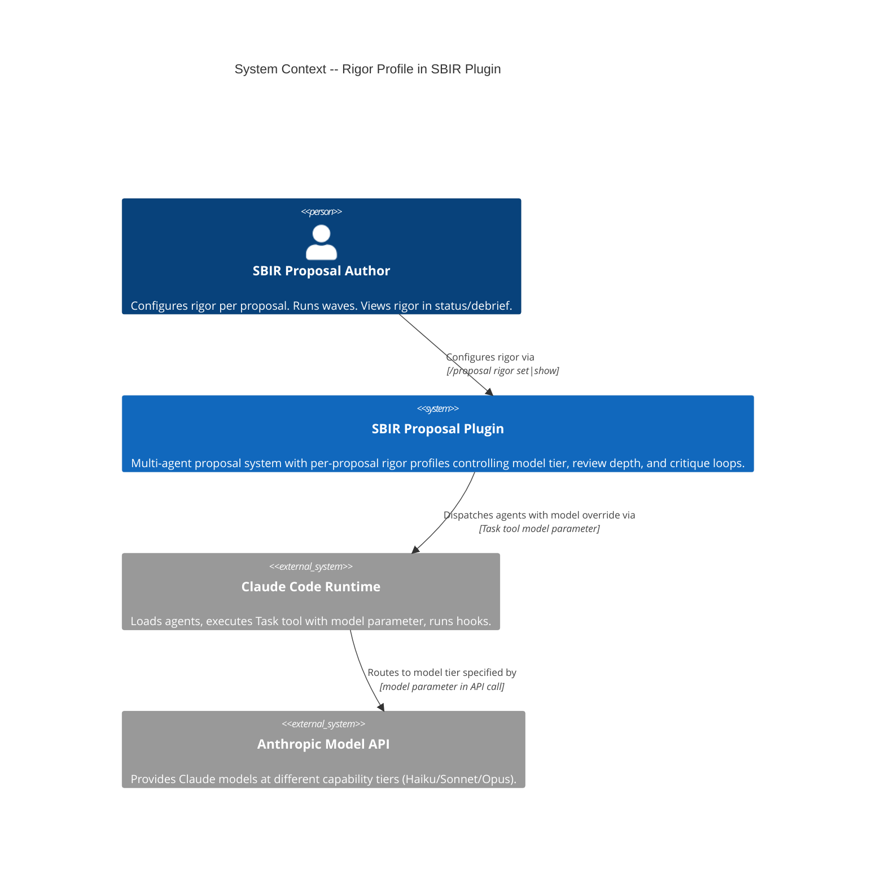
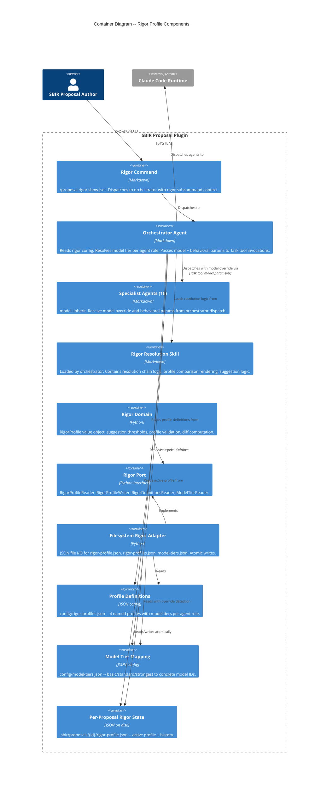
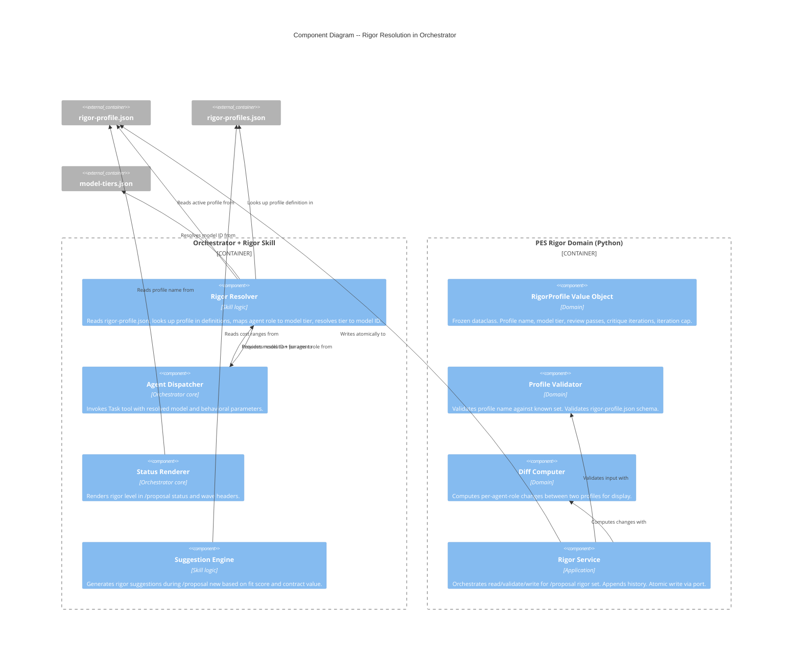

# Architecture -- Rigor Profile

Feature: rigor-profile
Date: 2026-03-23
Phase: 4 -- Architecture Design

---

## System Context

The rigor profile is a cross-cutting quality/cost dial that modifies how existing agents execute -- it does not add new waves, new agents, or new user-facing artifacts. It touches three layers: plugin config (profile definitions), per-proposal state (profile selection), and runtime behavior (model resolution + behavioral parameters).

### Quality Attributes (Priority Order)

1. **Maintainability** -- agents change frequently; rigor must not create tight coupling
2. **Testability** -- PES is TDD; rigor domain logic must be testable in isolation
3. **Time-to-market** -- plugin is actively used; ship incrementally

### Constraints

- Solo developer, Windows + Git Bash
- OOP with ports-and-adapters (established)
- Markdown agents with `model: inherit` frontmatter
- Existing PES hook system for enforcement
- Per-proposal config in `.sbir/proposals/{topic-id}/`

---

## C4 System Context (Level 1)



---

## C4 Container (Level 2)



---

## C4 Component (Level 3) -- Rigor Resolution Flow

The orchestrator's rigor resolution is the critical path. This diagram shows the internal components of the resolution mechanism.



---

## Component Architecture

### New Components

| Component | Location | Type | Responsibility |
|-----------|----------|------|----------------|
| Rigor command | `commands/proposal-rigor.md` | Markdown | Entry point for `/proposal rigor show\|set`. Dispatches to orchestrator. |
| Rigor resolution skill | `skills/orchestrator/rigor-resolution.md` | Markdown | Resolution chain, comparison rendering, suggestion logic. Loaded by orchestrator. |
| RigorProfile value object | `scripts/pes/domain/rigor.py` | Python | Frozen dataclass for resolved rigor config. |
| Profile validator | `scripts/pes/domain/rigor.py` | Python | Validates profile names and schema. |
| Diff computer | `scripts/pes/domain/rigor.py` | Python | Computes per-role changes between profiles. |
| Rigor service | `scripts/pes/domain/rigor_service.py` | Python | Application service: read/validate/write rigor selection. |
| Rigor port | `scripts/pes/ports/rigor_port.py` | Python | Abstract interfaces for rigor persistence. |
| Filesystem rigor adapter | `scripts/pes/adapters/filesystem_rigor_adapter.py` | Python | JSON file I/O with atomic writes. |
| Profile definitions | `config/rigor-profiles.json` | JSON | 4 named profiles with agent role mappings. |
| Model tier mapping | `config/model-tiers.json` | JSON | Tier-to-model-ID resolution. |

### Modified Components

| Component | Location | Change |
|-----------|----------|--------|
| Orchestrator agent | `agents/sbir-orchestrator.md` | Add rigor skill loading, rigor resolution before agent dispatch, rigor in wave headers. |
| Orchestrator skill list | `agents/sbir-orchestrator.md` frontmatter | Add `rigor-resolution` to skills list. |
| Wave-agent-mapping skill | `skills/orchestrator/wave-agent-mapping.md` | Add agent-role mapping table for rigor resolution. |
| Proposal-new command | `commands/proposal-new.md` | Add rigor-profile.json creation, contextual suggestion. |
| Proposal-status command | `commands/proposal-status.md` | Add rigor display in status output. |
| Proposal-debrief command/agent | Wave 9 debrief flow | Add rigor summary section in debrief output. |

### Unchanged Components

All 18 specialist agents remain `model: inherit` with no frontmatter changes. The orchestrator handles model resolution externally via the Task tool's `model` parameter.

---

## Technology Stack

| Component | Technology | License | Rationale |
|-----------|-----------|---------|-----------|
| Profile definitions | JSON | N/A | Human-readable, schema-validatable, no dependencies |
| Per-proposal state | JSON with atomic writes | N/A | Consistent with existing proposal-state.json pattern |
| Domain logic | Python 3.12+ | PSF (OSS) | Consistent with PES codebase |
| Schema validation | `jsonschema` (existing dep) | MIT | Already in use for proposal-state.json |
| Skill/command/agent | Markdown | N/A | Claude Code plugin convention |

No new technology dependencies. All additions use existing stack.

---

## Integration Patterns

### 1. Orchestrator Rigor Resolution (Critical Path)

```
Orchestrator receives command (e.g., /proposal draft section-3)
    |
    v
[Load rigor-resolution skill]
    |
    v
[Read .sbir/proposals/{id}/rigor-profile.json]
    |-- missing? -> default to "standard"
    v
[Read config/rigor-profiles.json]
    |
    v
[Look up agent role for target agent]
    |-- sbir-writer -> "writer" role
    v
[Get model_tier from profile.agent_roles.writer]
    |-- thorough.writer = "strongest"
    v
[Read config/model-tiers.json (or .sbir/ override)]
    |
    v
[Resolve model_tier to model_id]
    |-- strongest -> "claude-opus-4-20250514"
    v
[Dispatch via Task tool]
    model: "claude-opus-4-20250514"
    prompt includes: review_passes=2, critique_max_iterations=3, iteration_cap=3
```

### 2. Profile Selection (Write Path)

```
/proposal rigor set thorough
    |
    v
[Command dispatches to orchestrator]
    |
    v
[Orchestrator invokes rigor service (Python via Bash)]
    |
    v
[Rigor service: validate profile name]
    |-- invalid? -> return error with valid list
    |-- same as current? -> return no-op message
    v
[Rigor service: compute diff (old profile vs new)]
    |
    v
[Rigor service: write rigor-profile.json atomically]
    |-- append history entry with from/to/timestamp/wave
    v
[Return diff + confirmation to orchestrator]
    |
    v
[Orchestrator renders diff to user]
```

### 3. Proposal Creation Integration

```
/proposal new <solicitation>
    |
    v
[Existing creation flow: parse, score, Go/No-Go]
    |
    v
[Create rigor-profile.json with default "standard"]
    |
    v
[Read fit_score, contract_value, phase from proposal-state.json]
    |
    v
[Suggestion logic]
    |-- fit >= 80 AND Phase II -> suggest "thorough"
    |-- fit < 70 AND Phase I -> suggest "lean"
    |-- otherwise -> no suggestion
    v
[Render creation output with rigor default + optional suggestion]
```

### 4. Status Integration

```
/proposal status
    |
    v
[Read rigor-profile.json for active proposal]
    |
    v
[Render "Rigor: {profile}" in active proposal line]
    |
    v
[For each other proposal in .sbir/proposals/*/]
    |-- Read rigor-profile.json (or default "standard" if missing)
    v
[Render rigor level in portfolio summary line]
```

---

## Quality Attribute Strategies

### Maintainability

- **Profile definitions decoupled from agents**: Agents unchanged. Adding/modifying profiles is a JSON-only operation.
- **Model tier abstraction**: Model releases require updating `model-tiers.json` only. No agent, skill, or domain code changes.
- **Agent role mapping centralized**: One table maps agent names to roles. Adding new agents requires one mapping entry.

### Testability

- **Pure domain objects**: RigorProfile, ProfileValidator, DiffComputer are pure Python with no I/O dependencies.
- **Port isolation**: RigorProfileReader/Writer can be mocked for service tests.
- **Resolution chain testable end-to-end**: Given profile definitions + per-proposal selection + tier mapping, resolution output is deterministic.

### Time-to-Market

- **Incremental delivery**: Config files first, then domain objects, then service, then skill, then orchestrator integration.
- **Two delivery surfaces**: Python (TDD for PES domain) and markdown (agent/skill/command edits).
- **No existing code refactored**: Purely additive changes.

### Backward Compatibility

- **Missing rigor-profile.json**: Treated as "standard" everywhere. Pre-rigor proposals work without modification.
- **Missing model-tiers.json override**: Falls back to plugin default. No user action required.

---

## Delivery Surfaces

This feature has two delivery surfaces matching existing project patterns:

### Surface 1: Python TDD (PES Domain)

New production files:
- `scripts/pes/domain/rigor.py` -- value object, validator, diff computer
- `scripts/pes/domain/rigor_service.py` -- application service
- `scripts/pes/ports/rigor_port.py` -- port interfaces
- `scripts/pes/adapters/filesystem_rigor_adapter.py` -- file I/O adapter

Test files:
- `tests/test_rigor.py` -- domain unit tests
- `tests/test_rigor_service.py` -- service tests with mocked ports
- `tests/test_filesystem_rigor_adapter.py` -- adapter integration tests

### Surface 2: Markdown Editing (Agents/Skills/Commands)

Modified files:
- `agents/sbir-orchestrator.md` -- rigor skill loading, dispatch with model override
- `skills/orchestrator/wave-agent-mapping.md` -- agent-role mapping table
- `commands/proposal-new.md` -- rigor-profile.json creation, suggestion
- `commands/proposal-status.md` -- rigor display

New files:
- `commands/proposal-rigor.md` -- `/proposal rigor show|set` command
- `skills/orchestrator/rigor-resolution.md` -- resolution chain skill
- `config/rigor-profiles.json` -- profile definitions
- `config/model-tiers.json` -- tier-to-model mapping

---

## Roadmap

### Rejected Simple Alternatives

#### Alternative 1: Configuration-only (no Python code)

- What: Define profiles in JSON, have orchestrator skill read them directly, no PES domain objects.
- Expected Impact: 70% of the feature. Display and resolution work. No validation, no atomic writes, no diff computation, no testable domain logic.
- Why Insufficient: Profile validation, diff computation, and atomic writes require Python. Without TDD coverage on the rigor domain, enforcement is untestable -- violating the project's testability priority.

#### Alternative 2: Embed rigor in agent frontmatter

- What: Change agent frontmatter from `model: inherit` to `model: ${rigor_resolved}` with some template mechanism.
- Expected Impact: 40%. Claude Code does not support frontmatter templating. Would require runtime modification of markdown files, which violates immutability.
- Why Insufficient: Architecturally impossible. Markdown files are read-only at runtime.

### Implementation Phases

#### Phase 01: Config and Domain Foundation

```yaml
step_01-01:
  title: "Rigor profile definitions and tier mapping config"
  description: "Create config/rigor-profiles.json and config/model-tiers.json with all 4 profiles and 3 model tiers."
  acceptance_criteria:
    - "Four profiles defined: lean, standard, thorough, exhaustive"
    - "Each profile specifies model tier for all 8 agent roles"
    - "Three tiers mapped to concrete model IDs"
    - "Schema version present for future evolution"
  architectural_constraints:
    - "Read-only plugin-level config -- not user-editable"
    - "Model tier names abstract over concrete model names"

step_01-02:
  title: "RigorProfile domain objects and validation"
  description: "Domain value object, profile name validation, schema validation for rigor-profile.json and rigor-profiles.json."
  acceptance_criteria:
    - "RigorProfile value object is frozen (immutable)"
    - "Profile name validated against known set"
    - "Invalid profile name produces domain error"
    - "Missing rigor-profile.json resolves to standard default"
  architectural_constraints:
    - "Pure domain objects in scripts/pes/domain/rigor.py"
    - "No infrastructure imports"

step_01-03:
  title: "Rigor port and filesystem adapter"
  description: "Port interfaces for rigor persistence and filesystem adapter implementing read/write with atomic writes."
  acceptance_criteria:
    - "Per-proposal rigor file readable and writable via port"
    - "Atomic write follows .tmp/.bak/rename protocol"
    - "Profile definitions loadable from plugin config directory"
    - "Model tier mapping loadable with .sbir/ override detection"
  architectural_constraints:
    - "Port in scripts/pes/ports/rigor_port.py"
    - "Adapter in scripts/pes/adapters/filesystem_rigor_adapter.py"
```

#### Phase 02: Service and Resolution

```yaml
step_02-01:
  title: "Rigor service with diff computation and history"
  description: "Application service for profile selection: validate, compute diff between old and new profiles, write with history append."
  acceptance_criteria:
    - "Profile change produces per-agent-role diff"
    - "History entry appended with from/to/timestamp/wave"
    - "Same-profile set is a no-op returning confirmation"
    - "No-active-proposal returns guidance error"
  architectural_constraints:
    - "Service in scripts/pes/domain/rigor_service.py"
    - "Uses rigor port -- no direct file I/O"

step_02-02:
  title: "Rigor resolution skill for orchestrator"
  description: "Markdown skill encoding resolution chain: read per-proposal profile, look up definitions, resolve tier to model ID, render comparison table."
  acceptance_criteria:
    - "Resolution chain documented for orchestrator consumption"
    - "Comparison table rendering logic for /proposal rigor show"
    - "Detail view rendering for /proposal rigor show <profile>"
    - "Agent-role-to-agent-name mapping table included"
  architectural_constraints:
    - "Skill at skills/orchestrator/rigor-resolution.md"
    - "Display uses model tier names, not concrete model IDs"
```

#### Phase 03: Commands and Orchestrator Integration

```yaml
step_03-01:
  title: "Rigor command and proposal-new integration"
  description: "/proposal rigor show|set command. Proposal-new creates rigor-profile.json with suggestion logic."
  acceptance_criteria:
    - "/proposal rigor show displays comparison table"
    - "/proposal rigor show <profile> displays detail view"
    - "/proposal rigor set <profile> updates with diff display"
    - "/proposal new creates rigor-profile.json with standard default"
    - "Contextual suggestion based on fit score and phase"
  architectural_constraints:
    - "Command at commands/proposal-rigor.md"
    - "Dispatches to orchestrator for rendering and service invocation"

step_03-02:
  title: "Orchestrator rigor-aware agent dispatch"
  description: "Orchestrator reads rigor config before every agent dispatch, resolves model ID, passes model parameter and behavioral params to Task tool."
  acceptance_criteria:
    - "Every agent dispatch includes model parameter from rigor resolution"
    - "Behavioral params (review passes, critique iterations) in task prompt"
    - "Wave header displays active rigor level"
    - "Missing rigor-profile.json defaults to standard behavior"
  architectural_constraints:
    - "Orchestrator loads rigor-resolution skill"
    - "Model resolution at dispatch time, not at session start"
```

#### Phase 04: Status, Debrief, and Polish

```yaml
step_04-01:
  title: "Rigor in status, switch, and debrief"
  description: "Status shows rigor per proposal. Switch loads target rigor. Debrief includes rigor summary with history."
  acceptance_criteria:
    - "Active proposal status line includes rigor level"
    - "Portfolio view shows rigor for each proposal"
    - "Switch loads target proposal's rigor"
    - "Debrief shows rigor summary with change history"
    - "Lean-only proposals show skipped critique loops in debrief"
  architectural_constraints:
    - "Status reads rigor from each proposal's namespace"
    - "Debrief reads rigor history + proposal-state review/critique counts"
```

### Roadmap Summary

| Phase | Steps | Estimated Production Files |
|-------|-------|--------------------------|
| 01 Config + Domain | 3 | 5 (2 JSON config + 3 Python) |
| 02 Service + Skill | 2 | 2 (1 Python + 1 Markdown) |
| 03 Commands + Orchestrator | 2 | 3 (1 Markdown cmd + 2 Markdown modified) |
| 04 Status/Debrief | 1 | 3 (3 Markdown modified) |
| **Total** | **8** | **~13** |

Step ratio: 8 / 13 = 0.62 (well under 2.5 threshold).

---

## ADR Index (Rigor Profile)

| ADR | Title | Status |
|-----|-------|--------|
| ADR-036 | Rigor model resolution mechanism | Accepted |
| ADR-037 | Rigor profile storage strategy | Accepted |
| ADR-038 | Model tier abstraction over concrete model names | Accepted |

---

## Dependency-Inversion Compliance

```
Commands (driving adapter) -> Orchestrator (application)
                                    |
                                    v
                           Rigor Skill (knowledge)
                           Rigor Service (application)
                                    |
                                    v
                           Rigor Domain (domain core)
                             RigorProfile VO
                             ProfileValidator
                             DiffComputer
                                    ^
                                    |
                           Rigor Port (interface)
                                    ^
                                    |
                           Filesystem Adapter (driven adapter)
```

Dependencies point inward. Adapter depends on port. Port depends on nothing. Domain depends on nothing. Service depends on domain + port (interface, not implementation).

---

## Requirements Traceability

| Requirement | Component(s) | Roadmap Step |
|-------------|-------------|-------------|
| FR-01 Named profiles | config/rigor-profiles.json, rigor domain | 01-01, 01-02 |
| FR-02 Profile comparison | rigor-resolution skill, rigor command | 02-02, 03-01 |
| FR-03 Profile selection | rigor service, rigor command | 02-01, 03-01 |
| FR-04 Contextual suggestion | proposal-new command, rigor skill | 03-01 |
| FR-05 Agent model resolution | orchestrator, rigor skill, model-tiers.json | 01-01, 02-02, 03-02 |
| FR-06 Wave execution display | orchestrator wave header | 03-02 |
| FR-07 Status display | proposal-status command | 04-01 |
| FR-08 Switch integration | proposal-switch (existing) | 04-01 |
| FR-09 Debrief summary | debrief agent/command | 04-01 |
| NFR-01 Resolution latency | File reads only, no computation | 01-03 |
| NFR-02 State durability | Atomic write protocol | 01-03 |
| NFR-03 Profile extensibility | JSON config, no code changes | 01-01 |
| NFR-04 Backward compatibility | Missing file defaults to standard | 01-02 |
