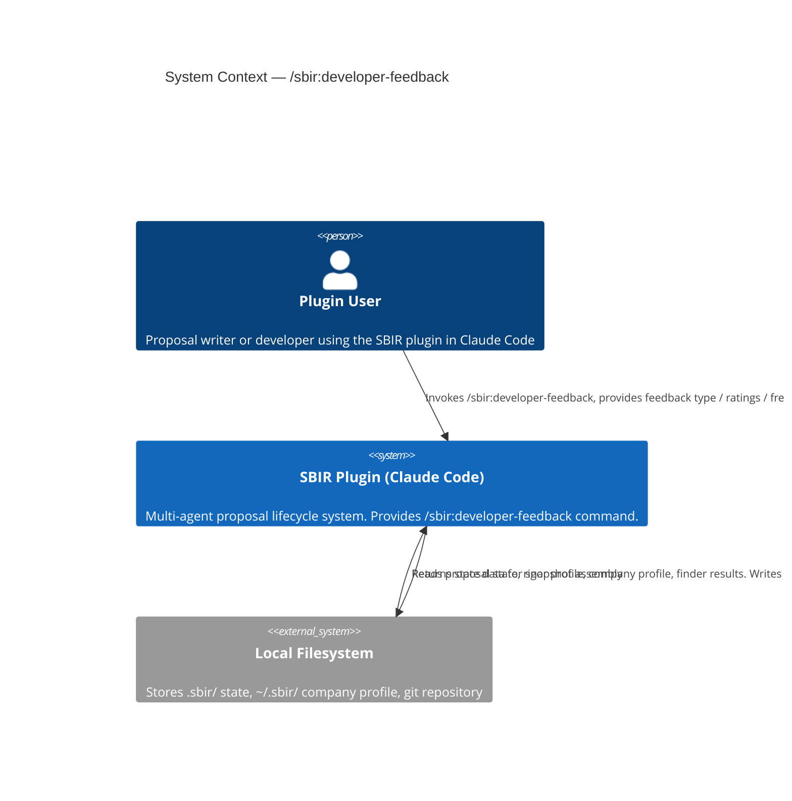
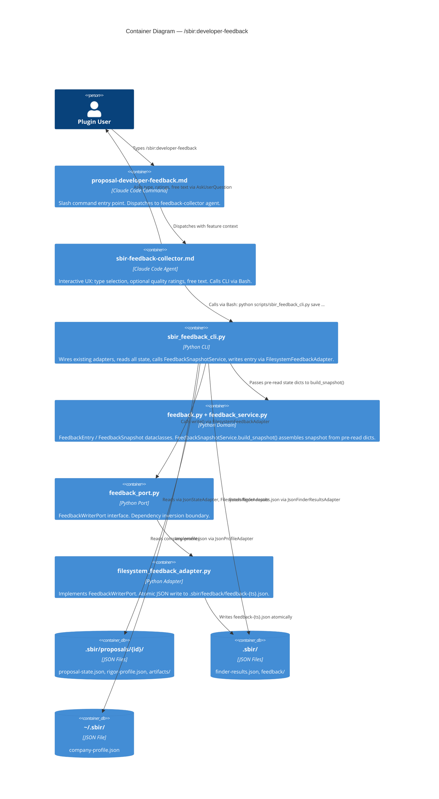
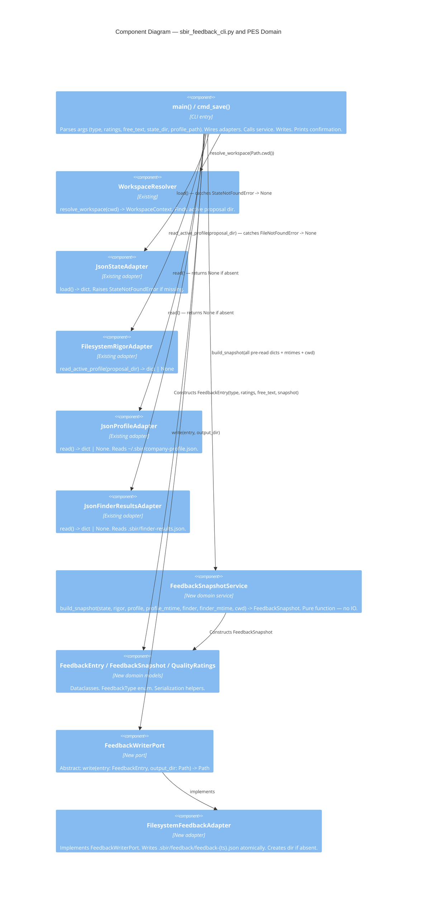

# Architecture Design — sbir-developer-feedback

## Summary

`/sbir:developer-feedback` is a lightweight, fully local feedback command. A markdown agent handles the interactive UX; a Python CLI script assembles and persists the context snapshot. Architecture reuses all existing PES adapters — no new infrastructure is required.

**Pattern**: Ports-and-Adapters (OOP) — consistent with the rest of `scripts/pes/`.
**Paradigm**: OOP (project-wide convention per CLAUDE.md).
**New components**: 5 (domain model, domain service, port, adapter, CLI) + 2 markdown files.
**Reused components**: 5 existing adapters read by the CLI.

---

## C4 System Context Diagram



---

## C4 Container Diagram



---

## C4 Component Diagram — Python CLI + Domain



---

## Data Flow

```
User invokes /sbir:developer-feedback
       │
       ▼
sbir-feedback-collector agent
  1. AskUserQuestion: type (Bug/Suggestion/Quality)
  2. If Quality: AskUserQuestion: ratings (1-5 or skip per dimension)
  3. AskUserQuestion: free text (optional)
  4. Bash: python scripts/sbir_feedback_cli.py save \
              --type "{type}" \
              --ratings "{json}" \
              --free-text "{text}"
       │
       ▼
sbir_feedback_cli.py
  1. WorkspaceResolver.resolve_workspace(cwd) -> WorkspaceContext
  2. JsonStateAdapter(state_dir).load() -> state_dict | None
  3. FilesystemRigorAdapter().read_active_profile(proposal_dir) -> rigor | None
  4. JsonProfileAdapter(~/.sbir).read() -> profile | None  (+ stat mtime)
  5. JsonFinderResultsAdapter(.sbir).read() -> finder | None  (+ stat mtime)
  6. subprocess: git rev-parse --short HEAD -> version_str
  7. FeedbackSnapshotService.build_snapshot(...) -> FeedbackSnapshot
  8. FeedbackEntry(id=uuid4(), ts=now(), type, ratings, free_text, snapshot)
  9. FilesystemFeedbackAdapter.write(entry, .sbir/feedback/)
  10. print JSON: {feedback_id, file_path}
       │
       ▼
Agent reads CLI output, confirms to user:
  "Feedback saved. ID: {uuid}. File: .sbir/feedback/feedback-{ts}.json"
```

---

## Integration Points with Existing PES

| Existing Component | How Used | Change Required |
|--------------------|----------|-----------------|
| `workspace_resolver.py` | Resolve active proposal path | None |
| `json_state_adapter.py` | Read proposal-state.json | None |
| `filesystem_rigor_adapter.py` | Read rigor-profile.json | None |
| `json_profile_adapter.py` | Read company-profile.json | None |
| `json_finder_results_adapter.py` | Read finder-results.json | None |

All five are read-only consumers. No existing adapter is modified.

---

## Quality Attribute Decisions

| Attribute | Decision | Rationale |
|-----------|----------|-----------|
| **Testability** | Domain service receives pre-read dicts (not adapter instances) | `build_snapshot()` is a pure function — no mocking needed in unit tests |
| **Maintainability** | CLI pattern matches `dsip_cli.py` | Consistent entry point convention across all PES CLI scripts |
| **Privacy** | Snapshot builder enforces field exclusion at domain layer | Privacy boundary in code, not just documentation |
| **Fault tolerance** | All adapter reads wrapped in try/except at CLI layer | No missing file can crash or block feedback submission |
| **Portability** | No network calls, no external services | Works air-gapped, works on first-time setup |
