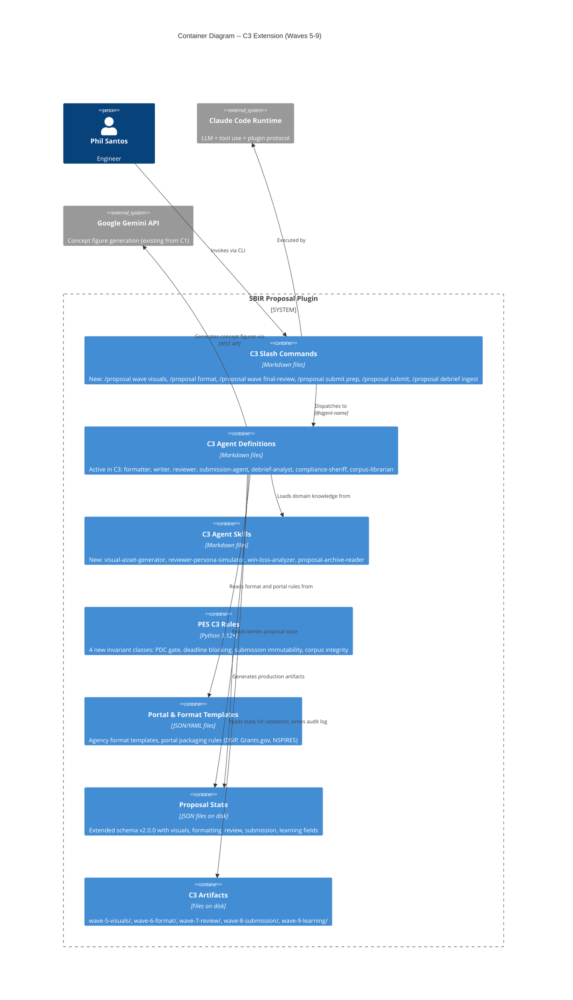
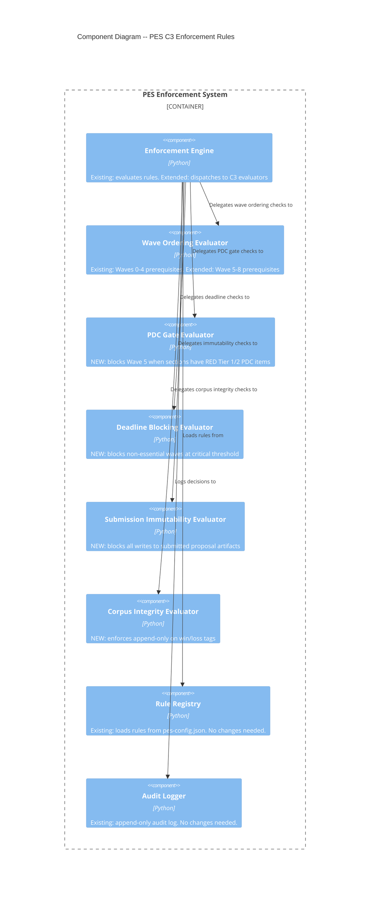
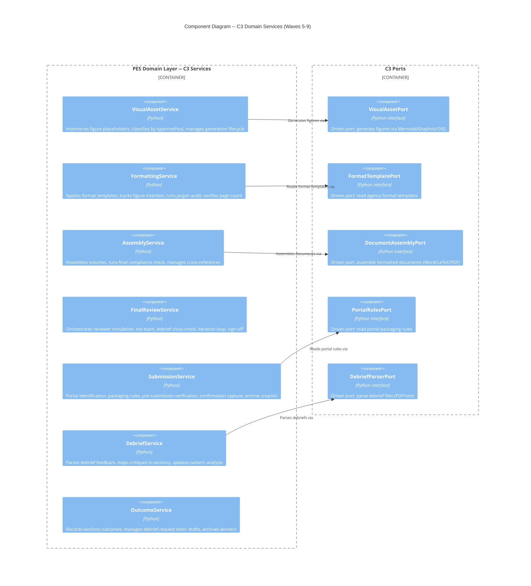

# C3 Architecture Extension -- Waves 5-9

Extends the C1/C2 architecture for proposal production, submission, and learning. No changes to existing components -- additive only.

---

## C4 System Context (Level 1) -- C3 Extension

No new external systems. Gemini API (ADR-007) already in C1 context for figure generation. All C3 capabilities operate within the existing plugin boundary.

---

## C4 Container (Level 2) -- C3 Extension



---

## C4 Component (Level 3) -- PES C3 Extension



---

## C4 Component (Level 3) -- C3 Domain Services



---

## Integration with Existing Architecture

### Unchanged Components
- Hook adapter, enforcement engine dispatch, rule registry, audit logger
- State reader/writer ports and JSON adapter
- Corpus port and filesystem adapter
- All C1/C2 domain services and their ports

### Extended Components
- **EnforcementEngine._rule_triggers()**: Add dispatch cases for `pdc_gate`, `deadline_blocking`, `submission_immutability`, `corpus_integrity` rule types
- **WaveOrderingEvaluator**: Extend `_APPROVAL_CONDITIONS` with Wave 5-8 prerequisites (sign-off, figure approval, etc.)
- **proposal-state.json**: Schema v2.0.0 with new top-level sections for visuals, formatting, review, submission, learning

### New PES Configuration

```json
{
    "enforcement": {
        "session_startup_check": true,
        "wave_ordering": "strict",
        "compliance_gate": true,
        "pdc_gate": true,
        "deadline_blocking": true,
        "submission_immutability": true,
        "corpus_integrity": true
    },
    "deadlines": {
        "warning_days": 7,
        "critical_days": 3,
        "non_essential_waves": [5]
    }
}
```

---

## Artifact Directory Structure (C3 Additions)

```
./artifacts/
    wave-5-visuals/
        figure-inventory.md
        cross-reference-log.md
        figures/                    # Generated SVG/PNG/Mermaid files
    wave-6-format/
        compliance-final-check.md
        jargon-audit.md
        assembled/                  # Volume files (Word/PDF/LaTeX)
    wave-7-review/
        reviewer-scorecard.md
        red-team-findings.md
        debrief-cross-check.md
        sign-off-record.md
    wave-8-submission/
        pre-submission-checklist.md
        confirmation-record.md
        package/                    # Portal-ready files
        archive/                    # Immutable snapshot
    wave-9-learning/
        debrief-request-draft.md
        debrief-structured.md
        critique-section-map.md
        pattern-analysis.md
        lessons-learned.md
```

---

## New Commands (C3)

| Command | Wave | Agent | Description |
|---------|------|-------|-------------|
| `/proposal wave visuals` | 5 | formatter, writer | Figure inventory, generation, review, cross-reference validation |
| `/proposal wave visuals --replace <n> <file>` | 5 | formatter | Manual figure replacement |
| `/proposal format` | 6 | formatter, compliance-sheriff | Template formatting, figure insertion, jargon audit, volume assembly |
| `/proposal wave final-review` | 7 | reviewer, compliance-sheriff | Reviewer simulation, red team, debrief cross-check, sign-off |
| `/proposal submit prep` | 8 | submission-agent | Portal identification, packaging, pre-submission verification |
| `/proposal submit` | 8 | submission-agent | Submission confirmation and immutable archive |
| `/proposal debrief ingest <path>` | 9 | debrief-analyst, corpus-librarian | Debrief parsing, critique mapping, pattern analysis |

---

## New Skills (C3)

| Skill | Agent(s) | Purpose |
|-------|----------|---------|
| `visual-asset-generator` | formatter, writer | Figure classification, Mermaid/Graphviz syntax, external brief templates |
| `reviewer-persona-simulator` | reviewer | Government evaluator persona, scoring criteria, red team methodology |
| `win-loss-analyzer` | debrief-analyst | Debrief parsing strategies, pattern detection heuristics, critique mapping |
| `proposal-archive-reader` | debrief-analyst | Submitted proposal structure, section identification for critique mapping |

---

## Quality Attribute Strategies (C3 Extension)

### Reliability (Submission Safety -- NFR-005)
- Pre-submission verification catches 100% of missing files and naming violations
- Human confirmation required before any irreversible action
- Immutable archive created within 30 seconds of confirmation
- PES blocks all post-submission modifications

### Maintainability (Template Extensibility)
- Agency format templates are data files, not code -- new agencies added without code changes
- Portal packaging rules are data files in `templates/portal-rules/`
- New PES rules added to pes-config.json without engine changes (same extensibility as C1)

### Usability (NFR-007 -- Debrief Effort)
- Debrief ingestion under 5 minutes of Phil's time
- Best-effort parsing preserves freeform text when structured extraction fails
- "No debrief received" is a valid terminal state

### Data Integrity (NFR-006 -- Corpus Integrity)
- Win/loss tags append-only, PES-enforced
- Source documents never modified by annotations
- Pattern analysis degrades gracefully with small corpus (confidence levels noted)

---

## C3 Roadmap

### Rejected Simple Alternatives

#### Alternative 1: Agent-only approach (no new PES domain services)
- What: All C3 logic handled by LLM agents; no new Python domain services
- Expected Impact: Could handle 60% of scenarios (generation, review, formatting via Claude Code)
- Why Insufficient: Submission immutability, corpus integrity, PDC gates, and deadline blocking require deterministic enforcement. Agents cannot guarantee invariants. PES hook-based enforcement is the established pattern for structural guarantees.

#### Alternative 2: Minimal PES extension only (skip formatting/assembly services)
- What: Add PES rules for Waves 5-9 gates; let agents handle all formatting and assembly
- Expected Impact: Could handle 75% of scenarios; gate enforcement works, formatting is best-effort
- Why Insufficient: Template-based formatting requires structured data (format rules, page counts, volume assembly). Without domain services, formatting quality depends entirely on LLM prompt adherence. NFR-004 (90% formatting fidelity) requires deterministic template application via python-docx.

### Build Phases

C3 is organized into 7 implementation phases with 15 steps. Build order follows DISCUSS recommendation: PES gates first, then waves sequentially.

#### Phase 05: PES C3 Enforcement (US-014)

```yaml
step_05-01:
  title: "PES C3 rule evaluators and state schema extension"
  description: "Four new rule evaluators (PDC gate, deadline blocking, submission immutability, corpus integrity). State schema v2.0.0 with C3 fields. Engine dispatch for new rule types."
  stories: [US-014]
  acceptance_criteria:
    - "PDC gate blocks Wave 5 entry when sections have RED Tier 1/2 PDC items"
    - "Deadline blocking warns at critical threshold and blocks non-essential waves"
    - "Submission immutability blocks writes to submitted artifacts"
    - "Corpus integrity blocks modification of win/loss tags"
    - "All four rules configurable in pes-config.json"
  architectural_constraints:
    - "Each evaluator is a separate domain class following WaveOrderingEvaluator pattern"
    - "Engine dispatches by rule_type -- no conditional logic in evaluators"
    - "State schema v2.0.0 forward-compatible with v1.0.0"
```

#### Phase 06: Visual Assets (US-010)

```yaml
step_06-01:
  title: "Visual asset domain models and port"
  description: "FigurePlaceholder, FigureInventory, GeneratedFigure, CrossReferenceLog domain models. VisualAssetPort interface."
  stories: [US-010]
  acceptance_criteria:
    - "Figure placeholders extracted from outline with type and generation method"
    - "Figure inventory created with all placeholders"
    - "Cross-reference log validates figure-to-text consistency"
  architectural_constraints:
    - "Domain models are frozen dataclasses (same pattern as SectionDraft)"
    - "VisualAssetPort abstracts generation method"

step_06-02:
  title: "Visual asset generation and review lifecycle"
  description: "VisualAssetService orchestrates generation per method (Mermaid/Graphviz/SVG/Gemini/external brief). Human review checkpoint per figure. Cross-reference validation."
  stories: [US-010]
  acceptance_criteria:
    - "Mermaid diagrams generate SVG output"
    - "Non-generatable figures produce external brief"
    - "Each figure presented for human review with approve/revise/replace options"
    - "Cross-reference validation catches orphaned references and missing figures"
    - "PES PDC gate enforced before Wave 5 entry"
  architectural_constraints:
    - "Generation method routed by FigurePlaceholder.generation_method"
    - "FileVisualAssetAdapter writes to ./artifacts/wave-5-visuals/figures/"
```

#### Phase 07: Formatting & Assembly (US-011)

```yaml
step_07-01:
  title: "Format template port and agency templates"
  description: "FormatTemplatePort, DocumentAssemblyPort interfaces. JsonFormatTemplateAdapter. Agency format templates (DoD, NASA, NSF, DOE) as JSON data files."
  stories: [US-011]
  acceptance_criteria:
    - "Format templates loaded by agency and solicitation type"
    - "Templates specify font, margins, headers, footers, page limits"
    - "New agency templates added by creating JSON file, no code changes"
  architectural_constraints:
    - "Templates in templates/format-rules/ directory"
    - "Port interface returns FormatTemplate domain object"

step_07-02:
  title: "Document formatting and jargon audit"
  description: "FormattingService applies template rules, inserts figures, formats references. Jargon audit identifies undefined acronyms. Page count verification against limit."
  stories: [US-011]
  acceptance_criteria:
    - "Formatted document matches solicitation font, margins, headers"
    - "Figures inserted at correct positions with captions"
    - "Jargon audit flags undefined acronyms with locations"
    - "Page count verified against solicitation limit with guidance when exceeded"
  architectural_constraints:
    - "python-docx adapter for Word output"
    - "Formatting service delegates to DocumentAssemblyPort"

step_07-03:
  title: "Volume assembly and compliance final check"
  description: "AssemblyService assembles sections into volumes per solicitation structure. Final compliance matrix check. Human checkpoint for assembled package."
  stories: [US-011]
  acceptance_criteria:
    - "Volumes assembled into required file structure"
    - "Compliance matrix final check reports covered/waived/missing counts"
    - "Missing compliance items block progression with guidance"
    - "Human checkpoint at assembled package review"
  architectural_constraints:
    - "Assembled volumes written to ./artifacts/wave-6-format/assembled/"
    - "Compliance check reads the same living matrix from Wave 1"
```

#### Phase 08: Final Review (US-012)

```yaml
step_08-01:
  title: "Final review domain models and service"
  description: "ReviewerScorecard (C3), RedTeamFinding, DebriefCrossCheckEntry, SignOffRecord models. FinalReviewService with iteration loop (max 2) and sign-off gate."
  stories: [US-012]
  acceptance_criteria:
    - "Reviewer persona simulation scores against evaluation criteria"
    - "Red team identifies 3-5 objections tagged by severity"
    - "Debrief cross-check flags known weaknesses from corpus"
    - "Handles gracefully when no past debriefs exist"
    - "Issue resolution loop supports max 2 iterations"
  architectural_constraints:
    - "FinalReviewService tracks review_round and delegates LLM review to agent"
    - "Scorecard and findings written to ./artifacts/wave-7-review/"

step_08-02:
  title: "Review sign-off and Wave 8 gate"
  description: "Human sign-off checkpoint. After 2 iterations, sign-off required even with unresolved issues. Sign-off gates Wave 8 via PES."
  stories: [US-012]
  acceptance_criteria:
    - "Human sign-off required before submission"
    - "After 2 review iterations, forced sign-off with unresolved items documented"
    - "Sign-off record written to ./artifacts/wave-7-review/sign-off-record.md"
    - "PES blocks Wave 8 without sign-off"
  architectural_constraints:
    - "Sign-off status stored in proposal-state.json#final_review"
    - "PES wave ordering evaluator extended for Wave 7->8 gate"
```

#### Phase 09: Submission (US-013)

```yaml
step_09-01:
  title: "Portal rules port and submission packaging"
  description: "PortalRulesPort interface. JsonPortalRulesAdapter. Portal rule templates (DSIP, Grants.gov, NSPIRES). SubmissionService applies portal-specific file naming, size limits, format requirements."
  stories: [US-013]
  acceptance_criteria:
    - "Portal identified from agency in proposal state"
    - "Portal-specific file naming applied"
    - "File sizes verified against portal limits"
    - "Missing required files block submission with guidance"
  architectural_constraints:
    - "Portal rules in templates/portal-rules/ as JSON data files"
    - "Portal rules editable by Phil for inter-cycle changes"

step_09-02:
  title: "Submission confirmation, immutable archive, and read-only enforcement"
  description: "Human confirmation checkpoint. Manual confirmation number entry. Immutable archive creation. PES marks artifacts read-only."
  stories: [US-013]
  acceptance_criteria:
    - "Submission requires explicit human confirmation"
    - "Confirmation number manually entered after portal submission"
    - "Immutable archive created in ./artifacts/wave-8-submission/archive/"
    - "PES blocks all modifications to submitted artifacts"
    - "Timestamp captured at confirmation entry"
  architectural_constraints:
    - "submission.immutable flag triggers PES immutability evaluator"
    - "Archive is directory copy of assembled volumes + package"
```

#### Phase 10: Debrief Request Letter (US-016)

```yaml
step_10-01:
  title: "Debrief request letter generation"
  description: "OutcomeService records outcome, generates agency-specific debrief request letter from templates. Skipping is valid."
  stories: [US-016]
  acceptance_criteria:
    - "Letter references topic number, confirmation, applicable regulations"
    - "Letter adapts to agency (DoD FAR 15.505 vs. NASA vs. other)"
    - "Skipping debrief request is a valid option"
    - "Letter written to ./artifacts/wave-9-learning/"
  architectural_constraints:
    - "Letter templates in templates/debrief-request/"
    - "Outcome recorded in proposal-state.json#learning"
```

#### Phase 11: Debrief Ingestion & Learning (US-015)

```yaml
step_11-01:
  title: "Debrief parsing and critique-to-section mapping"
  description: "DebriefParserPort interface. TextDebriefParserAdapter. DebriefService parses feedback, maps critiques to sections, flags known weaknesses."
  stories: [US-015]
  acceptance_criteria:
    - "Debrief parsed from PDF or text file"
    - "Each critique mapped to proposal section and page"
    - "Known weaknesses from past debriefs flagged"
    - "Unstructured debriefs preserved as freeform text"
    - "Parsing confidence reported"
  architectural_constraints:
    - "LLM agent does parsing; domain service validates output"
    - "Critique mapping uses section numbering from submitted outline"

step_11-02:
  title: "Win/loss pattern analysis and corpus update"
  description: "OutcomeService updates pattern analysis across corpus. Corpus librarian updates win/loss tags (append-only). Lessons learned with human checkpoint."
  stories: [US-015]
  acceptance_criteria:
    - "Win/loss pattern analysis updates cumulatively"
    - "Win/loss tags are append-only (PES-enforced)"
    - "Awarded proposals archived with winning discriminators"
    - "Lessons learned reviewed by human before corpus update"
    - "Pattern analysis notes confidence level with small corpus"
  architectural_constraints:
    - "Corpus integrity PES rule enforces append-only tags"
    - "Pattern analysis written to ./artifacts/wave-9-learning/"
```

### Roadmap Summary

| Phase | Steps | Stories | Est. Production Files |
|-------|-------|---------|----------------------|
| 05 PES C3 Enforcement | 1 | US-014 | 6 |
| 06 Visual Assets | 2 | US-010 | 5 |
| 07 Formatting & Assembly | 3 | US-011 | 8 |
| 08 Final Review | 2 | US-012 | 4 |
| 09 Submission | 2 | US-013 | 6 |
| 10 Debrief Request | 1 | US-016 | 2 |
| 11 Debrief & Learning | 2 | US-015 | 5 |
| **Total** | **13** | **7 stories, 38 scenarios** | **~36** |

Step ratio: 13 / 36 = 0.36 (well under 2.5 threshold).

### Step-to-Story Traceability

| Step | Story | Scenarios Covered |
|------|-------|-------------------|
| 05-01 | US-014 | 5 |
| 06-01 | US-010 | 2 (inventory, cross-ref models) |
| 06-02 | US-010 | 3 (generation, review, PES gate) |
| 07-01 | US-011 | 1 (template loading) |
| 07-02 | US-011 | 3 (formatting, jargon, page count) |
| 07-03 | US-011 | 3 (assembly, compliance, checkpoint) |
| 08-01 | US-012 | 4 (simulation, red team, debrief cross-check, no debriefs) |
| 08-02 | US-012 | 2 (sign-off, iteration limit) |
| 09-01 | US-013 | 3 (portal ID, packaging, missing files) |
| 09-02 | US-013 | 3 (confirmation, archive, immutability) |
| 10-01 | US-016 | 3 |
| 11-01 | US-015 | 3 (parse, map, unstructured) |
| 11-02 | US-015 | 3 (patterns, outcomes, lessons) |

---

## ADR Index (C3 Additions)

| ADR | Title | Status |
|-----|-------|--------|
| ADR-008 | Document formatting engine selection (python-docx + WeasyPrint) | Accepted |
| ADR-009 | Submission portal packaging as data-driven adapters | Accepted |
| ADR-010 | Debrief parsing strategy -- best-effort with freeform fallback | Accepted |
| ADR-011 | Visual asset generation -- local-first with API fallback | Accepted |
| ADR-012 | State schema evolution for C3 | Accepted |
