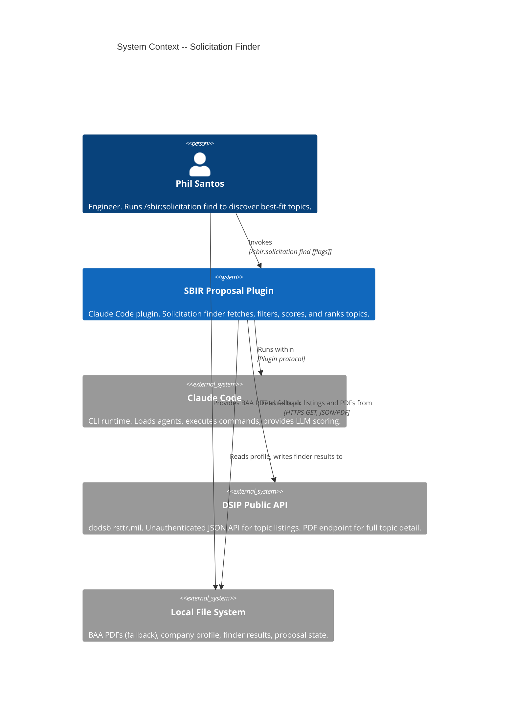
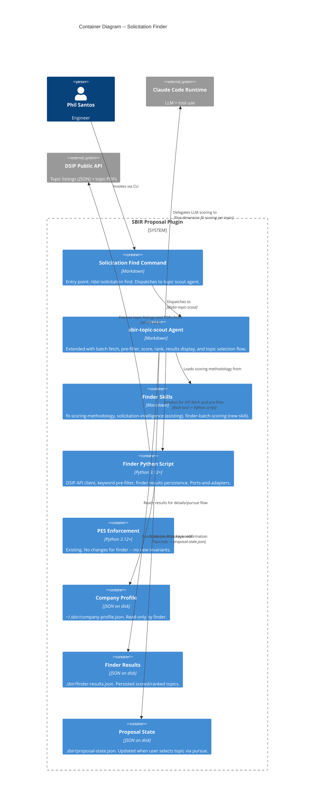
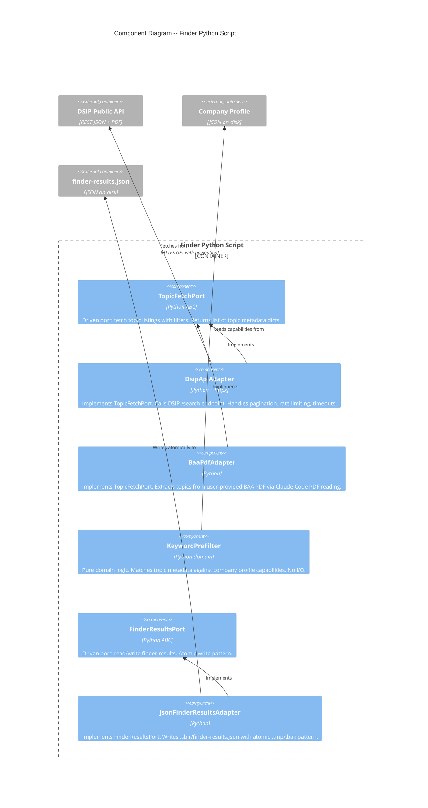

# Architecture Design: Solicitation Finder

## System Context

The solicitation finder extends the SBIR Proposal Plugin with automated topic discovery and batch scoring. It adds one new external system dependency (DSIP public API) and extends the existing sbir-topic-scout agent with batch capabilities.

**Scope**: Fetch open SBIR/STTR topics from DSIP, pre-filter by keyword, score via LLM, rank, persist results, and hand off selected topic to `/sbir:proposal new`.

---

## C4 System Context (Level 1) -- Solicitation Finder



---

## C4 Container (Level 2) -- Solicitation Finder



---

## C4 Component (Level 3) -- Finder Python Script

The finder Python script has sufficient internal complexity (5 components) to warrant a component diagram.



---

## Component Architecture

### New Components

| Component | Layer | Location | Purpose |
|-----------|-------|----------|---------|
| `TopicFetchPort` | Port | `scripts/pes/ports/topic_fetch_port.py` | Driven port: fetch topic listings with optional filters |
| `DsipApiAdapter` | Adapter | `scripts/pes/adapters/dsip_api_adapter.py` | DSIP REST API client with pagination, retry, rate limiting |
| `BaaPdfAdapter` | Adapter | `scripts/pes/adapters/baa_pdf_adapter.py` | Extract topics from BAA PDF (fallback). Delegates PDF reading to Claude. |
| `KeywordPreFilter` | Domain | `scripts/pes/domain/keyword_prefilter.py` | Pure function: match topic metadata against profile capabilities |
| `FinderResultsPort` | Port | `scripts/pes/ports/finder_results_port.py` | Driven port: read/write finder results |
| `JsonFinderResultsAdapter` | Adapter | `scripts/pes/adapters/json_finder_results_adapter.py` | JSON persistence for finder results with atomic writes |
| `FinderService` | Application | `scripts/pes/domain/finder_service.py` | Orchestrates: fetch -> pre-filter -> prepare for LLM scoring -> persist |
| `/sbir:solicitation find` command | Command | `commands/sbir-solicitation-find.md` | CLI entry point with --agency, --phase, --solicitation, --file flags |
| `finder-batch-scoring` skill | Skill | `skills/topic-scout/finder-batch-scoring.md` | Batch scoring instructions for the agent |

### Extended Components (existing, modified)

| Component | Change |
|-----------|--------|
| `sbir-topic-scout` agent | Add batch scoring workflow phases, finder results display, details/pursue interactive flow |
| `TopicInfo` dataclass | Extend with optional fields: `topic_code`, `component`, `solicitation_number`, `cmmc_level`, `start_date`, `end_date` |

### Reused Components (no changes)

| Component | Usage |
|-----------|-------|
| `ProfilePort` / `JsonProfileAdapter` | Read company profile for pre-filter and scoring |
| `StateWriter` / `JsonStateAdapter` | Update proposal state on pursue confirmation |
| `fit-scoring-methodology` skill | Five-dimension scoring model (weights, thresholds, recommendations) |
| `solicitation-intelligence` skill | Source identification, format parsing |

---

## Data Models

### DSIP Topic Listing (API response, external)

```json
{
  "total": 347,
  "data": [{
    "topicId": "68490",
    "topicCode": "AF263-042",
    "topicTitle": "Compact Directed Energy for C-UAS",
    "topicStatus": "Open",
    "program": "SBIR",
    "component": "USAF",
    "solicitationNumber": "26.3",
    "cycleName": "DOD_SBIR_2026_P1_C3",
    "topicStartDate": 1747267200000,
    "topicEndDate": 1752537600000,
    "cmmcLevel": "",
    "phaseHierarchy": "{...}"
  }]
}
```

### Finder Results Schema (`.sbir/finder-results.json`)

```json
{
  "schema_version": "1.0.0",
  "finder_run_id": "UUID",
  "run_date": "2026-03-13T14:30:00Z",
  "source": {
    "type": "dsip_api",
    "query_params": {"topicStatus": "Open", "baa": "DOD_SBIR_2026_P1_C3"},
    "fallback_file": null
  },
  "filters_applied": {
    "agency": "Air Force",
    "phase": "I",
    "solicitation": null
  },
  "topics_fetched": 347,
  "topics_after_prefilter": 42,
  "topics_scored": 42,
  "topics_disqualified": 3,
  "company_profile_used": "~/.sbir/company-profile.json",
  "profile_hash": "sha256:abc123...",
  "results": [
    {
      "topic_id": "AF263-042",
      "topic_code": "AF263-042",
      "agency": "Air Force",
      "component": "USAF",
      "title": "Compact Directed Energy for C-UAS",
      "program": "SBIR",
      "phase": "I",
      "deadline": "2026-05-15",
      "solicitation_number": "26.3",
      "cmmc_level": "",
      "composite_score": 0.82,
      "dimensions": {
        "subject_matter": 0.95,
        "past_performance": 0.80,
        "certifications": 1.0,
        "eligibility": 1.0,
        "sttr": 1.0
      },
      "recommendation": "go",
      "rationale": "Core competency in directed energy with prior Air Force Phase I win.",
      "disqualifiers": [],
      "key_personnel_match": ["Dr. Elena Vasquez", "Marcus Chen"],
      "prefilter_keywords_matched": ["directed energy", "RF power", "C-UAS"]
    }
  ]
}
```

### TopicInfo Extension

The existing `TopicInfo(topic_id, agency, phase, deadline, title)` dataclass needs optional fields to carry DSIP metadata through the pipeline. The `pursue` flow maps back to the existing five fields for `proposal-state.json` compatibility.

New optional fields: `topic_code`, `component`, `solicitation_number`, `cmmc_level`, `start_date`, `end_date`, `program`.

---

## Technology Stack (New Additions)

| Component | Technology | Version | License | Rationale |
|-----------|-----------|---------|---------|-----------|
| HTTP client | httpx | 0.27+ | BSD-3-Clause | Async-capable, timeout/retry support, modern Python HTTP. Preferred over requests for timeout handling and connection pooling. |
| PDF text extraction | Claude Code PDF reading | N/A | N/A (built-in) | Claude reads PDFs natively. No additional library needed for BAA PDF fallback. |
| JSON Schema validation | jsonschema (existing) | 4.x | MIT | Already in project. Validate finder-results.json schema. |
| UUID generation | Python stdlib `uuid` | 3.12+ | PSF | finder_run_id generation. No external dependency. |
| Hash computation | Python stdlib `hashlib` | 3.12+ | PSF | profile_hash for results provenance. |

### Technology Decision: httpx over requests

See ADR-018. Key factors: built-in timeout support at transport level, connection pooling, async-ready if needed later, similar API to requests (low learning curve).

### Technology Decision: No PDF parsing library

BAA PDFs are parsed by Claude Code's native PDF reading capability (the LLM reads PDFs directly). Topic PDFs from the DSIP API are also read by Claude. No pdfplumber/PyPDF2 needed. This avoids a fragile parsing dependency -- Claude handles format variation across agencies.

---

## Integration Patterns

### Data Flow: End-to-End

```
User invokes /sbir:solicitation find [--agency X] [--phase I] [--solicitation Y]
    |
    v
[Command] dispatches to sbir-topic-scout agent
    |
    v
[Agent] loads skills, invokes Python finder script via Bash tool
    |
    v
[FinderService] orchestrates:
    1. Read company profile via ProfilePort
    2. Fetch topics via TopicFetchPort (DsipApiAdapter primary, BaaPdfAdapter fallback)
    3. Apply KeywordPreFilter against profile capabilities
    4. Return candidate list to agent (JSON stdout)
    |
    v
[Agent] receives candidates, scores each via LLM:
    - Reads topic PDF from DSIP for full description (Claude reads PDF URL)
    - Applies five-dimension fit scoring from skill
    - Produces composite score and recommendation
    |
    v
[Agent] writes results via FinderResultsPort (JsonFinderResultsAdapter)
    |
    v
[Agent] displays ranked table to user
    |
    v
User types "details <topic-id>" or "pursue <topic-id>"
    |
    v
[Agent] reads from finder-results.json for detail display
    |
    v
On "pursue" + confirm: [Agent] maps TopicInfo -> proposal-state.json via StateWriter
                        transitions to /sbir:proposal new flow
```

### API Integration: DSIP

- **Endpoint**: `GET https://www.dodsbirsttr.mil/topics/api/public/topics/search`
- **Auth**: None (public API)
- **Pagination**: `numPerPage` parameter, iterate until all pages fetched
- **Rate limiting**: 1-2 second delay between page requests
- **Timeout**: 30 seconds per request, 3 retries with exponential backoff
- **Failure mode**: On timeout/error after retries, report partial results and suggest `--file` fallback

### Topic PDF Enrichment

- **Endpoint**: `GET https://www.dodsbirsttr.mil/topics/api/public/topics/{hash_id}/download/PDF`
- **Method**: Agent uses Claude Code's Read tool on the PDF URL (Claude reads PDFs natively)
- **When**: Only for candidates that pass the keyword pre-filter (20-50 topics, not 300+)
- **Fallback**: If PDF download fails, score with metadata only (degraded accuracy, warn user)

### Finder Results Persistence

- **Path**: `.sbir/finder-results.json`
- **Write pattern**: Atomic (.tmp -> .bak -> rename), same as proposal-state.json
- **Read pattern**: Detail view and pursue flow read from persisted results (no re-scoring)
- **Schema version**: `1.0.0` with version field for future migration

### TopicInfo Handoff to /sbir:proposal new

The `pursue` command maps finder result fields to the existing `TopicInfo` dataclass:
- `topic_id` -> `TopicInfo.topic_id`
- `agency` -> `TopicInfo.agency`
- `phase` -> `TopicInfo.phase`
- `deadline` -> `TopicInfo.deadline`
- `title` -> `TopicInfo.title`

This enables seamless transition without schema changes to proposal-state.json.

---

## Quality Attribute Strategies

### Reliability

- **DSIP API resilience**: Primary API with BAA PDF fallback. Partial results offered on rate limiting. Retry with exponential backoff.
- **Atomic writes**: Finder results use the same .tmp/.bak/rename pattern as proposal state.
- **Graceful degradation**: Missing profile -> clear error + degraded mode. API failure -> fallback guidance. Sparse profile -> per-dimension warnings.

### Performance

- **Two-pass filtering**: Keyword pre-filter eliminates 80-90% of topics before LLM scoring. Reduces token budget from ~500K to ~100K.
- **Batch scoring**: Topics scored in groups of 10-20 to manage context window.
- **Target**: End-to-end < 10 minutes for 50 candidate topics.

### Maintainability

- **Port abstraction**: TopicFetchPort enables swapping data sources (DSIP API, BAA PDF, future NASA API) without domain changes.
- **Domain purity**: KeywordPreFilter is pure Python, no I/O. Testable in isolation.
- **Skill separation**: Batch scoring methodology in a skill file, not hardcoded in agent.

### Security

- **No credentials stored**: DSIP API is unauthenticated. No API keys in code or config.
- **Local data**: All topic data and scoring results stay on local filesystem. No company profile data sent externally.
- **DSIP is read-only**: Only GET requests. No data submitted to DSIP.

---

## Rejected Simple Alternatives

### Alternative 1: Agent-only (no Python script)

- **What**: Let the agent handle everything -- fetch API, filter, score, persist -- using Claude Code tools (Bash curl, Read, Write).
- **Expected impact**: 80% of functionality.
- **Why insufficient**: No testable domain logic. Keyword pre-filter would be LLM-based (slow, token-expensive). No retry/pagination logic. Rate limiting handled poorly by curl. Results persistence would be fragile (agent writing JSON directly).

### Alternative 2: BAA PDF only (no API)

- **What**: Skip the DSIP API entirely. User always provides a BAA PDF. Agent extracts topics from it.
- **Expected impact**: 60% of functionality. Covers the scoring pipeline but not automated discovery.
- **Why insufficient**: Eliminates the core value proposition (automated discovery). User still manually downloads BAA. Misses topics from other solicitations not in the specific BAA. Discovery validated in H1 -- the API is public and reliable.

### Why current approach is necessary

Simple alternatives fail because: (1) the keyword pre-filter must be fast and testable (pure Python), (2) API pagination and rate limiting require proper HTTP client logic, (3) results persistence needs atomic writes (proven pattern in Python), (4) the two-pass architecture inherently spans Python (pre-filter) and LLM (semantic scoring).

---

## Implementation Roadmap

### Phase 01: Ports, Domain, and Pre-Filter (US-SF-001, US-SF-005)

```yaml
step_01-01:
  title: "Topic fetch port and DSIP API adapter"
  description: "TopicFetchPort driven port and DsipApiAdapter with pagination, retry, rate limiting, and timeout handling."
  stories: [US-SF-001]
  acceptance_criteria:
    - "Adapter fetches topic listings from DSIP API with configurable filters"
    - "Pagination retrieves all matching topics across multiple pages"
    - "Rate limiting delays 1-2 seconds between page requests"
    - "Timeout after 30 seconds per request with 3 retries"
    - "API failure returns partial results with error context"
  architectural_constraints:
    - "TopicFetchPort in scripts/pes/ports/"
    - "DsipApiAdapter in scripts/pes/adapters/"
    - "httpx as HTTP client (ADR-018)"

step_01-02:
  title: "Keyword pre-filter and profile integration"
  description: "Pure domain logic matching topic metadata against company profile capabilities. No I/O dependencies."
  stories: [US-SF-001, US-SF-002, US-SF-005]
  acceptance_criteria:
    - "Pre-filter matches topic titles and codes against profile capability keywords"
    - "Returns candidate topics with matched keywords annotated"
    - "Empty profile capabilities returns all topics with warning"
    - "Case-insensitive matching with basic stemming"
  architectural_constraints:
    - "KeywordPreFilter in scripts/pes/domain/"
    - "Pure function: takes topic list + capabilities, returns filtered list"
    - "No I/O, no external dependencies"

step_01-03:
  title: "Finder results port and JSON adapter"
  description: "FinderResultsPort and JsonFinderResultsAdapter for persisting scored results with atomic writes."
  stories: [US-SF-003]
  acceptance_criteria:
    - "Results written atomically to .sbir/finder-results.json"
    - "Schema version field present for future migration"
    - "Read returns full results including all dimension scores"
    - "Missing results file returns None (not error)"
  architectural_constraints:
    - "FinderResultsPort in scripts/pes/ports/"
    - "JsonFinderResultsAdapter in scripts/pes/adapters/"
    - "Atomic write: .tmp -> .bak -> rename"

step_01-04:
  title: "BAA PDF fallback adapter and profile-missing handling"
  description: "BaaPdfAdapter implements TopicFetchPort for user-provided BAA PDFs. FinderService handles missing/incomplete profile."
  stories: [US-SF-001, US-SF-005]
  acceptance_criteria:
    - "Adapter extracts topic metadata from BAA PDF content"
    - "Missing profile produces clear error with setup guidance"
    - "Missing profile + --file flag enables degraded mode (topics listed, not scored)"
    - "Incomplete profile warns per missing section"
  architectural_constraints:
    - "BaaPdfAdapter in scripts/pes/adapters/"
    - "PDF reading delegated to caller (agent reads PDF, passes text to adapter)"
```

### Phase 02: Finder Service and Agent Extension (US-SF-002)

```yaml
step_02-01:
  title: "Finder orchestration service"
  description: "FinderService coordinates fetch, pre-filter, and results persistence. Prepares candidate list for LLM scoring."
  stories: [US-SF-001, US-SF-002]
  acceptance_criteria:
    - "Service fetches topics via TopicFetchPort with caller-provided filters"
    - "Service applies KeywordPreFilter using profile capabilities"
    - "Service returns candidate count and pre-filter statistics"
    - "Service persists results via FinderResultsPort after scoring"
    - "Progress reporting via callback for fetch and filter phases"
  architectural_constraints:
    - "FinderService in scripts/pes/domain/"
    - "Depends only on ports (TopicFetchPort, ProfilePort, FinderResultsPort)"

step_02-02:
  title: "Agent batch scoring and results display"
  description: "Extend sbir-topic-scout with batch LLM scoring, ranked table display, and per-topic detail drilldown."
  stories: [US-SF-002, US-SF-003]
  acceptance_criteria:
    - "Agent scores each candidate topic with five-dimension fit model"
    - "Results displayed as ranked table (ID, agency, title, score, recommendation, deadline)"
    - "Disqualified topics shown separately with reasons"
    - "Details command shows per-dimension breakdown and key personnel match"
    - "Scoring completes within 10 minutes for 50 candidates"
  architectural_constraints:
    - "Extend sbir-topic-scout agent (not new agent, per ADR-005)"
    - "Scoring methodology loaded from fit-scoring-methodology skill"
    - "Results read/written via FinderResultsPort"
```

### Phase 03: Command, Selection Flow, and Integration (US-SF-003, US-SF-004)

```yaml
step_03-01:
  title: "Solicitation find command and topic selection flow"
  description: "CLI command with --agency, --phase, --solicitation, --file flags. Pursue command maps selected topic to /sbir:proposal new."
  stories: [US-SF-003, US-SF-004]
  acceptance_criteria:
    - "Command dispatches to sbir-topic-scout with parsed flags"
    - "Pursue shows confirmation with topic metadata and score"
    - "Confirmed pursue transitions to /sbir:proposal new with TopicInfo pre-loaded"
    - "Cancelled pursue returns to results list"
    - "Expired topic cannot be pursued"
    - "Results persisted for later reference across sessions"
  architectural_constraints:
    - "Command file at commands/sbir-solicitation-find.md"
    - "TopicInfo maps to existing dataclass for proposal state"
    - "Deadline expiry computed at pursue time, not at scoring time"
```

### Roadmap Summary

| Phase | Steps | Stories | Est. Production Files |
|-------|-------|---------|----------------------|
| 01 Ports, Domain, Pre-Filter | 4 | US-SF-001, US-SF-005 | 8 |
| 02 Service and Agent | 2 | US-SF-001, US-SF-002, US-SF-003 | 4 |
| 03 Command and Selection | 1 | US-SF-003, US-SF-004 | 3 |
| **Total** | **7** | **5 stories, 23 scenarios** | **~15** |

Step ratio: 7 / 15 = 0.47 (well under 2.5 threshold).

---

## ADR Index (Solicitation Finder)

| ADR | Title | Status |
|-----|-------|--------|
| ADR-016 | DSIP public API as primary data source | Accepted |
| ADR-017 | Two-pass matching (keyword pre-filter + LLM scoring) | Accepted |
| ADR-018 | httpx as HTTP client for DSIP API | Accepted |
