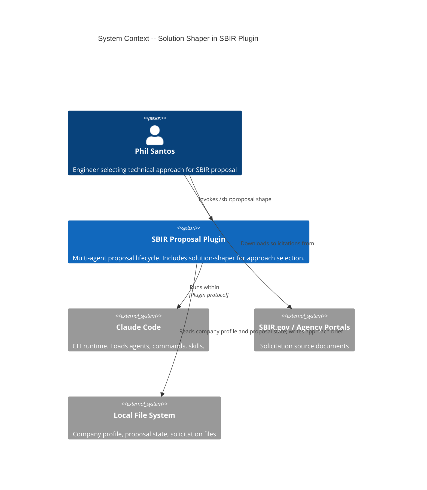
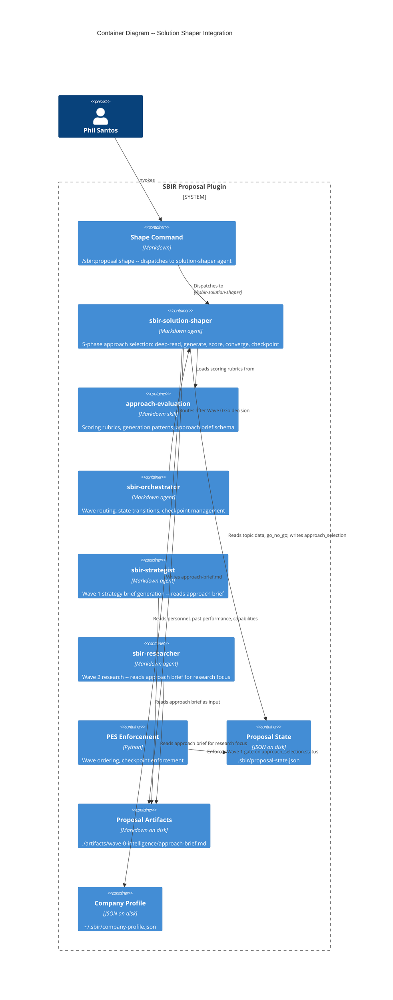

# Architecture Document: Solution Shaper

## System Context

The solution-shaper fills the structural gap between Wave 0 (Go/No-Go) and Wave 1 (Strategy). It adds a pre-strategy approach selection step: deep-read the solicitation, generate 3-5 candidate technical approaches, score each against company-specific dimensions, converge on a recommendation, and checkpoint for human approval. Produces `approach-brief.md` consumed by Wave 1+ agents.

**Implementation type**: Markdown artifacts only (1 agent, 1 skill, 1 command). No new Python services.

---

## C4 System Context (Level 1)



---

## C4 Container (Level 2)



---

## Component Architecture

### Component Boundaries

| Component | File | Responsibility |
|-----------|------|---------------|
| **Command** | `commands/sbir-proposal-shape.md` | Entry point. Dispatches to agent. Handles `--revise` flag routing. |
| **Agent** | `agents/sbir-solution-shaper.md` | Orchestrates 5-phase workflow. Reads inputs, generates approaches, scores, converges, checkpoints. |
| **Skill** | `skills/solution-shaper/approach-evaluation.md` | Domain knowledge: scoring rubrics, generation patterns (forward/reverse/prior-art), brief schema, commercialization quick-assessment. |
| **State extension** | `.sbir/proposal-state.json` | New `approach_selection` section: status, approach_name, composite_score, revision_count. |
| **Artifact** | `./artifacts/wave-0-intelligence/approach-brief.md` | Output. Structured markdown consumed by strategist (Wave 1), researcher (Wave 2), discrimination table (Wave 3). |

### Why Single Skill (Not Split)

The approach-evaluation skill covers generation patterns, scoring rubrics, brief schema, and commercialization quick-assessment. Estimated size: 150-250 lines. This is within the skill size guideline (< 400 lines). Splitting into two skills would create artificial boundaries between tightly coupled knowledge. If the skill exceeds 300 lines during implementation, the crafter may split generation and scoring.

### Data Flow

```
~/.sbir/company-profile.json ───┐
                                 │
.sbir/proposal-state.json ──────┤
  topic.id, topic.title          │
  go_no_go: "go"                 │
  solicitation_file              │
                                 ▼
                    ┌─────────────────────────────┐
                    │   sbir-solution-shaper       │
                    │                              │
                    │  Phase 1: DEEP READ          │
                    │    → parse solicitation       │
                    │                              │
                    │  Phase 2: APPROACH GENERATION │
                    │    → 3-5 candidates           │
                    │    → forward + reverse + prior │
                    │                              │
                    │  Phase 3: APPROACH SCORING    │
                    │    → 5-dimension matrix       │
                    │    → company-specific refs     │
                    │                              │
                    │  Phase 4: CONVERGENCE         │
                    │    → recommendation + brief    │
                    │                              │
                    │  Phase 5: CHECKPOINT          │
                    │    → approve/revise/explore/   │
                    │      restart/quit             │
                    └──────────┬───────────────────┘
                               │
              ┌────────────────┼────────────────┐
              ▼                ▼                ▼
  approach-brief.md   proposal-state.json   Wave 1 unlocked
  (wave-0-intelligence)  (approach_selection)
              │                                │
              ├────────────> sbir-strategist (reads as Wave 1 input)
              ├────────────> sbir-researcher (reads for Wave 2 focus)
              └────────────> discrimination-table (Wave 3 baseline)
```

---

## Integration Points

### Upstream: Wave 0 Output

| Data | Source | Required |
|------|--------|----------|
| Topic ID, title, agency | `.sbir/proposal-state.json` field `topic.*` | Yes |
| Go/No-Go decision | `.sbir/proposal-state.json` field `go_no_go` | Yes (must be "go") |
| Solicitation file path | `.sbir/proposal-state.json` field `topic.solicitation_file` | Yes |
| Company profile | `~/.sbir/company-profile.json` | Yes (blocking pre-condition) |

### Downstream: Wave 1+ Consumption

| Consumer | Reads | Integration Mechanism |
|----------|-------|----------------------|
| sbir-strategist | approach-brief.md | Agent reads file from `./artifacts/wave-0-intelligence/approach-brief.md` during Phase 1 GATHER. Brief provides technical approach, discrimination angles, and Phase III quick assessment. |
| sbir-researcher | approach-brief.md | Agent reads to focus research on selected approach domain, risks, and commercialization pathway. |
| discrimination-table skill | approach-brief.md | Discrimination angles section provides initial discriminators for Wave 3 table. |
| PES wave ordering | `approach_selection.status` in proposal-state.json | Wave 1 gated on `approach_selection.status == "approved"` OR `approach_selection.status == "skipped"`. |

### PES Integration

The solution-shaper step is **optional but gated once started**:

- If user never invokes `/sbir:proposal shape`, Wave 1 proceeds as before (no `approach_selection` in state = no gate).
- If user invokes the command, `approach_selection.status` is set to "pending". Wave 1 is then gated until status becomes "approved" or "skipped".
- This preserves backward compatibility: existing proposals without approach selection are unaffected.

PES implementation: extend the existing wave-ordering rule to check for `approach_selection` presence. No new rule class needed. Configurable in pes-config.json as `approach_gate: true` (default).

---

## Agent Workflow Design

### Phase 1: DEEP READ

- Read solicitation file (full text, not just topic-scout summary)
- Extract: problem statement, key objectives, evaluation criteria with weights, technical constraints, format requirements
- Flag ambiguities for TPOC questions
- Internal output: structured solicitation analysis (not persisted as separate artifact)

### Phase 2: APPROACH GENERATION

- Generate 3-5 technically distinct candidates using:
  - Forward mapping: solicitation requirements to known technical approaches
  - Reverse mapping: company capabilities/IP/personnel to applicable approaches
  - Prior art awareness: established approaches in the problem domain, including non-obvious combinations
- Each approach: name, 2-3 sentence description, key technical elements, required capabilities
- User may add/modify candidates before proceeding

### Phase 3: APPROACH SCORING

Five dimensions with configurable weights (defined in approach-evaluation skill):

| Dimension | Default Weight | Source |
|-----------|---------------|--------|
| Personnel alignment | 0.25 | company-profile.json `key_personnel.expertise` vs. approach needs |
| Past performance | 0.20 | company-profile.json `past_performance` vs. approach domain |
| Technical readiness | 0.20 | Estimated TRL for approach given company's current state |
| Solicitation fit | 0.20 | How directly approach addresses stated objectives and evaluation criteria |
| Commercialization potential | 0.15 | Phase III pathway strength, dual-use potential, market size |

Scores: 0.00-1.00 per dimension. Composite: weighted sum. Scoring references specific company data (personnel names, contract numbers) for traceability.

### Phase 4: CONVERGENCE

- Recommend top approach with rationale
- Document runner-up with non-selection rationale and reconsideration conditions
- Identify 3+ discrimination angles for Wave 3
- List risks and open questions assigned to Wave 1-2 validation
- Phase III quick assessment: pathway, target programs, market relevance
- Write approach-brief.md

### Phase 5: CHECKPOINT

Standard plugin checkpoint pattern:

| Option | Action |
|--------|--------|
| approve | Write approach-brief.md, update `approach_selection.status = "approved"` in state, unlock Wave 1 |
| revise | Accept feedback, regenerate brief, re-present |
| explore | Deep-dive on a specific approach (additional detail, risks, trade study) |
| restart | Regenerate candidate approaches from scratch |
| quit | Save state (`approach_selection.status = "pending"`) and exit |

---

## Approach Scoring Model

### Dimension Definitions

**Personnel alignment (0.25)**: Maps each candidate approach's required expertise areas to company profile `key_personnel[].expertise`. Scores based on: direct expertise match (0.8-1.0), adjacent expertise (0.5-0.7), no relevant personnel (0.0-0.3). References specific personnel names in scoring rationale.

**Past performance (0.20)**: Maps approach domain to `past_performance[]` entries. Scores based on: direct domain match with successful outcome (0.8-1.0), related domain (0.5-0.7), no relevant past performance (0.0-0.3). References specific contract IDs.

**Technical readiness (0.20)**: Estimates TRL starting point for this approach given company's current IP, prototypes, and lab work. Higher TRL start = higher score. Accounts for TRL gap to solicitation target.

**Solicitation fit (0.20)**: How directly the approach addresses stated objectives and evaluation criteria. Weighted by evaluation criteria percentages from solicitation. Penalizes approaches that address objectives partially or require scope stretching.

**Commercialization potential (0.15)**: Quick Phase III pathway assessment. Scores based on: dual-use with large market (0.8-1.0), government transition to known programs (0.5-0.7), narrow military niche (0.3-0.5), unclear pathway (0.0-0.3).

### Weight Configurability

Weights are defined in the approach-evaluation skill, not hardcoded in the agent. Users can adjust per-proposal (e.g., when a solicitation weights commercialization at 30%, increase that dimension). The skill documents the default weights and guidance for adjustment.

---

## Artifact Schema: approach-brief.md

```markdown
# Approach Brief: {Topic ID} -- {Topic Title}

## Solicitation Summary
- Agency: {agency}
- Problem: {1-2 sentence problem statement}
- Key objectives: {bulleted list}
- Evaluation criteria: {criteria with weights}

## Selected Approach
- Name: {approach name}
- Description: {2-3 sentences}
- Key technical elements: {bulleted list}
- Why this approach: {rationale referencing scoring dimensions}

## Approach Scoring Matrix
| Dimension | Approach A | Approach B | Approach C | ... |
|-----------|-----------|-----------|-----------|-----|
| Personnel alignment | {score} | {score} | {score} | |
| Past performance | {score} | {score} | {score} | |
| Technical readiness | {score} | {score} | {score} | |
| Solicitation fit | {score} | {score} | {score} | |
| Commercialization | {score} | {score} | {score} | |
| **Composite** | **{score}** | **{score}** | **{score}** | |

## Runner-Up
- Name: {approach name}
- Why not selected: {brief rationale}
- When to reconsider: {conditions}

## Discrimination Angles
- {discriminator 1}: {how this approach differentiates}
- {discriminator 2}: ...
- {discriminator 3}: ...

## Risks and Open Questions
- {risk/question}: Validate in {Wave 1|Wave 2}
- ...

## Phase III Quick Assessment
- Primary pathway: {government transition | commercial | dual-use}
- Target programs: {specific programs or markets}
- Estimated market relevance: {high | medium | low with brief rationale}

## Revision History
(Populated only on revision. Append-only.)
- {date}: Original selection -- {approach name} ({rationale})
- {date}: Revised -- {new approach or same} ({revision rationale})
```

---

## Wave Placement Decision

The solution-shaper **extends Wave 0** rather than creating a new wave:

- Artifacts write to `./artifacts/wave-0-intelligence/` (existing directory)
- Logically: Wave 0 answers "should we pursue this?" and now also "what should we propose?"
- No wave-numbering changes needed (avoids disrupting all existing wave references)
- The wave-agent-mapping skill gets a new entry for Wave 0: `solution-shaper` alongside existing agents

See ADR-019 for the full rationale.

---

## Strategist Integration

The strategist agent's Phase 1 GATHER is updated to:

1. Read compliance matrix (existing)
2. Read approach brief from `./artifacts/wave-0-intelligence/approach-brief.md` (new)
3. Read TPOC Q&A log if available (existing)
4. Read corpus exemplars (existing)

The approach brief provides:
- Technical approach direction (replaces implicit user assumption)
- Discrimination angles (feeds competitive positioning section)
- Phase III quick assessment (feeds commercialization section)
- Risks (feeds risk assessment section)

If no approach brief exists, the strategist proceeds as before (backward compatible).

---

## Error Handling

| Condition | Behavior |
|-----------|----------|
| No company profile at `~/.sbir/company-profile.json` | Block with: "Company profile required for approach scoring. Run `/sbir:company-profile setup`." |
| No proposal state or `go_no_go != "go"` | Block with: "Wave 0 Go decision required. Run `/sbir:proposal status`." |
| Solicitation file not found | Block with: "Solicitation file not found at {path}. Update proposal state or provide file." |
| All approaches score below 0.40 | Warn: "All approaches scored below 0.40. Reconsider Go decision." Allow user to proceed or archive. |
| Score spread < 10 percentage points | Note: "Multiple viable approaches -- no clear winner." Present tiebreaker considerations. |
| Fewer than 3 approaches generated | Proceed with user notification. Narrow topics may have fewer distinct approaches. |

---

## Quality Attribute Strategies

### Maintainability
- Single skill file with configurable weights avoids scatter
- Agent follows established 5-phase pattern consistent with other agents
- Approach brief schema is the integration contract -- changes require coordinating with strategist/researcher

### Usability
- Target: under 10 minutes for straightforward topics
- Same checkpoint pattern as all other agents (no new UX concepts)
- Progressive disclosure: summary first, detailed scoring on request
- Error messages follow what/why/what-to-do pattern

### Reliability
- Approach brief written atomically (temp file + rename)
- Proposal state updated atomically (existing pattern)
- Checkpoint saves state on quit (no lost work)

### Testability
- BDD scenarios defined: 9 scenarios across 2 user stories
- Integration testing via end-to-end command execution
- Skill can be validated independently (rubric produces expected score distributions)

---

## ADR Index (Solution Shaper)

| ADR | Title | Status |
|-----|-------|--------|
| ADR-019 | Pre-proposal approach selection as distinct Wave 0 step | Accepted |
