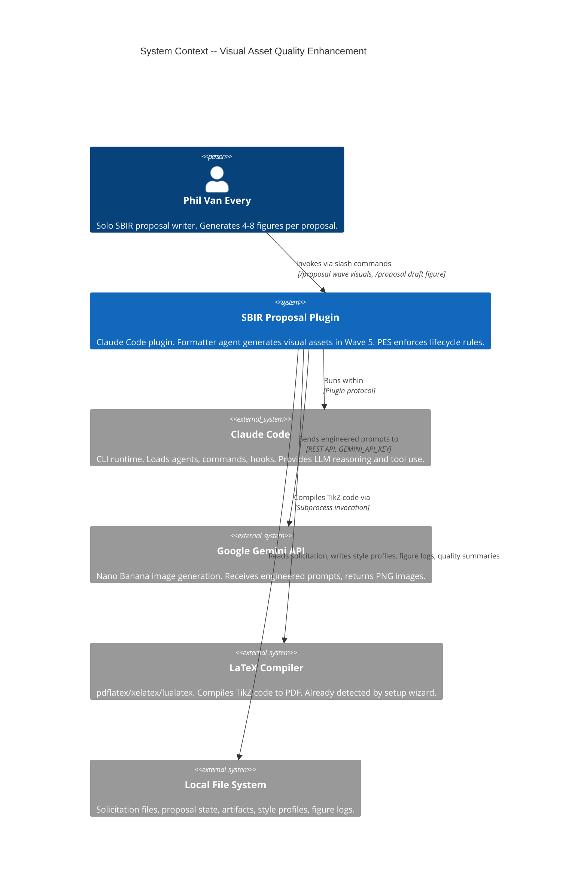
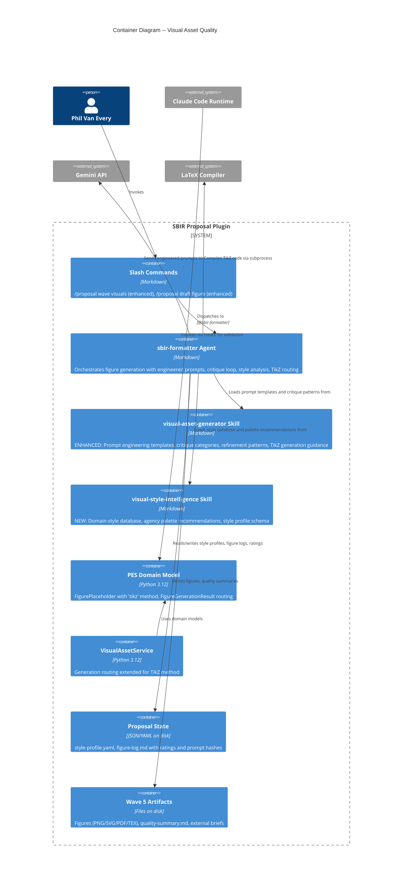

# Visual Asset Quality -- Architecture Design

## System Context

Brownfield enhancement to the existing SBIR proposal plugin's Wave 5 visual asset pipeline. Four capabilities added: engineered prompt generation, structured critique-and-refine loop, domain-aware style intelligence, and TikZ generation for LaTeX proposals.

**Architectural approach**: Extend existing ports-and-adapters OOP (Python PES) and markdown agent/skill system. No new agents, no new commands. Enhancements delivered through skill expansion, agent behavior updates, and minimal domain model extension.

---

## C4 System Context (Level 1)



---

## C4 Container (Level 2)



---

## Delivery Surface Map

| Component | Surface | Delivery Method | Rationale |
|-----------|---------|-----------------|-----------|
| visual-asset-generator skill (enhanced) | Markdown | `skill/edit` | Prompt templates, critique categories, refinement patterns are domain knowledge |
| visual-style-intelligence skill (new) | Markdown | `forge/skill` | Style database, agency palettes, recommendation logic are domain knowledge |
| sbir-formatter agent (enhanced) | Markdown | `agent/edit` | Critique loop, style analysis step, TikZ routing are agent behavior |
| /proposal wave visuals command (enhanced) | Markdown | `command/edit` | Style analysis step added to existing command flow |
| /proposal draft figure command (enhanced) | Markdown | `command/edit` | Prompt preview and critique loop added to existing command flow |
| FigurePlaceholder domain model | Python | `code/tdd` | Add "tikz" as valid generation_method |
| VisualAssetService routing | Python | `code/tdd` | Route "tikz" method through generation pipeline |
| FigureGenerationResult extension | Python | `code/tdd` | Add prompt_hash, iteration_count fields |

---

## Component Architecture

### 1. Engineered Prompt Generation (US-VAQ-1)

**Delivery surface**: Markdown (skill + agent behavior)

The visual-asset-generator skill gains a prompt engineering section with:
- Structured prompt template: COMPOSITION, STYLE, LABELS, AVOID, RESOLUTION sections
- Per-figure-type prompt patterns (system-diagram, concept, block-diagram, etc.)
- Style profile injection point (palette, tone from style-profile.yaml)
- Figure plan metadata injection (section content, compliance items)

The formatter agent's Phase 2 (GENERATE FIGURES) gains a prompt preview step before generation. The agent constructs the prompt using skill templates, displays it, and offers: generate, edit prompt, switch method, skip.

### 2. Structured Critique and Refinement Loop (US-VAQ-2)

**Delivery surface**: Markdown (skill + agent behavior)

The visual-asset-generator skill gains:
- Five critique categories: composition, labels, accuracy, style match, scale/proportion
- Category descriptions and rating scale (1-5)
- Per-category prompt adjustment patterns (what to add/remove for each low-rated category)
- Refinement preservation rules (high-rated sections unchanged)

The formatter agent's review checkpoint is replaced with structured critique:
- Present 5 categories with descriptions
- Categories rated below 3 flagged for refinement
- System prepares prompt adjustments, shows to user, regenerates
- Maximum 3 refinement rounds, then escape paths
- Ratings recorded in figure log

### 3. Domain-Aware Visual Style Intelligence (US-VAQ-3)

**Delivery surface**: Markdown (new skill + agent behavior)

New skill `skills/formatter/visual-style-intelligence.md` contains:
- Agency-domain style database (Navy/maritime, Air Force/aerospace, Army/ground, DARPA/advanced, generic fallback)
- Per-domain entries: palette (hex), tone, detail level, avoid list
- Style profile YAML schema
- Recommendation logic guidance (read solicitation -> identify agency/domain -> recommend profile)

The formatter agent's Phase 1 (FIGURE PLAN) gains a style analysis step at the start of Wave 5:
- Read solicitation context (agency, domain, topic)
- Recommend style profile using style-intelligence skill
- Present for review, allow adjustments
- Persist to `{artifact_base}/wave-5-visuals/style-profile.yaml`
- Style profile injected into all subsequent Nano Banana prompts

### 4. TikZ Generation for LaTeX (US-VAQ-4)

**Delivery surface**: Mixed (Python domain model + Markdown agent behavior)

**Python changes** (PES domain):
- `FigurePlaceholder.generation_method` accepts "tikz" as valid value
- `VisualAssetService.generate_figure()` routes "tikz" to a new internal method
- New `_generate_tikz()` method on service returns `FigureGenerationResult` with format "tikz"

**Markdown changes** (agent/skill):
- visual-asset-generator skill gains TikZ generation section: when to offer, compilation verification, fallback guidance
- Formatter agent routes TikZ figures through: generate code -> compile via subprocess -> verify 0 errors -> save .tex + .pdf -> present for critique
- TikZ offered only when: proposal format is LaTeX AND compiler detected AND figure type is diagram-compatible

### 5. Quality Summary and Style Consistency (US-VAQ-5)

**Delivery surface**: Markdown (agent behavior)

The formatter agent's Wave 5 conclusion gains:
- Quality summary aggregation: per-figure ratings table, average quality, iteration counts
- Style consistency check: compare prompt hex codes against style-profile.yaml
- Quality outlier detection: any category 2+ points below proposal average flagged
- Persist summary to `{artifact_base}/wave-5-visuals/quality-summary.md`

---

## Integration Patterns

### Shared Artifacts (Data Flow)

```
solicitation-parsed.md -> [Style Analysis] -> style-profile.yaml
                                                    |
figure-plan.md -----> [Prompt Engineering] <--------+
                             |
                      engineered prompt (in-memory)
                             |
                      [Generate] -> figure file + figure-log.md entry
                             |
                      [Critique] -> ratings (in-memory) -> figure-log.md
                             |
                      [Refine] -> adjusted prompt -> [Generate] (loop)
                             |
                      [Approve] -> figure-log.md (final ratings, prompt hash)
                             |
                      [Conclude] -> quality-summary.md
```

### Integration Points with Existing System

| Integration | Direction | Contract |
|------------|-----------|----------|
| Solicitation context | Read | `{state_dir}/solicitation-parsed.md` -- agency, domain, topic |
| Figure plan | Read | `{artifact_base}/wave-3-outline/figure-plan.md` -- figure specs |
| Compliance matrix | Read | `{state_dir}/compliance-matrix.md` -- FORMAT items |
| Format config | Read | `proposal-state.json` field `output_format` -- "latex" or "docx" |
| LaTeX compiler detection | Read | Setup wizard detection result (check `which pdflatex`) |
| Nano Banana script | Invoke | `scripts/nano-banana-generate.sh` -- unchanged interface |
| Figure log | Write | `{artifact_base}/wave-5-visuals/figure-log.md` -- extended with ratings, prompt hash |
| Cross-reference log | Write | Existing `VisualAssetService.validate_cross_references()` -- unchanged |

---

## Quality Attribute Strategies

| Attribute | Strategy |
|-----------|----------|
| **Maintainability** | Domain knowledge in skills (easy to edit markdown), not code. Prompt templates updated without Python changes. |
| **Testability** | Python domain model changes tested via TDD. Agent/skill behavior validated via forge checklist. |
| **Time-to-market** | Minimal Python changes (add "tikz" to routing). Bulk of work is skill/agent markdown. |
| **Reliability** | TikZ compilation verified before presenting. Critique loop capped at 3 iterations. Fallback paths at every decision point. |

---

## Rejected Simple Alternatives

### Alternative 1: Prompt improvement in skill only (no structured critique)
- **What**: Update visual-asset-generator skill with better prompt templates. No critique categories, no refinement loop.
- **Expected impact**: ~40% of problem solved (better first-generation quality, but no iteration capability)
- **Why insufficient**: User stories US-VAQ-2 explicitly requires structured critique. The JTBD analysis shows iteration efficiency (16.0 score) is second-highest priority. Prompt-only improvement leaves the "take it or leave it" problem unsolved.

### Alternative 2: Style as prompt prefix only (no persisted profile)
- **What**: Add domain-aware style keywords to prompts without a persisted style profile YAML.
- **Expected impact**: ~60% of style problem solved (better per-figure style, but no cross-figure consistency)
- **Why insufficient**: US-VAQ-5 quality summary requires comparing figures against an approved profile. Without persistence, no consistency check is possible. Also, user cannot review/adjust style once and have it apply to all figures.
