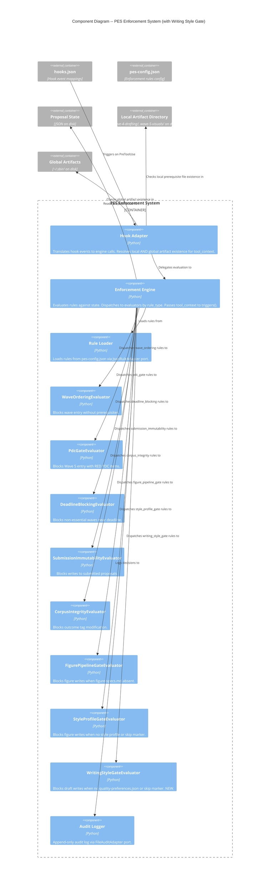

# Writing Style Gate Enforcement -- Architecture Design

## Overview

One new PES evaluator + engine/adapter/config wiring + writer agent markdown changes enforcing writing style selection before Wave 4 drafting. Prevents writer agent from drafting sections without a conscious writing style choice.

**Incident**: SF25D-T1201 session -- writer drafted all sections without any style discussion, ignoring quality discovery artifacts.

**Approach**: Brownfield extension of existing PES enforcement system. Follows existing evaluator pattern (FigurePipelineGateEvaluator, StyleProfileGateEvaluator). One key difference: this evaluator checks a GLOBAL artifact (~/.sbir/quality-preferences.json) rather than a proposal-directory artifact. Requires hook adapter extension for global artifact resolution (ADR-045).

---

## C4 System Context (Level 1)

No change to system context. PES enforcement system already intercepts all Claude Code tool invocations. The new evaluator adds one rule within the existing system boundary.

---

## C4 Container (Level 2)

No change to container diagram. The PES Enforcement System container gains one new internal component (evaluator) but its external interfaces remain identical:
- Input: PreToolUse hook events (JSON stdin)
- Output: ALLOW/BLOCK decisions (exit code + JSON stdout)

One new external data dependency: `~/.sbir/quality-preferences.json` (global artifact, outside proposal directory).

---

## C4 Component (Level 3) -- PES Enforcement System (Updated)

---

## Key Design Decisions

### Decision 1: Global Artifact Resolution (ADR-045)

See **ADR-045** for full rationale.

**Summary**: Add a `global_artifacts_present` list to `tool_context` alongside existing `artifacts_present`. The hook adapter resolves `Path.home() / ".sbir"` and checks for configured global prerequisite files. This keeps the two artifact scopes semantically distinct:
- `artifacts_present`: local files in the proposal artifact directory (used by figure pipeline + style profile gates)
- `global_artifacts_present`: files at `~/.sbir/` (used by writing style gate)

### Decision 2: Wave-4-Drafting Path Detection

The hook adapter already detects `wave-5-visuals/` in file paths to trigger local artifact resolution. Extend with `wave-4-drafting/` detection for global artifact resolution. This is a simple conditional addition in the same `resolve_tool_context` function -- no architectural change needed.

The adapter resolves global artifacts when file_path targets `wave-4-drafting/`. Local artifact resolution continues to trigger only for `wave-5-visuals/`. Both can coexist since they check different path segments and populate different tool_context fields.

---

## Evaluator Behavior Summary

### WritingStyleGateEvaluator

- **Triggers when**: file_path targets `wave-4-drafting/`, file is NOT an exempt infrastructure file, AND `quality-preferences.json` is NOT in `global_artifacts_present`, AND `writing_style_selection_skipped` is not true in state
- **Does not trigger when**: file_path is outside `wave-4-drafting/`, OR `quality-preferences.json` exists globally, OR state has `writing_style_selection_skipped: true`
- **Block message**: Guidance to run `/proposal quality discover` or skip style selection at the style checkpoint, includes both resolution paths

---

## Integration Points

| Integration Point | Direction | Description |
|---|---|---|
| Hook Adapter -> Engine | Unchanged | `evaluate()` already accepts `tool_context` (from ADR-044) |
| Hook Adapter -> Global Filesystem | New | Checks `~/.sbir/` for global artifact existence |
| Hook Adapter resolve_tool_context | Modified | Detects `wave-4-drafting/` in addition to `wave-5-visuals/`, populates `global_artifacts_present` |
| Engine._evaluators | Modified | One new evaluator registration: `"writing_style_gate"` |
| pes-config.json | Modified | One new rule added |
| sbir-writer.md | Modified | Style checkpoint added before first section draft in Phase 3 |
| proposal-draft.md | Modified | Prerequisites updated to mention style checkpoint |

---

## Two Delivery Surfaces

### Surface 1: Python TDD (PES enforcement layer)

| Component | Type | Delivery |
|---|---|---|
| WritingStyleGateEvaluator | Domain | TDD: unit tests -> implementation -> refactor |
| Hook adapter global resolution | Adapter | TDD: unit tests -> implementation -> refactor |
| Engine registration | Domain | Registration + existing test verification |
| Config rule | Template | JSON addition |
| Integration tests | Test | End-to-end through hook-to-evaluator path |
| BDD acceptance tests | Test | From 17 Gherkin scenarios |

### Surface 2: Markdown Editing (writer agent + command)

| Component | Type | Delivery |
|---|---|---|
| sbir-writer.md Phase 3 | Agent | Add style checkpoint before first section draft |
| proposal-draft.md | Command | Update prerequisites to include style checkpoint |

---

## Quality Attribute Strategies

| Attribute | Strategy |
|---|---|
| **Testability** | Pure domain evaluator with no I/O. Global artifact existence passed as data via tool_context. TDD with pytest. |
| **Maintainability** | Follows existing evaluator pattern exactly. One new ADR documents the global artifact resolution. |
| **Auditability** | All decisions (block and allow) recorded in audit log via existing engine audit path. |
| **Reliability** | Unknown rule_types silently return False (existing safety). Missing tool_context defaults to empty dict. Missing global_artifacts_present defaults to empty list. |

---

## Deployment Architecture

No deployment changes. New Python file loaded by existing import machinery. pes-config.json gains one rule. No new dependencies, no new infrastructure.
